# Architecture (Rendered View)

> **Generated** from the `wiki/` bundle — do not edit by hand.
> The bundle is the source of truth; this is the single-document linear
> view for onboarding. Regenerate with `okf-render-views.sh`.

## Contents

- **overview/**
  - [overview](#overview)
  - [Grok Build — system architecture overview](#grok-build-system-architecture-overview)
  - [Getting started — build and run](#getting-started-build-and-run)
  - [Glossary](#glossary)
- **systems/**
  - [systems](#systems)
  - [build — proto build helpers](#build-proto-build-helpers)
  - [cargo — graph label → see xai-grok-pager-bin](#cargo-graph-label-see-xai-grok-pager-bin)
  - [cli-chat-proxy-types — Chat proxy types](#cli-chat-proxy-types-chat-proxy-types)
  - [codegen — primary CLI crate closure](#codegen-primary-cli-crate-closure)
  - [common — shared leaf crates](#common-shared-leaf-crates)
  - [Component Coverage](#component-coverage)
  - [dagre_rust — Dagre layout](#dagre_rust-dagre-layout)
  - [dict — graph label → see xai-grok-config](#dict-graph-label-see-xai-grok-config)
  - [graphlib_rust — Graphlib](#graphlib_rust-graphlib)
  - [int — graph label → see xai-token-estimation](#int-graph-label-see-xai-token-estimation)
  - [list — graph label → see xai-grok-shell](#list-graph-label-see-xai-grok-shell)
  - [mc — cli-chat-proxy shared types](#mc-cli-chat-proxy-shared-types)
  - [mermaid-to-svg — Mermaid→SVG](#mermaid-to-svg-mermaidsvg)
  - [ordered_hashmap — Ordered map](#ordered_hashmap-ordered-map)
  - [profile — graph label → see xai-grok-shell-base](#profile-graph-label-see-xai-grok-shell-base)
  - [ptyctl-cli — PTY control CLI](#ptyctl-cli-pty-control-cli)
  - [ptyctl — PTY control lib](#ptyctl-pty-control-lib)
  - [str — graph label → see xai-grok-secrets](#str-graph-label-see-xai-grok-secrets)
  - [workspace — graph label → see xai-grok-workspace](#workspace-graph-label-see-xai-grok-workspace)
  - [xai-acp-lib — ACP protocol lib](#xai-acp-lib-acp-protocol-lib)
  - [xai-agent-lifecycle — Agent lifecycle](#xai-agent-lifecycle-agent-lifecycle)
  - [xai-chat-state — Chat state actor](#xai-chat-state-chat-state-actor)
  - [xai-circuit-breaker — Circuit breaker](#xai-circuit-breaker-circuit-breaker)
  - [xai-codebase-graph — Code index graph](#xai-codebase-graph-code-index-graph)
  - [xai-computer-hub-core — Computer hub core](#xai-computer-hub-core-computer-hub-core)
  - [xai-computer-hub-mcp-adapter — Hub MCP adapter](#xai-computer-hub-mcp-adapter-hub-mcp-adapter)
  - [xai-computer-hub-sdk — Computer hub SDK](#xai-computer-hub-sdk-computer-hub-sdk)
  - [xai-crash-handler — Workspace crate](#xai-crash-handler-workspace-crate)
  - [xai-fast-worktree — Fast git worktrees](#xai-fast-worktree-fast-git-worktrees)
  - [xai-file-utils — File utilities](#xai-file-utils-file-utilities)
  - [xai-fsnotify — FS notify](#xai-fsnotify-fs-notify)
  - [xai-gix-status — Workspace crate](#xai-gix-status-workspace-crate)
  - [xai-grok-agent — Agent core helpers](#xai-grok-agent-agent-core-helpers)
  - [xai-grok-announcements — Workspace crate](#xai-grok-announcements-workspace-crate)
  - [xai-grok-auth — Authentication](#xai-grok-auth-authentication)
  - [xai-grok-compaction — Context compaction](#xai-grok-compaction-context-compaction)
  - [xai-grok-config — Config loading/merge](#xai-grok-config-config-loadingmerge)
  - [xai-grok-config-types — Config type defs](#xai-grok-config-types-config-type-defs)
  - [xai-grok-env — Workspace crate](#xai-grok-env-workspace-crate)
  - [xai-grok-hooks — Hooks runtime](#xai-grok-hooks-hooks-runtime)
  - [xai-grok-http — HTTP helpers](#xai-grok-http-http-helpers)
  - [xai-grok-markdown-core — Workspace crate](#xai-grok-markdown-core-workspace-crate)
  - [xai-grok-markdown — Streaming markdown TUI](#xai-grok-markdown-streaming-markdown-tui)
  - [xai-grok-mcp — MCP integration](#xai-grok-mcp-mcp-integration)
  - [xai-grok-memory — Cross-session memory](#xai-grok-memory-cross-session-memory)
  - [xai-grok-mermaid — Mermaid integration](#xai-grok-mermaid-mermaid-integration)
  - [xai-grok-models — Model catalog](#xai-grok-models-model-catalog)
  - [xai-grok-pager-bin — Entrypoint composition root](#xai-grok-pager-bin-entrypoint-composition-root)
  - [xai-grok-pager — Full-screen TUI](#xai-grok-pager-full-screen-tui)
  - [xai-grok-pager-minimal — Minimal scrollback-native mode](#xai-grok-pager-minimal-minimal-scrollback-native-mode)
  - [xai-grok-pager-pty-harness — PTY harness / benches](#xai-grok-pager-pty-harness-pty-harness-benches)
  - [xai-grok-pager-render — Pager render engine](#xai-grok-pager-render-pager-render-engine)
  - [xai-grok-paths — Workspace crate](#xai-grok-paths-workspace-crate)
  - [xai-grok-plugin-marketplace — Plugin marketplace](#xai-grok-plugin-marketplace-plugin-marketplace)
  - [xai-grok-sampler — Model sampling/streaming](#xai-grok-sampler-model-samplingstreaming)
  - [xai-grok-sampling-types — Sampling shared types](#xai-grok-sampling-types-sampling-shared-types)
  - [xai-grok-sandbox — OS sandbox](#xai-grok-sandbox-os-sandbox)
  - [xai-grok-secrets — Secret sanitizer](#xai-grok-secrets-secret-sanitizer)
  - [xai-grok-shared — Shared CLI helpers](#xai-grok-shared-shared-cli-helpers)
  - [xai-grok-shell-base — Shell base helpers](#xai-grok-shell-base-shell-base-helpers)
  - [xai-grok-shell — Agent runtime](#xai-grok-shell-agent-runtime)
  - [xai-grok-shell-session-support — Workspace crate](#xai-grok-shell-session-support-workspace-crate)
  - [xai-grok-subagent-resolution — Workspace crate](#xai-grok-subagent-resolution-workspace-crate)
  - [xai-grok-telemetry — Telemetry engine](#xai-grok-telemetry-telemetry-engine)
  - [xai-grok-test-support — Workspace crate](#xai-grok-test-support-workspace-crate)
  - [xai-grok-tools-api — Tools protobuf API](#xai-grok-tools-api-tools-protobuf-api)
  - [xai-grok-tools — Tool implementations](#xai-grok-tools-tool-implementations)
  - [xai-grok-update — Auto-update](#xai-grok-update-auto-update)
  - [xai-grok-version — Workspace crate](#xai-grok-version-workspace-crate)
  - [xai-grok-voice — Voice input](#xai-grok-voice-voice-input)
  - [xai-grok-workspace-client — Workspace client](#xai-grok-workspace-client-workspace-client)
  - [xai-grok-workspace — Host FS/VCS/permissions](#xai-grok-workspace-host-fsvcspermissions)
  - [xai-grok-workspace-types — Workspace request types](#xai-grok-workspace-types-workspace-request-types)
  - [xai-hooks-plugins-types — Workspace crate](#xai-hooks-plugins-types-workspace-crate)
  - [xai-hunk-tracker — Hunk tracker actor](#xai-hunk-tracker-hunk-tracker-actor)
  - [xai-interjection-core — Workspace crate](#xai-interjection-core-workspace-crate)
  - [xai-mixpanel — Workspace crate](#xai-mixpanel-workspace-crate)
  - [xai-prompt-queue — Workspace crate](#xai-prompt-queue-workspace-crate)
  - [xai-proto-build — Protoc finder](#xai-proto-build-protoc-finder)
  - [xai-ratatui-inline — Workspace crate](#xai-ratatui-inline-workspace-crate)
  - [xai-ratatui-textarea — Workspace crate](#xai-ratatui-textarea-workspace-crate)
  - [xai-sqlite-journal — Workspace crate](#xai-sqlite-journal-workspace-crate)
  - [xai-system-power — Workspace crate](#xai-system-power-workspace-crate)
  - [xai-test-utils — Workspace crate](#xai-test-utils-workspace-crate)
  - [xai-token-estimation — Workspace crate](#xai-token-estimation-workspace-crate)
  - [xai-tool-protocol — Tool wire protocol](#xai-tool-protocol-tool-wire-protocol)
  - [xai-tool-runtime — Tool runtime dispatch](#xai-tool-runtime-tool-runtime-dispatch)
  - [xai-tool-types — Tool type defs](#xai-tool-types-tool-type-defs)
  - [xai-tracing-macros — Workspace crate](#xai-tracing-macros-workspace-crate)
  - [xai-tracing — Workspace crate](#xai-tracing-workspace-crate)
  - [xai-tty-utils — Workspace crate](#xai-tty-utils-workspace-crate)
- **features/**
  - [features](#features)
  - [ACP agent mode & IDE integration](#acp-agent-mode-ide-integration)
  - [Agent mode (ACP) (product feature)](#agent-mode-acp-product-feature)
  - [Authentication (product feature)](#authentication-product-feature)
  - [Background tasks (product feature)](#background-tasks-product-feature)
  - [Configuration (product feature)](#configuration-product-feature)
  - [Custom models (product feature)](#custom-models-product-feature)
  - [Dashboard (product feature)](#dashboard-product-feature)
  - [Getting started (product feature)](#getting-started-product-feature)
  - [Headless mode (product feature)](#headless-mode-product-feature)
  - [Hooks (product feature)](#hooks-product-feature)
  - [Keyboard shortcuts (product feature)](#keyboard-shortcuts-product-feature)
  - [MCP servers (product feature)](#mcp-servers-product-feature)
  - [Memory (product feature)](#memory-product-feature)
  - [Monitoring and usage (product feature)](#monitoring-and-usage-product-feature)
  - [Permissions and safety (product feature)](#permissions-and-safety-product-feature)
  - [Plan mode (product feature)](#plan-mode-product-feature)
  - [Plugins (product feature)](#plugins-product-feature)
  - [Project rules (product feature)](#project-rules-product-feature)
  - [Sandbox (product feature)](#sandbox-product-feature)
  - [Sessions (product feature)](#sessions-product-feature)
  - [Skills (product feature)](#skills-product-feature)
  - [Slash commands (product feature)](#slash-commands-product-feature)
  - [Subagents (product feature)](#subagents-product-feature)
  - [Terminal support (product feature)](#terminal-support-product-feature)
  - [Theming (product feature)](#theming-product-feature)
  - [Tool authorization pipeline](#tool-authorization-pipeline)
- **reference/**
  - [reference](#reference)
  - [Build and test runbook](#build-and-test-runbook)
  - [Configuration surface](#configuration-surface)
  - [Key external dependencies](#key-external-dependencies)
  - [cli-chat-proxy wire types](#cli-chat-proxy-wire-types)
  - [Tool protocol API](#tool-protocol-api)
- **entrypoints/**
  - [xai-grok-pager binary (grok CLI)](#xai-grok-pager-binary-grok-cli)


---


# overview

## Concept Map

<!-- CONCEPT-MAP:START -->
| Concept | Type | Routing description |
|---------|------|---------------------|
| [Grok Build — system architecture overview](wiki/overview/architecture.md) | Subsystem | Open for a sparse whole-repo map of the Grok CLI monorepo: process roles, |
| [Getting started — build and run](wiki/overview/getting-started.md) | Runbook | Open for build prerequisites, cargo run/check commands, auth first-launch, and |
| [Glossary](wiki/overview/glossary.md) | DataModel | Open for definitions of pager, shell, leader, ACP, sampler, workspace, |
<!-- CONCEPT-MAP:END -->

---


# Grok Build — system architecture overview

## What it is


**Grok Build** is SpaceXAI's terminal AI coding agent: full-screen TUI, headless/CI mode, and ACP IDE embedding. This OSS tree is a periodic sync of the Rust CLI/TUI + agent runtime from the internal monorepo. [Existing:README.md]

Graph spine: ~87.9k nodes / 580k edges; Rust-dominant (~2219 `.rs` files). Engine packages are coarse (`codegen`, `common`, third_party, …) — crate-level truth lives under `crates/codegen/*`.

## How it works

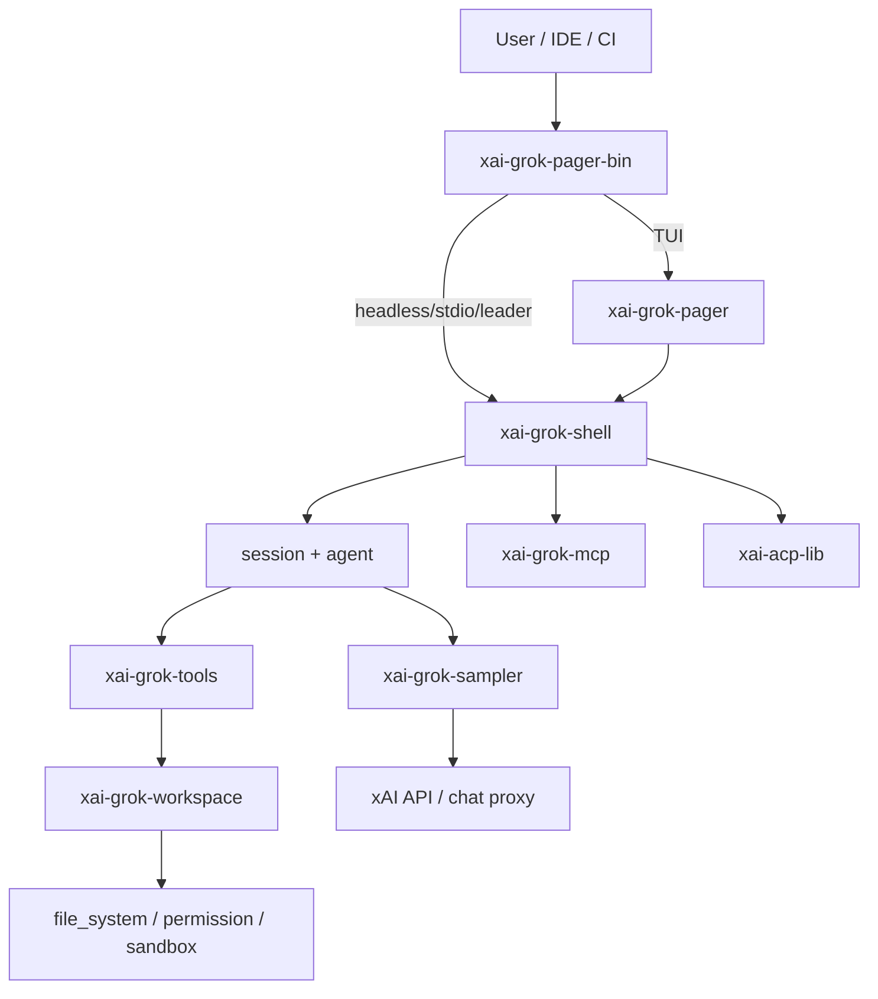

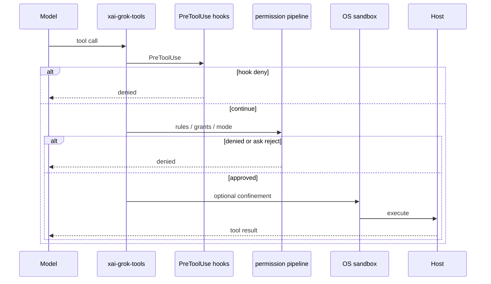

### Repository layout

| Path | Role |
|------|------|
| `crates/codegen/` | Application crates (pager, shell, tools, workspace, …) |
| `crates/common/` | Shared leaves (tool protocol, compaction, hub) |
| `crates/build/` | Proto build helpers |
| `prod/mc/` | Proxy shared types |
| `third_party/` | Vendored Mermaid SVG stack |
| `bin/protoc` | Hermetic protoc launcher |

### Invariants (synthesis from user-guide + structure)

1. **Permission order** — PreToolUse hooks → deny/ask/allow rules → remembered grants → built-in read-only auto-approvals → permission mode. Deny wins. [Existing:user-guide/22-permissions-and-safety.md]
2. **Root Cargo.toml is generated** — edit per-crate manifests only. [Existing:README.md]
3. **External contributions not accepted** — [Existing:CONTRIBUTING.md]
4. **Prefer per-crate cargo** — full workspace builds are slow. [Existing:README.md]

## Used by

- All wiki concept pages hang under this overview for orientation.
- Agents should load `draft/.ai-context.md` for compact routing.

## Blast radius

Mis-documenting process roles or the permission order causes unsafe agent edits (skipped denials) or wrong crate targeting. Keep this page sparse; deep dives belong under systems/*.

## See also

- [codegen](wiki/systems/codegen.md)
- [entrypoint](wiki/entrypoints/main.md)
- [getting-started](wiki/overview/getting-started.md)

---


# Getting started — build and run

## What it is


Developer bootstrap for building and launching Grok Build from this repository.

Provenance: graph package inventory + repository layout synthesis. Agents should open grounded paths rather than treat this page as complete implementation documentation.

## How it works

**Requirements:** Rust (pinned `rust-toolchain.toml` channel 1.92.0), protoc via `bin/protoc` or PATH.

```sh
cargo run -p xai-grok-pager-bin              # build + launch TUI
cargo build -p xai-grok-pager-bin --release  # target/release/xai-grok-pager
cargo check -p xai-grok-pager-bin
cargo test -p <crate>
cargo clippy -p <crate>
cargo fmt --all
```

First interactive launch opens browser auth. User guide:
`crates/codegen/xai-grok-pager/docs/user-guide/`.

## See also

- [architecture overview](wiki/overview/architecture.md)
- [entrypoint](wiki/entrypoints/main.md)

---


# Glossary

## What it is


Shared vocabulary for the Grok Build monorepo.

Provenance: graph package inventory + repository layout synthesis. Agents should open grounded paths rather than treat this page as complete implementation documentation.

## How it works

| Term | Meaning |
|------|---------|
| **pager** | Full-screen TUI (`xai-grok-pager`) |
| **shell** | Agent runtime crate (`xai-grok-shell`) — sessions, leader, headless |
| **leader** | Long-lived agent process clients reconnect to |
| **ACP** | Agent Client Protocol — IDE embedding (stdio/serve/relay) |
| **sampler** | Model streaming client (`xai-grok-sampler`) |
| **workspace** | Host FS/VCS/permission crate (`xai-grok-workspace`) |
| **permission mode** | default / dontAsk / bypassPermissions / acceptEdits / plan |
| **hooks** | User scripts on tool lifecycle (PreToolUse, etc.) |
| **MCP** | Model Context Protocol servers for extra tools |
| **compaction** | Summarizing old transcript to free context |
| **skills** | Packaged agent skill markdown + scripts |
| **sandbox** | OS-level confinement for tool/shell execution |

## See also

- [architecture](wiki/overview/architecture.md)
- User guide index

---


# systems

## Concept Map

<!-- CONCEPT-MAP:START -->
| Concept | Type | Routing description |
|---------|------|---------------------|
| [build — proto build helpers](wiki/systems/build.md) | Module | Open when fixing protoc discovery, protobuf codegen build scripts, or hermetic builds that depend on bin/protoc. |
| [cargo — graph label → see xai-grok-pager-bin](wiki/systems/cargo.md) | Module | Graph package label `cargo` is low-fidelity. Prefer the real crate page `xai-grok-pager-bin`. Cargo workspace root is generated; start from composition root crate. |
| [cli-chat-proxy-types — Chat proxy types](wiki/systems/cli-chat-proxy-types.md) | Module | Open when changing CLI↔proxy serde contracts. |
| [codegen — primary CLI crate closure](wiki/systems/codegen.md) | Module | Open when changing the Grok CLI/TUI, agent runtime, tools, workspace, config, MCP, markdown, auth, or sampler. Parent of all crates/codegen/* pages. |
| [common — shared leaf crates](wiki/systems/common.md) | Module | Open when working on tool protocol/runtime, compaction, circuit breakers, computer-hub, or shared tracing under crates/common/. |
| [dagre_rust — Dagre layout](wiki/systems/dagre-rust.md) | Module | Open when fixing graph layout in Mermaid stack. |
| [dict — graph label → see xai-grok-config](wiki/systems/dict.md) | Module | Graph package label `dict` is low-fidelity. Prefer the real crate page `xai-grok-config`. Map-like settings live in config types — not a package boundary. |
| [graphlib_rust — Graphlib](wiki/systems/graphlib-rust.md) | Module | Open when changing graph primitives for Mermaid. |
| [int — graph label → see xai-token-estimation](wiki/systems/int.md) | Module | Graph package label `int` is low-fidelity. Prefer the real crate page `xai-token-estimation`. Numeric helpers are scattered; token estimation is one real crate. |
| [list — graph label → see xai-grok-shell](wiki/systems/list.md) | Module | Graph package label `list` is low-fidelity. Prefer the real crate page `xai-grok-shell`. List UIs live in pager/shell session listing — not a package boundary. |
| [mc — cli-chat-proxy shared types](wiki/systems/mc.md) | Module | Open when changing wire types shared with the cli-chat-proxy backend: session metadata, sandbox flags, feedback, subagent bundles, deployment config. |
| [mermaid-to-svg — Mermaid→SVG](wiki/systems/mermaid-to-svg.md) | Module | Open when fixing diagram SVG rendering (vendored). |
| [ordered_hashmap — Ordered map](wiki/systems/ordered-hashmap.md) | Module | Open when fixing order-sensitive maps in Mermaid stack. |
| [profile — graph label → see xai-grok-shell-base](wiki/systems/profile.md) | Module | Graph package label `profile` is low-fidelity. Prefer the real crate page `xai-grok-shell-base`. CPU profiling lives in shell-base; --agent-profile is CLI path resolution. |
| [ptyctl-cli — PTY control CLI](wiki/systems/ptyctl-cli.md) | Module | Open when changing ptyctl command-line. |
| [ptyctl — PTY control lib](wiki/systems/ptyctl.md) | Module | Open when changing PTY control primitives. |
| [str — graph label → see xai-grok-secrets](wiki/systems/str.md) | Module | Graph package label `str` is low-fidelity. Prefer the real crate page `xai-grok-secrets`. String/secret handling is not a package; see secrets sanitizer and string-heavy crates. |
| [workspace — graph label → see xai-grok-workspace](wiki/systems/workspace.md) | Module | Graph package label `workspace` is low-fidelity. Prefer the real crate page `xai-grok-workspace`. Prefer the real `xai-grok-workspace` crate page. |
| [xai-acp-lib — ACP protocol lib](wiki/systems/xai-acp-lib.md) | Module | Open when changing ACP gateway, channels, or message framing. |
| [xai-agent-lifecycle — Agent lifecycle](wiki/systems/xai-agent-lifecycle.md) | Module | Open when changing agent start/stop/lifecycle contributors. |
| [xai-chat-state — Chat state actor](wiki/systems/xai-chat-state.md) | Module | Open when changing conversation state, persistence, or compaction hooks. |
| [xai-circuit-breaker — Circuit breaker](wiki/systems/xai-circuit-breaker.md) | Module | Open when changing open/half-open breaker policy. |
| [xai-codebase-graph — Code index graph](wiki/systems/xai-codebase-graph.md) | Module | Open when changing tree-sitter index, goto-def/ref, or incremental reindex. |
| [xai-computer-hub-core — Computer hub core](wiki/systems/xai-computer-hub-core.md) | Module | Open when changing hub tool registry/transport core. |
| [xai-computer-hub-mcp-adapter — Hub MCP adapter](wiki/systems/xai-computer-hub-mcp-adapter.md) | Module | Open when bridging computer hub to MCP. |
| [xai-computer-hub-sdk — Computer hub SDK](wiki/systems/xai-computer-hub-sdk.md) | Module | Open when changing hub client connection/handshake. |
| [xai-crash-handler — Workspace crate](wiki/systems/xai-crash-handler.md) | Module | Open when changing the `xai-crash-handler` crate at `crates/codegen/xai-crash-handler`. |
| [xai-fast-worktree — Fast git worktrees](wiki/systems/xai-fast-worktree.md) | Module | Open when changing CoW/BTRFS worktree creation or pools. |
| [xai-file-utils — File utilities](wiki/systems/xai-file-utils.md) | Module | Open when changing shared file helpers. |
| [xai-fsnotify — FS notify](wiki/systems/xai-fsnotify.md) | Module | Open when changing filesystem watchers. |
| [xai-gix-status — Workspace crate](wiki/systems/xai-gix-status.md) | Module | Open when changing the `xai-gix-status` crate at `crates/codegen/xai-gix-status`. |
| [xai-grok-agent — Agent core helpers](wiki/systems/xai-grok-agent.md) | Module | Open when changing agent-side helpers used by shell/pager. |
| [xai-grok-announcements — Workspace crate](wiki/systems/xai-grok-announcements.md) | Module | Open when changing the `xai-grok-announcements` crate at `crates/codegen/xai-grok-announcements`. |
| [xai-grok-auth — Authentication](wiki/systems/xai-grok-auth.md) | Module | Open when changing OIDC/browser auth or token refresh. |
| [xai-grok-compaction — Context compaction](wiki/systems/xai-grok-compaction.md) | Module | Open when changing intra/inter/history/code compaction. |
| [xai-grok-config — Config loading/merge](wiki/systems/xai-grok-config.md) | Module | Open when changing config.toml layers, managed config, or version overrides. |
| [xai-grok-config-types — Config type defs](wiki/systems/xai-grok-config-types.md) | Module | Open when changing config schema types. |
| [xai-grok-env — Workspace crate](wiki/systems/xai-grok-env.md) | Module | Open when changing the `xai-grok-env` crate at `crates/codegen/xai-grok-env`. |
| [xai-grok-hooks — Hooks runtime](wiki/systems/xai-grok-hooks.md) | Module | Open when changing PreToolUse/session hooks discovery or execution. |
| [xai-grok-http — HTTP helpers](wiki/systems/xai-grok-http.md) | Module | Open when changing shared HTTP client wrappers. |
| [xai-grok-markdown-core — Workspace crate](wiki/systems/xai-grok-markdown-core.md) | Module | Open when changing the `xai-grok-markdown-core` crate at `crates/codegen/xai-grok-markdown-core`. |
| [xai-grok-markdown — Streaming markdown TUI](wiki/systems/xai-grok-markdown.md) | Module | Open when changing markdown/code/math/mermaid rendering in scrollback. |
| [xai-grok-mcp — MCP integration](wiki/systems/xai-grok-mcp.md) | Module | Open when changing MCP servers, OAuth, credentials, or rmcp quarantine. |
| [xai-grok-memory — Cross-session memory](wiki/systems/xai-grok-memory.md) | Module | Open when changing MEMORY.md storage, dream/search, or experimental memory. |
| [xai-grok-mermaid — Mermaid integration](wiki/systems/xai-grok-mermaid.md) | Module | Open when wiring Mermaid diagrams into markdown/TUI. |
| [xai-grok-models — Model catalog](wiki/systems/xai-grok-models.md) | Module | Open when changing default model lists. |
| [xai-grok-pager-bin — Entrypoint composition root](wiki/systems/xai-grok-pager-bin.md) | Module | Open when changing CLI binary startup, mode dispatch, jemalloc, or auto-update wiring. |
| [xai-grok-pager — Full-screen TUI](wiki/systems/xai-grok-pager.md) | Module | Open when changing TUI scrollback, prompt, slash commands, modals, event loop, or pager UI. |
| [xai-grok-pager-minimal — Minimal scrollback-native mode](wiki/systems/xai-grok-pager-minimal.md) | Module | Open when changing minimal pager mode seams or lightweight UI. |
| [xai-grok-pager-pty-harness — PTY harness / benches](wiki/systems/xai-grok-pager-pty-harness.md) | Module | Open when changing PTY integration tests or paste-latency benches. |
| [xai-grok-pager-render — Pager render engine](wiki/systems/xai-grok-pager-render.md) | Module | Open when changing terminal rendering, themes, or scrollback paint paths. |
| [xai-grok-paths — Workspace crate](wiki/systems/xai-grok-paths.md) | Module | Open when changing the `xai-grok-paths` crate at `crates/codegen/xai-grok-paths`. |
| [xai-grok-plugin-marketplace — Plugin marketplace](wiki/systems/xai-grok-plugin-marketplace.md) | Module | Open when changing plugin discovery/install marketplace. |
| [xai-grok-sampler — Model sampling/streaming](wiki/systems/xai-grok-sampler.md) | Module | Open when changing HTTP streaming, retry, sampler actor, or model backends. |
| [xai-grok-sampling-types — Sampling shared types](wiki/systems/xai-grok-sampling-types.md) | Module | Open when changing sampling event/type contracts. |
| [xai-grok-sandbox — OS sandbox](wiki/systems/xai-grok-sandbox.md) | Module | Open when changing Landlock/Seatbelt profiles or child network policy. |
| [xai-grok-secrets — Secret sanitizer](wiki/systems/xai-grok-secrets.md) | Module | Open when changing secret redaction. |
| [xai-grok-shared — Shared CLI helpers](wiki/systems/xai-grok-shared.md) | Module | Open when changing cross-cutting shared utilities. |
| [xai-grok-shell-base — Shell base helpers](wiki/systems/xai-grok-shell-base.md) | Module | Open when changing CPU profile, env helpers shared by shell. |
| [xai-grok-shell — Agent runtime](wiki/systems/xai-grok-shell.md) | Module | Open when changing sessions, leader, headless/stdio agent, relay, or shell-side tool orchestration. |
| [xai-grok-shell-session-support — Workspace crate](wiki/systems/xai-grok-shell-session-support.md) | Module | Open when changing the `xai-grok-shell-session-support` crate at `crates/codegen/xai-grok-shell-session-support`. |
| [xai-grok-subagent-resolution — Workspace crate](wiki/systems/xai-grok-subagent-resolution.md) | Module | Open when changing the `xai-grok-subagent-resolution` crate at `crates/codegen/xai-grok-subagent-resolution`. |
| [xai-grok-telemetry — Telemetry engine](wiki/systems/xai-grok-telemetry.md) | Module | Open when changing product events, OTEL, Sentry, or unified log. |
| [xai-grok-test-support — Workspace crate](wiki/systems/xai-grok-test-support.md) | Module | Open when changing the `xai-grok-test-support` crate at `crates/codegen/xai-grok-test-support`. |
| [xai-grok-tools-api — Tools protobuf API](wiki/systems/xai-grok-tools-api.md) | Module | Open when changing tools wire proto or generated API shapes. |
| [xai-grok-tools — Tool implementations](wiki/systems/xai-grok-tools.md) | Module | Open when adding/changing tools (file, shell, search, web, skills, MCP use_tool). |
| [xai-grok-update — Auto-update](wiki/systems/xai-grok-update.md) | Module | Open when changing binary update check/install. |
| [xai-grok-version — Workspace crate](wiki/systems/xai-grok-version.md) | Module | Open when changing the `xai-grok-version` crate at `crates/codegen/xai-grok-version`. |
| [xai-grok-voice — Voice input](wiki/systems/xai-grok-voice.md) | Module | Open when changing voice capture/integration. |
| [xai-grok-workspace-client — Workspace client](wiki/systems/xai-grok-workspace-client.md) | Module | Open when changing workspace client adapters. |
| [xai-grok-workspace — Host FS/VCS/permissions](wiki/systems/xai-grok-workspace.md) | Module | Open when changing filesystem, permission pipeline, worktrees, foreign sessions, or hub. |
| [xai-grok-workspace-types — Workspace request types](wiki/systems/xai-grok-workspace-types.md) | Module | Open when changing workspace RPC/request message types. |
| [xai-hooks-plugins-types — Workspace crate](wiki/systems/xai-hooks-plugins-types.md) | Module | Open when changing the `xai-hooks-plugins-types` crate at `crates/codegen/xai-hooks-plugins-types`. |
| [xai-hunk-tracker — Hunk tracker actor](wiki/systems/xai-hunk-tracker.md) | Module | Open when changing edit hunk tracking actors. |
| [xai-interjection-core — Workspace crate](wiki/systems/xai-interjection-core.md) | Module | Open when changing the `xai-interjection-core` crate at `crates/common/xai-interjection-core`. |
| [xai-mixpanel — Workspace crate](wiki/systems/xai-mixpanel.md) | Module | Open when changing the `xai-mixpanel` crate at `crates/codegen/xai-mixpanel`. |
| [xai-prompt-queue — Workspace crate](wiki/systems/xai-prompt-queue.md) | Module | Open when changing the `xai-prompt-queue` crate at `crates/codegen/xai-prompt-queue`. |
| [xai-proto-build — Protoc finder](wiki/systems/xai-proto-build.md) | Module | Open when fixing hermetic protoc discovery. |
| [xai-ratatui-inline — Workspace crate](wiki/systems/xai-ratatui-inline.md) | Module | Open when changing the `xai-ratatui-inline` crate at `crates/codegen/xai-ratatui-inline`. |
| [xai-ratatui-textarea — Workspace crate](wiki/systems/xai-ratatui-textarea.md) | Module | Open when changing the `xai-ratatui-textarea` crate at `crates/codegen/xai-ratatui-textarea`. |
| [xai-sqlite-journal — Workspace crate](wiki/systems/xai-sqlite-journal.md) | Module | Open when changing the `xai-sqlite-journal` crate at `crates/codegen/xai-sqlite-journal`. |
| [xai-system-power — Workspace crate](wiki/systems/xai-system-power.md) | Module | Open when changing the `xai-system-power` crate at `crates/codegen/xai-system-power`. |
| [xai-test-utils — Workspace crate](wiki/systems/xai-test-utils.md) | Module | Open when changing the `xai-test-utils` crate at `crates/common/xai-test-utils`. |
| [xai-token-estimation — Workspace crate](wiki/systems/xai-token-estimation.md) | Module | Open when changing the `xai-token-estimation` crate at `crates/codegen/xai-token-estimation`. |
| [xai-tool-protocol — Tool wire protocol](wiki/systems/xai-tool-protocol.md) | Module | Open when changing tool JSON-RPC envelopes or registration wire. |
| [xai-tool-runtime — Tool runtime dispatch](wiki/systems/xai-tool-runtime.md) | Module | Open when changing tool dispatch, streaming, or notifications. |
| [xai-tool-types — Tool type defs](wiki/systems/xai-tool-types.md) | Module | Open when changing shared tool types. |
| [xai-tracing-macros — Workspace crate](wiki/systems/xai-tracing-macros.md) | Module | Open when changing the `xai-tracing-macros` crate at `crates/codegen/xai-tracing-macros`. |
| [xai-tracing — Workspace crate](wiki/systems/xai-tracing.md) | Module | Open when changing the `xai-tracing` crate at `crates/common/xai-tracing`. |
| [xai-tty-utils — Workspace crate](wiki/systems/xai-tty-utils.md) | Module | Open when changing the `xai-tty-utils` crate at `crates/codegen/xai-tty-utils`. |
<!-- CONCEPT-MAP:END -->

---


# build — proto build helpers

## What it is


`crates/build/xai-proto-build` locates `protoc` (dotslash launcher at `bin/protoc`, `$PROTOC`, or PATH) for crates that generate Rust from `.proto` (notably `xai-grok-tools-api`). [Graph:High — package `build`]

Provenance: graph package inventory + repository layout synthesis. Agents should open grounded paths rather than treat this page as complete implementation documentation.

## How it works

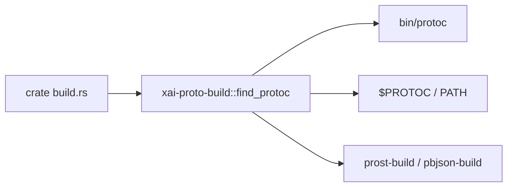

## Used by

- [codegen](wiki/systems/codegen.md) crates with protobuf codegen (e.g. tools-api)

## Blast radius

Broken protoc resolution fails compile of proto-dependent crates. Prefer the checked-in `bin/protoc` for hermeticity.

## See also

- [codegen](wiki/systems/codegen.md)
- README § Building from source

## Notes

- Supporting detail 1: keep graph package labels distinct from Cargo crate names when routing edits.
- Supporting detail 2: keep graph package labels distinct from Cargo crate names when routing edits.
- Supporting detail 3: keep graph package labels distinct from Cargo crate names when routing edits.
- Supporting detail 4: keep graph package labels distinct from Cargo crate names when routing edits.
- Supporting detail 5: keep graph package labels distinct from Cargo crate names when routing edits.

---


# cargo — graph label → see xai-grok-pager-bin

## What it is

**This is not a Cargo crate.** The knowledge-graph engine clustered a low-node package labeled `cargo`.

Cargo workspace root is generated; start from composition root crate.

**Canonical page:** [xai-grok-pager-bin.md](wiki/systems/xai-grok-pager-bin.md)

## How it works

Do not implement features under a `cargo` module path. Route work to `xai-grok-pager-bin` and related crates in the [codegen catalog](wiki/systems/codegen.md).

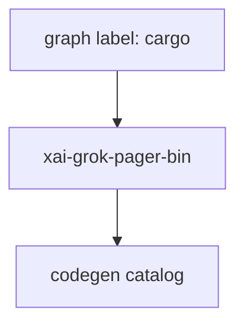

## Used by

- Agents misrouted by graph package list
- [codegen.md](wiki/systems/codegen.md) parent map

## Blast radius

Mis-editing as if `cargo` were a module wastes time. Always open `xai-grok-pager-bin` sources instead.

## See also

- [xai-grok-pager-bin.md](wiki/systems/xai-grok-pager-bin.md)
- [codegen.md](wiki/systems/codegen.md)

## Notes

- Prefer `cargo check -p cargo` / `cargo test -p cargo` for this crate.
- Full workspace builds are slow; target the crate under change.
- See root README for build prerequisites (Rust toolchain, protoc).

---


# cli-chat-proxy-types — Chat proxy types

## What it is

`cli-chat-proxy-types` is a Cargo workspace member at `prod/mc/cli-chat-proxy-types` (10 `.rs` files).

Lightweight request/response types for the cli-chat-proxy sandbox API.  This crate contains only the API types with minimal dependencies (just serde), suitable for use by clients that don't need the full cli-chat-proxy crate.

**Role:** Chat proxy types. [Graph: approximate via crate tree; Human:Synthesis from lib.rs docs]

## How it works

Primary surface is `src/lib.rs`.

Notable workspace dependencies (from crate Cargo.toml, truncated): `chrono`, `serde`, `serde_json.workspace`, `toml.workspace`.

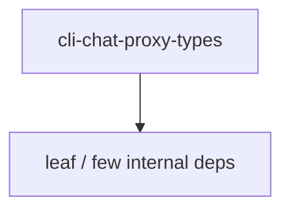

## Used by

- Parent cluster: [mc](wiki/systems/mc.md)
- Other crates that depend on this package (see Cargo graph / `cargo tree -p cli-chat-proxy-types`)

## Blast radius

Changes affect any consumer of `cli-chat-proxy-types` in the workspace. Run `cargo test -p cli-chat-proxy-types` and re-check dependent top crates (`xai-grok-shell`, `xai-grok-pager`, `xai-grok-tools`) when public APIs move.

## See also

- [systems/mc.md](wiki/systems/mc.md)
- [entrypoint](wiki/entrypoints/main.md)
- Workspace root `Cargo.toml` (generated — do not hand-edit)

## Notes

- Prefer `cargo check -p cli-chat-proxy-types` / `cargo test -p cli-chat-proxy-types` for this crate.
- Full workspace builds are slow; target the crate under change.
- See root README for build prerequisites (Rust toolchain, protoc).

---


# codegen — primary CLI crate closure

## What it is

`crates/codegen/` holds the primary application crates for Grok Build (pager TUI, shell runtime, tools, workspace, sampling, config, MCP, …).

This page is the **parent map**. Prefer the per-crate pages below for implementation work.

| Crate | `.rs` | Wiki page |
|-------|------:|-----------|
| `xai-grok-pager` | 596 | [xai-grok-pager.md](wiki/systems/xai-grok-pager.md) |
| `xai-grok-shell` | 429 | [xai-grok-shell.md](wiki/systems/xai-grok-shell.md) |
| `xai-grok-tools` | 211 | [xai-grok-tools.md](wiki/systems/xai-grok-tools.md) |
| `xai-grok-workspace` | 87 | [xai-grok-workspace.md](wiki/systems/xai-grok-workspace.md) |
| `xai-grok-pager-render` | 64 | [xai-grok-pager-render.md](wiki/systems/xai-grok-pager-render.md) |
| `xai-grok-workspace-types` | 45 | [xai-grok-workspace-types.md](wiki/systems/xai-grok-workspace-types.md) |
| `xai-grok-telemetry` | 39 | [xai-grok-telemetry.md](wiki/systems/xai-grok-telemetry.md) |
| `xai-grok-pager-pty-harness` | 37 | [xai-grok-pager-pty-harness.md](wiki/systems/xai-grok-pager-pty-harness.md) |
| `xai-fast-worktree` | 36 | [xai-fast-worktree.md](wiki/systems/xai-fast-worktree.md) |
| `xai-grok-agent` | 30 | [xai-grok-agent.md](wiki/systems/xai-grok-agent.md) |
| `xai-codebase-graph` | 28 | [xai-codebase-graph.md](wiki/systems/xai-codebase-graph.md) |
| `xai-grok-markdown` | 28 | [xai-grok-markdown.md](wiki/systems/xai-grok-markdown.md) |
| `xai-grok-sampler` | 26 | [xai-grok-sampler.md](wiki/systems/xai-grok-sampler.md) |
| `xai-chat-state` | 17 | [xai-chat-state.md](wiki/systems/xai-chat-state.md) |
| `xai-hunk-tracker` | 17 | [xai-hunk-tracker.md](wiki/systems/xai-hunk-tracker.md) |
| `xai-agent-lifecycle` | 15 | [xai-agent-lifecycle.md](wiki/systems/xai-agent-lifecycle.md) |
| `xai-file-utils` | 15 | [xai-file-utils.md](wiki/systems/xai-file-utils.md) |
| `xai-grok-hooks` | 15 | [xai-grok-hooks.md](wiki/systems/xai-grok-hooks.md) |
| `xai-grok-memory` | 15 | [xai-grok-memory.md](wiki/systems/xai-grok-memory.md) |
| `xai-grok-update` | 15 | [xai-grok-update.md](wiki/systems/xai-grok-update.md) |
| `xai-grok-voice` | 15 | [xai-grok-voice.md](wiki/systems/xai-grok-voice.md) |
| `xai-grok-config` | 14 | [xai-grok-config.md](wiki/systems/xai-grok-config.md) |
| `xai-grok-pager-minimal` | 11 | [xai-grok-pager-minimal.md](wiki/systems/xai-grok-pager-minimal.md) |
| `xai-grok-plugin-marketplace` | 11 | [xai-grok-plugin-marketplace.md](wiki/systems/xai-grok-plugin-marketplace.md) |
| `xai-grok-sandbox` | 11 | [xai-grok-sandbox.md](wiki/systems/xai-grok-sandbox.md) |
| `xai-grok-test-support` | 11 | [xai-grok-test-support.md](wiki/systems/xai-grok-test-support.md) |
| `xai-fsnotify` | 10 | [xai-fsnotify.md](wiki/systems/xai-fsnotify.md) |
| `xai-grok-mcp` | 10 | [xai-grok-mcp.md](wiki/systems/xai-grok-mcp.md) |
| `xai-grok-shell-base` | 10 | [xai-grok-shell-base.md](wiki/systems/xai-grok-shell-base.md) |
| `xai-ratatui-inline` | 10 | [xai-ratatui-inline.md](wiki/systems/xai-ratatui-inline.md) |
| `ptyctl` | 8 | [ptyctl.md](wiki/systems/ptyctl.md) |
| `xai-acp-lib` | 8 | [xai-acp-lib.md](wiki/systems/xai-acp-lib.md) |
| `xai-grok-shared` | 8 | [xai-grok-shared.md](wiki/systems/xai-grok-shared.md) |
| `xai-grok-mermaid` | 7 | [xai-grok-mermaid.md](wiki/systems/xai-grok-mermaid.md) |
| `xai-grok-sampling-types` | 7 | [xai-grok-sampling-types.md](wiki/systems/xai-grok-sampling-types.md) |
| `ptyctl-cli` | 6 | [ptyctl-cli.md](wiki/systems/ptyctl-cli.md) |
| `xai-crash-handler` | 6 | [xai-crash-handler.md](wiki/systems/xai-crash-handler.md) |
| `xai-grok-config-types` | 6 | [xai-grok-config-types.md](wiki/systems/xai-grok-config-types.md) |
| `xai-grok-subagent-resolution` | 6 | [xai-grok-subagent-resolution.md](wiki/systems/xai-grok-subagent-resolution.md) |
| `xai-ratatui-textarea` | 6 | [xai-ratatui-textarea.md](wiki/systems/xai-ratatui-textarea.md) |
| `xai-grok-tools-api` | 5 | [xai-grok-tools-api.md](wiki/systems/xai-grok-tools-api.md) |
| `xai-grok-auth` | 4 | [xai-grok-auth.md](wiki/systems/xai-grok-auth.md) |
| `xai-system-power` | 4 | [xai-system-power.md](wiki/systems/xai-system-power.md) |
| `xai-tracing-macros` | 3 | [xai-tracing-macros.md](wiki/systems/xai-tracing-macros.md) |
| `xai-grok-pager-bin` | 2 | [xai-grok-pager-bin.md](wiki/systems/xai-grok-pager-bin.md) |
| `xai-grok-secrets` | 2 | [xai-grok-secrets.md](wiki/systems/xai-grok-secrets.md) |
| `xai-grok-shell-session-support` | 2 | [xai-grok-shell-session-support.md](wiki/systems/xai-grok-shell-session-support.md) |
| `xai-grok-version` | 2 | [xai-grok-version.md](wiki/systems/xai-grok-version.md) |
| `xai-prompt-queue` | 2 | [xai-prompt-queue.md](wiki/systems/xai-prompt-queue.md) |
| `xai-tty-utils` | 2 | [xai-tty-utils.md](wiki/systems/xai-tty-utils.md) |
| `xai-gix-status` | 1 | [xai-gix-status.md](wiki/systems/xai-gix-status.md) |
| `xai-grok-announcements` | 1 | [xai-grok-announcements.md](wiki/systems/xai-grok-announcements.md) |
| `xai-grok-env` | 1 | [xai-grok-env.md](wiki/systems/xai-grok-env.md) |
| `xai-grok-http` | 1 | [xai-grok-http.md](wiki/systems/xai-grok-http.md) |
| `xai-grok-markdown-core` | 1 | [xai-grok-markdown-core.md](wiki/systems/xai-grok-markdown-core.md) |
| `xai-grok-models` | 1 | [xai-grok-models.md](wiki/systems/xai-grok-models.md) |
| `xai-grok-paths` | 1 | [xai-grok-paths.md](wiki/systems/xai-grok-paths.md) |
| `xai-grok-workspace-client` | 1 | [xai-grok-workspace-client.md](wiki/systems/xai-grok-workspace-client.md) |
| `xai-hooks-plugins-types` | 1 | [xai-hooks-plugins-types.md](wiki/systems/xai-hooks-plugins-types.md) |
| `xai-mixpanel` | 1 | [xai-mixpanel.md](wiki/systems/xai-mixpanel.md) |
| `xai-sqlite-journal` | 1 | [xai-sqlite-journal.md](wiki/systems/xai-sqlite-journal.md) |
| `xai-token-estimation` | 1 | [xai-token-estimation.md](wiki/systems/xai-token-estimation.md) |

## How it works

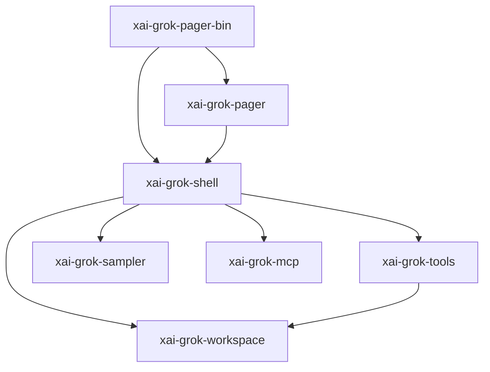

Composition root dispatches TUI vs headless vs ACP vs leader into shell/pager.

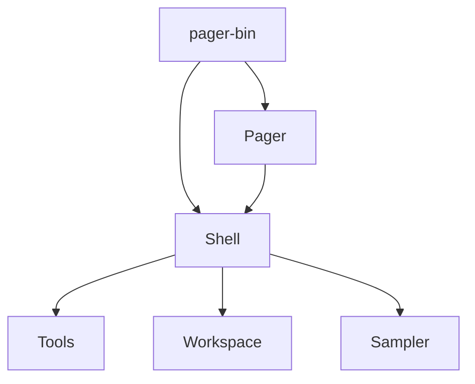

## Used by

- [entrypoint](wiki/entrypoints/main.md)
- All product features under `wiki/features/`
- [common](wiki/systems/common.md) shared leaves

## Blast radius

API or behavior changes in any listed crate can ship in the `grok` binary. Prefer per-crate tests; validate pager-bin integration for cross-crate features.

## See also

- [xai-grok-pager.md](wiki/systems/xai-grok-pager.md)
- [xai-grok-shell.md](wiki/systems/xai-grok-shell.md)
- [xai-grok-tools.md](wiki/systems/xai-grok-tools.md)
- [xai-grok-workspace.md](wiki/systems/xai-grok-workspace.md)
- [common.md](wiki/systems/common.md)

---


# common — shared leaf crates

## What it is

Shared leaf libraries used by the CLI closure (not process entrypoints).

| Crate | `.rs` | Wiki page |
|-------|------:|-----------|
| `xai-grok-compaction` | 33 | [xai-grok-compaction.md](wiki/systems/xai-grok-compaction.md) |
| `xai-computer-hub-sdk` | 21 | [xai-computer-hub-sdk.md](wiki/systems/xai-computer-hub-sdk.md) |
| `xai-tool-protocol` | 21 | [xai-tool-protocol.md](wiki/systems/xai-tool-protocol.md) |
| `xai-circuit-breaker` | 18 | [xai-circuit-breaker.md](wiki/systems/xai-circuit-breaker.md) |
| `xai-tool-runtime` | 18 | [xai-tool-runtime.md](wiki/systems/xai-tool-runtime.md) |
| `xai-computer-hub-core` | 15 | [xai-computer-hub-core.md](wiki/systems/xai-computer-hub-core.md) |
| `xai-tracing` | 8 | [xai-tracing.md](wiki/systems/xai-tracing.md) |
| `xai-test-utils` | 6 | [xai-test-utils.md](wiki/systems/xai-test-utils.md) |
| `xai-tool-types` | 6 | [xai-tool-types.md](wiki/systems/xai-tool-types.md) |
| `xai-computer-hub-mcp-adapter` | 5 | [xai-computer-hub-mcp-adapter.md](wiki/systems/xai-computer-hub-mcp-adapter.md) |
| `xai-interjection-core` | 4 | [xai-interjection-core.md](wiki/systems/xai-interjection-core.md) |

## How it works

These crates are dependency targets. Tool protocol + runtime feed `xai-grok-tools`; compaction is used by long sessions; computer-hub supports remote tool execution.

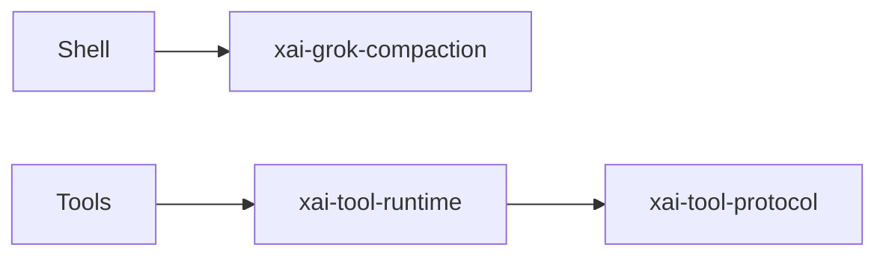

## Used by

- Parent consumers in [codegen](wiki/systems/codegen.md)
- Per-crate pages linked in the table above

## Blast radius

Wire/protocol changes break tools and MCP; compaction changes alter long-session behavior and cost.

## See also

- [xai-tool-protocol.md](wiki/systems/xai-tool-protocol.md)
- [xai-grok-compaction.md](wiki/systems/xai-grok-compaction.md)
- [codegen.md](wiki/systems/codegen.md)

---

<!-- okf:coverage-generated -->
# Component Coverage

> Generated by `okf-coverage-check.sh` — do not hand-edit (except deferral reasons in the manifest).
> Required components documented: 16/16 (100%).

| Component | Wiki page | Status | Fan-in |
|-----------|-----------|--------|--------|
| `systems/codegen` | [page](wiki/systems/codegen.md) | Full | 0 |
| `systems/common` | [page](wiki/systems/common.md) | Full | 0 |
| `systems/str` | [page](wiki/systems/str.md) | Full | 0 |
| `systems/list` | [page](wiki/systems/list.md) | Full | 0 |
| `systems/dict` | [page](wiki/systems/dict.md) | Full | 0 |
| `systems/cargo` | [page](wiki/systems/cargo.md) | Full | 0 |
| `systems/int` | [page](wiki/systems/int.md) | Full | 0 |
| `entrypoints/main` | [page](wiki/entrypoints/main.md) | Full | 0 |
| `systems/mermaid-to-svg` | [page](wiki/systems/mermaid-to-svg.md) | Full | 0 |
| `systems/dagre-rust` | [page](wiki/systems/dagre-rust.md) | Full | 0 |
| `systems/mc` | [page](wiki/systems/mc.md) | Full | 0 |
| `systems/graphlib-rust` | [page](wiki/systems/graphlib-rust.md) | Full | 0 |
| `systems/ordered-hashmap` | [page](wiki/systems/ordered-hashmap.md) | Full | 0 |
| `systems/build` | [page](wiki/systems/build.md) | Full | 0 |
| `systems/profile` | [page](wiki/systems/profile.md) | Full | 0 |
| `systems/workspace` | [page](wiki/systems/workspace.md) | Full | 0 |

---


# dagre_rust — Dagre layout

## What it is

`dagre_rust` is a Cargo workspace member at `third_party/dagre_rust` (24 `.rs` files).

Rust crate `dagre_rust` at `third_party/dagre_rust`.

**Role:** Dagre layout. [Graph: approximate via crate tree; Human:Synthesis from lib.rs docs]

## How it works

Primary surface is `src/lib.rs`.

Notable workspace dependencies (from crate Cargo.toml, truncated): `graphlib_rust`, `ordered_hashmap`.

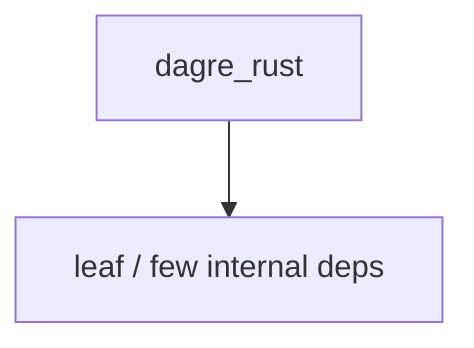

## Used by

- Parent cluster: [mermaid-to-svg](wiki/systems/mermaid-to-svg.md)
- Other crates that depend on this package (see Cargo graph / `cargo tree -p dagre_rust`)

## Blast radius

Changes affect any consumer of `dagre_rust` in the workspace. Run `cargo test -p dagre_rust` and re-check dependent top crates (`xai-grok-shell`, `xai-grok-pager`, `xai-grok-tools`) when public APIs move.

## See also

- [systems/mermaid-to-svg.md](wiki/systems/mermaid-to-svg.md)
- [entrypoint](wiki/entrypoints/main.md)
- Workspace root `Cargo.toml` (generated — do not hand-edit)

## Notes

- Prefer `cargo check -p dagre_rust` / `cargo test -p dagre_rust` for this crate.
- Full workspace builds are slow; target the crate under change.
- See root README for build prerequisites (Rust toolchain, protoc).

---


# dict — graph label → see xai-grok-config

## What it is

**This is not a Cargo crate.** The knowledge-graph engine clustered a low-node package labeled `dict`.

Map-like settings live in config types — not a package boundary.

**Canonical page:** [xai-grok-config.md](wiki/systems/xai-grok-config.md)

## How it works

Do not implement features under a `dict` module path. Route work to `xai-grok-config` and related crates in the [codegen catalog](wiki/systems/codegen.md).

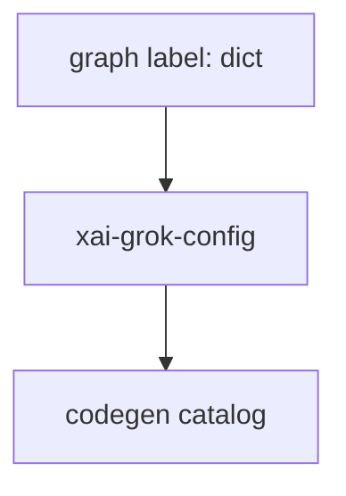

## Used by

- Agents misrouted by graph package list
- [codegen.md](wiki/systems/codegen.md) parent map

## Blast radius

Mis-editing as if `dict` were a module wastes time. Always open `xai-grok-config` sources instead.

## See also

- [xai-grok-config.md](wiki/systems/xai-grok-config.md)
- [codegen.md](wiki/systems/codegen.md)

## Notes

- Prefer `cargo check -p dict` / `cargo test -p dict` for this crate.
- Full workspace builds are slow; target the crate under change.
- See root README for build prerequisites (Rust toolchain, protoc).

---


# graphlib_rust — Graphlib

## What it is

`graphlib_rust` is a Cargo workspace member at `third_party/graphlib_rust` (6 `.rs` files).

Rust crate `graphlib_rust` at `third_party/graphlib_rust`.

**Role:** Graphlib. [Graph: approximate via crate tree; Human:Synthesis from lib.rs docs]

## How it works

Primary surface is `src/lib.rs`.

Notable workspace dependencies (from crate Cargo.toml, truncated): `ordered_hashmap`.

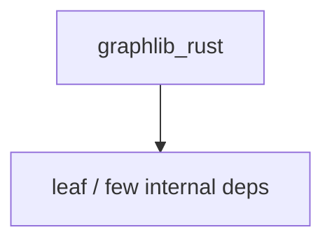

## Used by

- Parent cluster: [mermaid-to-svg](wiki/systems/mermaid-to-svg.md)
- Other crates that depend on this package (see Cargo graph / `cargo tree -p graphlib_rust`)

## Blast radius

Changes affect any consumer of `graphlib_rust` in the workspace. Run `cargo test -p graphlib_rust` and re-check dependent top crates (`xai-grok-shell`, `xai-grok-pager`, `xai-grok-tools`) when public APIs move.

## See also

- [systems/mermaid-to-svg.md](wiki/systems/mermaid-to-svg.md)
- [entrypoint](wiki/entrypoints/main.md)
- Workspace root `Cargo.toml` (generated — do not hand-edit)

## Notes

- Prefer `cargo check -p graphlib_rust` / `cargo test -p graphlib_rust` for this crate.
- Full workspace builds are slow; target the crate under change.
- See root README for build prerequisites (Rust toolchain, protoc).

---


# int — graph label → see xai-token-estimation

## What it is

**This is not a Cargo crate.** The knowledge-graph engine clustered a low-node package labeled `int`.

Numeric helpers are scattered; token estimation is one real crate.

**Canonical page:** [xai-token-estimation.md](wiki/systems/xai-token-estimation.md)

## How it works

Do not implement features under a `int` module path. Route work to `xai-token-estimation` and related crates in the [codegen catalog](wiki/systems/codegen.md).

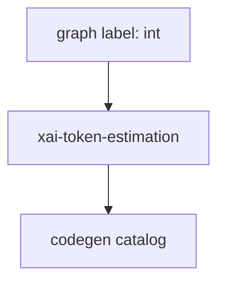

## Used by

- Agents misrouted by graph package list
- [codegen.md](wiki/systems/codegen.md) parent map

## Blast radius

Mis-editing as if `int` were a module wastes time. Always open `xai-token-estimation` sources instead.

## See also

- [xai-token-estimation.md](wiki/systems/xai-token-estimation.md)
- [codegen.md](wiki/systems/codegen.md)

## Notes

- Prefer `cargo check -p int` / `cargo test -p int` for this crate.
- Full workspace builds are slow; target the crate under change.
- See root README for build prerequisites (Rust toolchain, protoc).

---


# list — graph label → see xai-grok-shell

## What it is

**This is not a Cargo crate.** The knowledge-graph engine clustered a low-node package labeled `list`.

List UIs live in pager/shell session listing — not a package boundary.

**Canonical page:** [xai-grok-shell.md](wiki/systems/xai-grok-shell.md)

## How it works

Do not implement features under a `list` module path. Route work to `xai-grok-shell` and related crates in the [codegen catalog](wiki/systems/codegen.md).

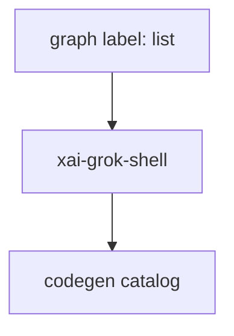

## Used by

- Agents misrouted by graph package list
- [codegen.md](wiki/systems/codegen.md) parent map

## Blast radius

Mis-editing as if `list` were a module wastes time. Always open `xai-grok-shell` sources instead.

## See also

- [xai-grok-shell.md](wiki/systems/xai-grok-shell.md)
- [codegen.md](wiki/systems/codegen.md)

## Notes

- Prefer `cargo check -p list` / `cargo test -p list` for this crate.
- Full workspace builds are slow; target the crate under change.
- See root README for build prerequisites (Rust toolchain, protoc).

---


# mc — cli-chat-proxy shared types

## What it is


`prod/mc/cli-chat-proxy-types` defines **shared serialization types** for the CLI ↔ chat-proxy boundary (session, storage, feedback, sandbox, deployment config, client metrics, subagent bundles). [Graph:High — package `mc`]

Provenance: graph package inventory + repository layout synthesis. Agents should open grounded paths rather than treat this page as complete implementation documentation.

## How it works

Pure types crate (serde-facing). Codegen shell/agent code imports these to speak the proxy's contract without embedding server code in the OSS tree.

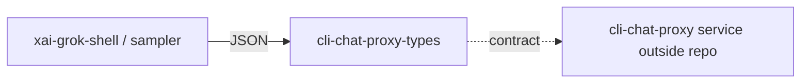

## Used by

- [codegen](wiki/systems/codegen.md) agent/session/upload paths that talk to xAI backends

## Blast radius

Field renames or enum changes break CLI↔proxy compatibility across version skew. Coordinate with proxy deploy when evolving types.

## See also

- [codegen](wiki/systems/codegen.md)
- [common](wiki/systems/common.md)

## Notes

- Supporting detail 1: keep graph package labels distinct from Cargo crate names when routing edits.
- Supporting detail 2: keep graph package labels distinct from Cargo crate names when routing edits.
- Supporting detail 3: keep graph package labels distinct from Cargo crate names when routing edits.
- Supporting detail 4: keep graph package labels distinct from Cargo crate names when routing edits.
- Supporting detail 5: keep graph package labels distinct from Cargo crate names when routing edits.

---


# mermaid-to-svg — Mermaid→SVG

## What it is

`mermaid-to-svg` is a Cargo workspace member at `third_party/mermaid-to-svg` (35 `.rs` files).

Rust crate `mermaid-to-svg` at `third_party/mermaid-to-svg`.

**Role:** Mermaid→SVG. [Graph: approximate via crate tree; Human:Synthesis from lib.rs docs]

## How it works

Primary surface is `src/lib.rs`.

Notable workspace dependencies (from crate Cargo.toml, truncated): `thiserror`, `dagre_rust`, `graphlib_rust`, `unicode-segmentation`, `unicode-width`, `serde_yaml`.

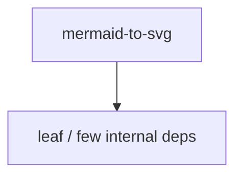

## Used by

- Parent cluster: [mermaid-to-svg](wiki/systems/mermaid-to-svg.md)
- Other crates that depend on this package (see Cargo graph / `cargo tree -p mermaid-to-svg`)

## Blast radius

Changes affect any consumer of `mermaid-to-svg` in the workspace. Run `cargo test -p mermaid-to-svg` and re-check dependent top crates (`xai-grok-shell`, `xai-grok-pager`, `xai-grok-tools`) when public APIs move.

## See also

- [systems/mermaid-to-svg.md](wiki/systems/mermaid-to-svg.md)
- [entrypoint](wiki/entrypoints/main.md)
- Workspace root `Cargo.toml` (generated — do not hand-edit)

## Notes

- Prefer `cargo check -p mermaid-to-svg` / `cargo test -p mermaid-to-svg` for this crate.
- Full workspace builds are slow; target the crate under change.
- See root README for build prerequisites (Rust toolchain, protoc).

---


# ordered_hashmap — Ordered map

## What it is

`ordered_hashmap` is a Cargo workspace member at `third_party/ordered_hashmap` (1 `.rs` files).

Rust crate `ordered_hashmap` at `third_party/ordered_hashmap`.

**Role:** Ordered map. [Graph: approximate via crate tree; Human:Synthesis from lib.rs docs]

## How it works

Primary surface is `src/lib.rs`.

Notable workspace dependencies (from crate Cargo.toml, truncated): (few/none listed).

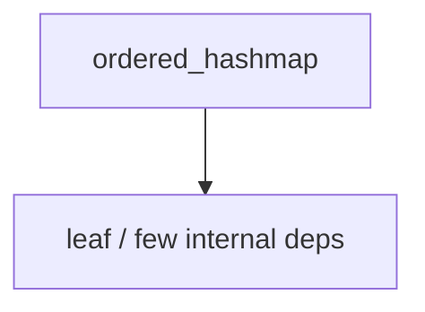

## Used by

- Parent cluster: [mermaid-to-svg](wiki/systems/mermaid-to-svg.md)
- Other crates that depend on this package (see Cargo graph / `cargo tree -p ordered_hashmap`)

## Blast radius

Changes affect any consumer of `ordered_hashmap` in the workspace. Run `cargo test -p ordered_hashmap` and re-check dependent top crates (`xai-grok-shell`, `xai-grok-pager`, `xai-grok-tools`) when public APIs move.

## See also

- [systems/mermaid-to-svg.md](wiki/systems/mermaid-to-svg.md)
- [entrypoint](wiki/entrypoints/main.md)
- Workspace root `Cargo.toml` (generated — do not hand-edit)

## Notes

- Prefer `cargo check -p ordered_hashmap` / `cargo test -p ordered_hashmap` for this crate.
- Full workspace builds are slow; target the crate under change.
- See root README for build prerequisites (Rust toolchain, protoc).

---


# profile — graph label → see xai-grok-shell-base

## What it is

**This is not a Cargo crate.** The knowledge-graph engine clustered a low-node package labeled `profile`.

CPU profiling lives in shell-base; --agent-profile is CLI path resolution.

**Canonical page:** [xai-grok-shell-base.md](wiki/systems/xai-grok-shell-base.md)

## How it works

Do not implement features under a `profile` module path. Route work to `xai-grok-shell-base` and related crates in the [codegen catalog](wiki/systems/codegen.md).

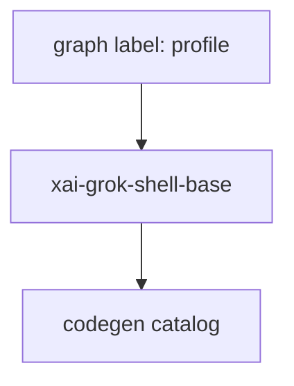

## Used by

- Agents misrouted by graph package list
- [codegen.md](wiki/systems/codegen.md) parent map

## Blast radius

Mis-editing as if `profile` were a module wastes time. Always open `xai-grok-shell-base` sources instead.

## See also

- [xai-grok-shell-base.md](wiki/systems/xai-grok-shell-base.md)
- [codegen.md](wiki/systems/codegen.md)

## Notes

- Prefer `cargo check -p profile` / `cargo test -p profile` for this crate.
- Full workspace builds are slow; target the crate under change.
- See root README for build prerequisites (Rust toolchain, protoc).

---


# ptyctl-cli — PTY control CLI

## What it is

`ptyctl-cli` is a Cargo workspace member at `crates/codegen/ptyctl-cli` (6 `.rs` files).

Rust crate `ptyctl-cli` at `crates/codegen/ptyctl-cli`.

**Role:** PTY control CLI. [Graph: approximate via crate tree; Human:Synthesis from lib.rs docs]

## How it works

Primary surface is `src/lib.rs` and `src/main.rs`.

Notable workspace dependencies (from crate Cargo.toml, truncated): `ptyctl`, `axum`, `clap`, `reqwest`, `tokio`, `serde`, `serde_json`, `anyhow`.

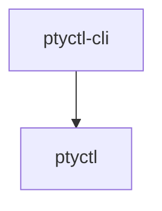

## Used by

- Parent cluster: [codegen](wiki/systems/codegen.md)
- Other crates that depend on this package (see Cargo graph / `cargo tree -p ptyctl-cli`)

## Blast radius

Changes affect any consumer of `ptyctl-cli` in the workspace. Run `cargo test -p ptyctl-cli` and re-check dependent top crates (`xai-grok-shell`, `xai-grok-pager`, `xai-grok-tools`) when public APIs move.

## See also

- [systems/codegen.md](wiki/systems/codegen.md)
- [entrypoint](wiki/entrypoints/main.md)
- Workspace root `Cargo.toml` (generated — do not hand-edit)

## Notes

- Prefer `cargo check -p ptyctl-cli` / `cargo test -p ptyctl-cli` for this crate.
- Full workspace builds are slow; target the crate under change.
- See root README for build prerequisites (Rust toolchain, protoc).

---


# ptyctl — PTY control lib

## What it is

`ptyctl` is a Cargo workspace member at `crates/codegen/ptyctl` (8 `.rs` files).

ptyctl — Headless PTY controller built on alacritty_terminal.  Provides programmatic control of terminal sessions: spawn processes in a PTY, send keystrokes, read screen content as text/styled/HTML, and expose it all via HTTP REST API.

**Role:** PTY control lib. [Graph: approximate via crate tree; Human:Synthesis from lib.rs docs]

## How it works

Primary surface is `src/lib.rs`.

Notable workspace dependencies (from crate Cargo.toml, truncated): `alacritty_terminal`, `portable-pty`, `terminput`, `tokio`, `axum`, `futures-util`, `tower-http`, `serde`.

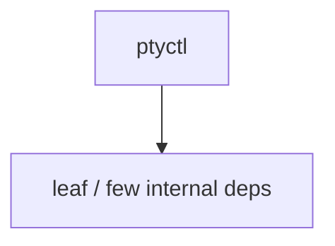

## Used by

- Parent cluster: [codegen](wiki/systems/codegen.md)
- Other crates that depend on this package (see Cargo graph / `cargo tree -p ptyctl`)

## Blast radius

Changes affect any consumer of `ptyctl` in the workspace. Run `cargo test -p ptyctl` and re-check dependent top crates (`xai-grok-shell`, `xai-grok-pager`, `xai-grok-tools`) when public APIs move.

## See also

- [systems/codegen.md](wiki/systems/codegen.md)
- [entrypoint](wiki/entrypoints/main.md)
- Workspace root `Cargo.toml` (generated — do not hand-edit)

## Notes

- Prefer `cargo check -p ptyctl` / `cargo test -p ptyctl` for this crate.
- Full workspace builds are slow; target the crate under change.
- See root README for build prerequisites (Rust toolchain, protoc).

---


# str — graph label → see xai-grok-secrets

## What it is

**This is not a Cargo crate.** The knowledge-graph engine clustered a low-node package labeled `str`.

String/secret handling is not a package; see secrets sanitizer and string-heavy crates.

**Canonical page:** [xai-grok-secrets.md](wiki/systems/xai-grok-secrets.md)

## How it works

Do not implement features under a `str` module path. Route work to `xai-grok-secrets` and related crates in the [codegen catalog](wiki/systems/codegen.md).

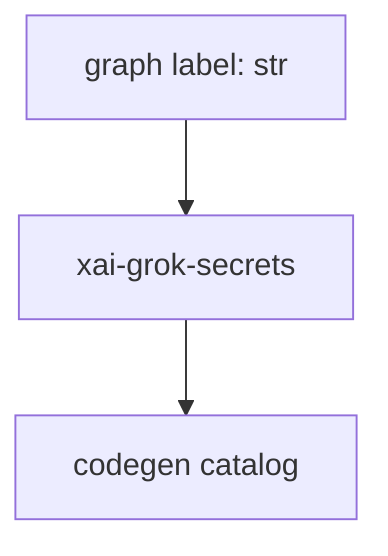

## Used by

- Agents misrouted by graph package list
- [codegen.md](wiki/systems/codegen.md) parent map

## Blast radius

Mis-editing as if `str` were a module wastes time. Always open `xai-grok-secrets` sources instead.

## See also

- [xai-grok-secrets.md](wiki/systems/xai-grok-secrets.md)
- [codegen.md](wiki/systems/codegen.md)

## Notes

- Prefer `cargo check -p str` / `cargo test -p str` for this crate.
- Full workspace builds are slow; target the crate under change.
- See root README for build prerequisites (Rust toolchain, protoc).

---


# workspace — graph label → see xai-grok-workspace

## What it is

**This is not a Cargo crate.** The knowledge-graph engine clustered a low-node package labeled `workspace`.

Prefer the real `xai-grok-workspace` crate page.

**Canonical page:** [xai-grok-workspace.md](wiki/systems/xai-grok-workspace.md)

## How it works

Do not implement features under a `workspace` module path. Route work to `xai-grok-workspace` and related crates in the [codegen catalog](wiki/systems/codegen.md).

```mermaid
flowchart TB
  Noise["graph label: workspace"] --> Real["xai-grok-workspace"]
  Real --> Codegen[codegen catalog]
```

## Used by

- Agents misrouted by graph package list
- [codegen.md](wiki/systems/codegen.md) parent map

## Blast radius

Mis-editing as if `workspace` were a module wastes time. Always open `xai-grok-workspace` sources instead.

## See also

- [xai-grok-workspace.md](wiki/systems/xai-grok-workspace.md)
- [codegen.md](wiki/systems/codegen.md)

## Notes

- Prefer `cargo check -p workspace` / `cargo test -p workspace` for this crate.
- Full workspace builds are slow; target the crate under change.
- See root README for build prerequisites (Rust toolchain, protoc).

---


# xai-acp-lib — ACP protocol lib

## What it is

`xai-acp-lib` is a Cargo workspace member at `crates/codegen/xai-acp-lib` (8 `.rs` files).

Rust crate `xai-acp-lib` at `crates/codegen/xai-acp-lib`.

**Role:** ACP protocol lib. [Graph: approximate via crate tree; Human:Synthesis from lib.rs docs]

## How it works

Primary surface is `src/lib.rs`.

Notable workspace dependencies (from crate Cargo.toml, truncated): `agent-client-protocol`, `async-trait`, `derive_more`, `futures`, `serde.workspace`, `tokio`, `tracing`, `serde_json.workspace`.

```mermaid
flowchart TB
  C["xai-acp-lib"]
  C --> Leaf["leaf / few internal deps"]
```

## Used by

- Parent cluster: [codegen](wiki/systems/codegen.md)
- Other crates that depend on this package (see Cargo graph / `cargo tree -p xai-acp-lib`)

## Blast radius

Changes affect any consumer of `xai-acp-lib` in the workspace. Run `cargo test -p xai-acp-lib` and re-check dependent top crates (`xai-grok-shell`, `xai-grok-pager`, `xai-grok-tools`) when public APIs move.

## See also

- [systems/codegen.md](wiki/systems/codegen.md)
- [entrypoint](wiki/entrypoints/main.md)
- Workspace root `Cargo.toml` (generated — do not hand-edit)

## Notes

- Prefer `cargo check -p xai-acp-lib` / `cargo test -p xai-acp-lib` for this crate.
- Full workspace builds are slow; target the crate under change.
- See root README for build prerequisites (Rust toolchain, protoc).

---


# xai-agent-lifecycle — Agent lifecycle

## What it is

`xai-agent-lifecycle` is a Cargo workspace member at `crates/codegen/xai-agent-lifecycle` (15 `.rs` files).

Host-agnostic agent lifecycle hooks shared by multiple agent hosts (e.g. xai-grok-shell). Contributors receive data-only per-hook inputs at dispatch time; anything they act through is a capability injected at install time, and they never own loop control.

**Role:** Agent lifecycle. [Graph: approximate via crate tree; Human:Synthesis from lib.rs docs]

## How it works

Primary surface is `src/lib.rs`.

Notable workspace dependencies (from crate Cargo.toml, truncated): `async-trait`, `tracing`.

```mermaid
flowchart TB
  C["xai-agent-lifecycle"]
  C --> Leaf["leaf / few internal deps"]
```

## Used by

- Parent cluster: [codegen](wiki/systems/codegen.md)
- Other crates that depend on this package (see Cargo graph / `cargo tree -p xai-agent-lifecycle`)

## Blast radius

Changes affect any consumer of `xai-agent-lifecycle` in the workspace. Run `cargo test -p xai-agent-lifecycle` and re-check dependent top crates (`xai-grok-shell`, `xai-grok-pager`, `xai-grok-tools`) when public APIs move.

## See also

- [systems/codegen.md](wiki/systems/codegen.md)
- [entrypoint](wiki/entrypoints/main.md)
- Workspace root `Cargo.toml` (generated — do not hand-edit)

## Notes

- Prefer `cargo check -p xai-agent-lifecycle` / `cargo test -p xai-agent-lifecycle` for this crate.
- Full workspace builds are slow; target the crate under change.
- See root README for build prerequisites (Rust toolchain, protoc).

---


# xai-chat-state — Chat state actor

## What it is

`xai-chat-state` is a Cargo workspace member at `crates/codegen/xai-chat-state` (17 `.rs` files).

xai-chat-state — Actor-based chat state management for xAI agents.  This crate extracts conversation state management from `xai-grok-shell`'s `acp_session.rs` into a standalone actor. It follows the same actor pattern as `xai-hunk-tracker`:  ```text ┌────────────────┐                  ┌──────────────────────────────────────┐ │ SessionActor   │ ─── Command ───▶ │        ChatStateActor              

**Role:** Chat state actor. [Graph: approximate via crate tree; Human:Synthesis from lib.rs docs]

## How it works

Primary surface is `src/lib.rs`.

Notable workspace dependencies (from crate Cargo.toml, truncated): `indexmap`, `regex`, `serde`, `serde_json`, `strum`, `tokio`, `tokio-util`, `tracing`.

```mermaid
flowchart TB
  C["xai-chat-state"]
  D0["xai-grok-compaction"]
  C --> D0
  D1["xai-grok-sampling-types"]
  C --> D1
  D2["xai-token-estimation"]
  C --> D2
```

## Used by

- Parent cluster: [codegen](wiki/systems/codegen.md)
- Other crates that depend on this package (see Cargo graph / `cargo tree -p xai-chat-state`)

## Blast radius

Changes affect any consumer of `xai-chat-state` in the workspace. Run `cargo test -p xai-chat-state` and re-check dependent top crates (`xai-grok-shell`, `xai-grok-pager`, `xai-grok-tools`) when public APIs move.

## See also

- [systems/codegen.md](wiki/systems/codegen.md)
- [entrypoint](wiki/entrypoints/main.md)
- Workspace root `Cargo.toml` (generated — do not hand-edit)

---


# xai-circuit-breaker — Circuit breaker

## What it is

`xai-circuit-breaker` is a Cargo workspace member at `crates/common/xai-circuit-breaker` (18 `.rs` files).

Shared HTTP circuit breaker.  Sliding-window-with-min-samples algorithm: the breaker trips when `sample_count >= min_samples AND error_rate >= error_rate_threshold` over the live window. Server- and client-side consumers run the same state machine and pick a preset via `BreakerConfig::server` or `BreakerConfig::client`.

**Role:** Circuit breaker. [Graph: approximate via crate tree; Human:Synthesis from lib.rs docs]

## How it works

Primary surface is `src/lib.rs`.

Notable workspace dependencies (from crate Cargo.toml, truncated): `log`.

```mermaid
flowchart TB
  C["xai-circuit-breaker"]
  C --> Leaf["leaf / few internal deps"]
```

## Used by

- Parent cluster: [common](wiki/systems/common.md)
- Other crates that depend on this package (see Cargo graph / `cargo tree -p xai-circuit-breaker`)

## Blast radius

Changes affect any consumer of `xai-circuit-breaker` in the workspace. Run `cargo test -p xai-circuit-breaker` and re-check dependent top crates (`xai-grok-shell`, `xai-grok-pager`, `xai-grok-tools`) when public APIs move.

## See also

- [systems/common.md](wiki/systems/common.md)
- [entrypoint](wiki/entrypoints/main.md)
- Workspace root `Cargo.toml` (generated — do not hand-edit)

## Notes

- Prefer `cargo check -p xai-circuit-breaker` / `cargo test -p xai-circuit-breaker` for this crate.
- Full workspace builds are slow; target the crate under change.
- See root README for build prerequisites (Rust toolchain, protoc).

---


# xai-codebase-graph — Code index graph

## What it is

`xai-codebase-graph` is a Cargo workspace member at `crates/codegen/xai-codebase-graph` (28 `.rs` files).

# xai-codebase-graph  High-performance code graph generation using tree-sitter queries.  This crate provides: - **Go-to-definitions**: Find where symbols are defined - **Go-to-references**: Find where symbols are used - **Initial repository indexing**: Build the full index from scratch - **Incremental reindexing**: Update the index based on file system events - **Parallel processing**: Uses rayon 

**Role:** Code index graph. [Graph: approximate via crate tree; Human:Synthesis from lib.rs docs]

## How it works

Primary surface is `src/lib.rs`.

Notable workspace dependencies (from crate Cargo.toml, truncated): `dunce`, `xai-grok-paths`, `petgraph`, `serde`, `serde_json`, `rayon`, `crossbeam`, `num_cpus`.

```mermaid
flowchart TB
  C["xai-codebase-graph"]
  D0["xai-grok-paths"]
  C --> D0
```

## Used by

- Parent cluster: [codegen](wiki/systems/codegen.md)
- Other crates that depend on this package (see Cargo graph / `cargo tree -p xai-codebase-graph`)

## Blast radius

Changes affect any consumer of `xai-codebase-graph` in the workspace. Run `cargo test -p xai-codebase-graph` and re-check dependent top crates (`xai-grok-shell`, `xai-grok-pager`, `xai-grok-tools`) when public APIs move.

## See also

- [systems/codegen.md](wiki/systems/codegen.md)
- [entrypoint](wiki/entrypoints/main.md)
- Workspace root `Cargo.toml` (generated — do not hand-edit)

## Notes

- Prefer `cargo check -p xai-codebase-graph` / `cargo test -p xai-codebase-graph` for this crate.
- Full workspace builds are slow; target the crate under change.
- See root README for build prerequisites (Rust toolchain, protoc).

---


# xai-computer-hub-core — Computer hub core

## What it is

`xai-computer-hub-core` is a Cargo workspace member at `crates/common/xai-computer-hub-core` (15 `.rs` files).

xAI Computer Hub — transport + registry + resolver core.  Object-safe abstractions used by every router build: a `Transport` that authorises and dispatches calls, a `ToolRegistry` trait shared by both storage planes, a `CompoundResolver` that applies the local-shadows-remote rule, and the local + remote transports plus inner-dispatch glue that sit on top.

**Role:** Computer hub core. [Graph: approximate via crate tree; Human:Synthesis from lib.rs docs]

## How it works

Primary surface is `src/lib.rs`.

Notable workspace dependencies (from crate Cargo.toml, truncated): `async-trait`, `chrono`, `futures`, `serde_json`, `tracing`, `xai-tool-protocol`, `xai-tool-runtime`, `xai-tool-types`.

```mermaid
flowchart TB
  C["xai-computer-hub-core"]
  D0["xai-tool-protocol"]
  C --> D0
  D1["xai-tool-runtime"]
  C --> D1
  D2["xai-tool-types"]
  C --> D2
```

## Used by

- Parent cluster: [common](wiki/systems/common.md)
- Other crates that depend on this package (see Cargo graph / `cargo tree -p xai-computer-hub-core`)

## Blast radius

Changes affect any consumer of `xai-computer-hub-core` in the workspace. Run `cargo test -p xai-computer-hub-core` and re-check dependent top crates (`xai-grok-shell`, `xai-grok-pager`, `xai-grok-tools`) when public APIs move.

## See also

- [systems/common.md](wiki/systems/common.md)
- [entrypoint](wiki/entrypoints/main.md)
- Workspace root `Cargo.toml` (generated — do not hand-edit)

---


# xai-computer-hub-mcp-adapter — Hub MCP adapter

## What it is

`xai-computer-hub-mcp-adapter` is a Cargo workspace member at `crates/common/xai-computer-hub-mcp-adapter` (5 `.rs` files).

Unified MCP adapter for the xAI Computer Hub.  This crate bridges MCP (Model Context Protocol) servers into the computer hub's tool routing infrastructure. An `McpBridge` connects to an MCP server via an `McpTransport`, discovers the server's tools, and produces `ToolServerHandler` implementations that can be registered with a hub `ToolServerBuilder`
**Role:** Hub MCP adapter. [Graph: approximate via crate tree; Human:Synthesis from lib.rs docs]

## How it works

Primary surface is `src/lib.rs`.

Notable workspace dependencies (from crate Cargo.toml, truncated): `async-trait`, `serde`, `serde_json`, `thiserror`, `tokio`, `tracing`, `prometheus`, `xai-tool-protocol`.

```mermaid
flowchart TB
  C["xai-computer-hub-mcp-adapter"]
  D0["xai-tool-protocol"]
  C --> D0
  D1["xai-tool-runtime"]
  C --> D1
  D2["xai-tool-types"]
  C --> D2
  D3["xai-computer-hub-sdk"]
  C --> D3
```

## Used by

- Parent cluster: [common](wiki/systems/common.md)
- Other crates that depend on this package (see Cargo graph / `cargo tree -p xai-computer-hub-mcp-adapter`)

## Blast radius

Changes affect any consumer of `xai-computer-hub-mcp-adapter` in the workspace. Run `cargo test -p xai-computer-hub-mcp-adapter` and re-check dependent top crates (`xai-grok-shell`, `xai-grok-pager`, `xai-grok-tools`) when public APIs move.

## See also

- [systems/common.md](wiki/systems/common.md)
- [entrypoint](wiki/entrypoints/main.md)
- Workspace root `Cargo.toml` (generated — do not hand-edit)

---


# xai-computer-hub-sdk — Computer hub SDK

## What it is

`xai-computer-hub-sdk` is a Cargo workspace member at `crates/common/xai-computer-hub-sdk` (21 `.rs` files).

Tool-server and harness SDK.  Single crate hosting both the tool-server runtime and the harness-side dispatch surface. The shared substrate — `HubConnectionPool`, `HubConnection`, the inbound demux, the refcount-managed bound-session set, and the transparent reconnect / replay state machine — lives here so both ends speak through one frame multiplex on top of one WebSocket per `(url, principal

**Role:** Computer hub SDK. [Graph: approximate via crate tree; Human:Synthesis from lib.rs docs]

## How it works

Primary surface is `src/lib.rs`.

Notable workspace dependencies (from crate Cargo.toml, truncated): `tokio`, `tokio-tungstenite`, `tokio-util`, `futures`, `serde`, `serde_json`, `dashmap`, `indexmap`.

```mermaid
flowchart TB
  C["xai-computer-hub-sdk"]
  C --> Leaf["leaf / few internal deps"]
```

## Used by

- Parent cluster: [common](wiki/systems/common.md)
- Other crates that depend on this package (see Cargo graph / `cargo tree -p xai-computer-hub-sdk`)

## Blast radius

Changes affect any consumer of `xai-computer-hub-sdk` in the workspace. Run `cargo test -p xai-computer-hub-sdk` and re-check dependent top crates (`xai-grok-shell`, `xai-grok-pager`, `xai-grok-tools`) when public APIs move.

## See also

- [systems/common.md](wiki/systems/common.md)
- [entrypoint](wiki/entrypoints/main.md)
- Workspace root `Cargo.toml` (generated — do not hand-edit)

## Notes

- Prefer `cargo check -p xai-computer-hub-sdk` / `cargo test -p xai-computer-hub-sdk` for this crate.
- Full workspace builds are slow; target the crate under change.
- See root README for build prerequisites (Rust toolchain, protoc).

---


# xai-crash-handler — Workspace crate

## What it is

`xai-crash-handler` is a Cargo workspace member at `crates/codegen/xai-crash-handler` (6 `.rs` files).

Cross-platform crash handler with startup crash detection.  - **Unix**: SIGBUS/SIGSEGV via `sigaction(2)`. - **Windows**: access violations via `SetUnhandledExceptionFilter`.  # Usage  Call `check_previous_crash` first to detect crashes from the previous session, then `install` early in `main()`, before any async runtime or thread spawning. `check_previous_crash` must run before `install` beca

**Role:** Workspace crate. [Graph: approximate via crate tree; Human:Synthesis from lib.rs docs]

## How it works

Primary surface is `src/lib.rs`.

Notable workspace dependencies (from crate Cargo.toml, truncated): `backtrace`.

```mermaid
flowchart TB
  C["xai-crash-handler"]
  C --> Leaf["leaf / few internal deps"]
```

## Used by

- Parent cluster: [codegen](wiki/systems/codegen.md)
- Other crates that depend on this package (see Cargo graph / `cargo tree -p xai-crash-handler`)

## Blast radius

Changes affect any consumer of `xai-crash-handler` in the workspace. Run `cargo test -p xai-crash-handler` and re-check dependent top crates (`xai-grok-shell`, `xai-grok-pager`, `xai-grok-tools`) when public APIs move.

## See also

- [systems/codegen.md](wiki/systems/codegen.md)
- [entrypoint](wiki/entrypoints/main.md)
- Workspace root `Cargo.toml` (generated — do not hand-edit)

## Notes

- Prefer `cargo check -p xai-crash-handler` / `cargo test -p xai-crash-handler` for this crate.
- Full workspace builds are slow; target the crate under change.
- See root README for build prerequisites (Rust toolchain, protoc).

---


# xai-fast-worktree — Fast git worktrees

## What it is

`xai-fast-worktree` is a Cargo workspace member at `crates/codegen/xai-fast-worktree` (36 `.rs` files).

High-performance git worktree creation using CoW cloning.  This crate provides fast worktree creation by: 1. Using `git worktree add --no-checkout` (instant metadata creation) 2. Parallel CoW file cloning with hash-based sharding 3. Optional dirty file replication and ignored file copying 4. BTRFS snapshot support on Linux for O(1) cloning 5. Worktree sync API for pre-created worktree pools 6. SQL

**Role:** Fast git worktrees. [Graph: approximate via crate tree; Human:Synthesis from lib.rs docs]

## How it works

Primary surface is `src/lib.rs`.

Notable workspace dependencies (from crate Cargo.toml, truncated): `anyhow`, `bytes`, `clap`, `crossbeam`, `dashmap`, `dunce`, `gix`, `gix-status`.

```mermaid
flowchart TB
  C["xai-fast-worktree"]
  C --> Leaf["leaf / few internal deps"]
```

## Used by

- Parent cluster: [codegen](wiki/systems/codegen.md)
- Other crates that depend on this package (see Cargo graph / `cargo tree -p xai-fast-worktree`)

## Blast radius

Changes affect any consumer of `xai-fast-worktree` in the workspace. Run `cargo test -p xai-fast-worktree` and re-check dependent top crates (`xai-grok-shell`, `xai-grok-pager`, `xai-grok-tools`) when public APIs move.

## See also

- [systems/codegen.md](wiki/systems/codegen.md)
- [entrypoint](wiki/entrypoints/main.md)
- Workspace root `Cargo.toml` (generated — do not hand-edit)

## Notes

- Prefer `cargo check -p xai-fast-worktree` / `cargo test -p xai-fast-worktree` for this crate.
- Full workspace builds are slow; target the crate under change.
- See root README for build prerequisites (Rust toolchain, protoc).

---


# xai-file-utils — File utilities

## What it is

`xai-file-utils` is a Cargo workspace member at `crates/codegen/xai-file-utils` (15 `.rs` files).

Local data collection: per-turn event tracking, upload queueing, and S3-compatible blob storage.

**Role:** File utilities. [Graph: approximate via crate tree; Human:Synthesis from lib.rs docs]

## How it works

Primary surface is `src/lib.rs`.

Notable workspace dependencies (from crate Cargo.toml, truncated): `anyhow`, `base64.workspace`, `dunce`, `xai-circuit-breaker`, `xai-grok-version`, `aws-sdk-s3`, `aws-config`, `aws-smithy-http-client`.

```mermaid
flowchart TB
  C["xai-file-utils"]
  D0["xai-circuit-breaker"]
  C --> D0
  D1["xai-grok-version"]
  C --> D1
```

## Used by

- Parent cluster: [codegen](wiki/systems/codegen.md)
- Other crates that depend on this package (see Cargo graph / `cargo tree -p xai-file-utils`)

## Blast radius

Changes affect any consumer of `xai-file-utils` in the workspace. Run `cargo test -p xai-file-utils` and re-check dependent top crates (`xai-grok-shell`, `xai-grok-pager`, `xai-grok-tools`) when public APIs move.

## See also

- [systems/codegen.md](wiki/systems/codegen.md)
- [entrypoint](wiki/entrypoints/main.md)
- Workspace root `Cargo.toml` (generated — do not hand-edit)

---


# xai-fsnotify — FS notify

## What it is

`xai-fsnotify` is a Cargo workspace member at `crates/codegen/xai-fsnotify` (10 `.rs` files).

Local-filesystem event source. Single causal stream of wire-ready `FsEvent`s on one broadcast channel. The `xai-grok-workspace` layer translates these into `WorkspaceEvent`s with git-enrichment I/O.  Single workspace root only; multi-root composition (parent + worktrees) lives in the workspace layer.

**Role:** FS notify. [Graph: approximate via crate tree; Human:Synthesis from lib.rs docs]

## How it works

Primary surface is `src/lib.rs`.

Notable workspace dependencies (from crate Cargo.toml, truncated): `dunce`, `notify`, `notify-debouncer-full`, `ignore`, `globset`, `tokio`, `tokio-util`, `tracing`.

```mermaid
flowchart TB
  C["xai-fsnotify"]
  C --> Leaf["leaf / few internal deps"]
```

## Used by

- Parent cluster: [codegen](wiki/systems/codegen.md)
- Other crates that depend on this package (see Cargo graph / `cargo tree -p xai-fsnotify`)

## Blast radius

Changes affect any consumer of `xai-fsnotify` in the workspace. Run `cargo test -p xai-fsnotify` and re-check dependent top crates (`xai-grok-shell`, `xai-grok-pager`, `xai-grok-tools`) when public APIs move.

## See also

- [systems/codegen.md](wiki/systems/codegen.md)
- [entrypoint](wiki/entrypoints/main.md)
- Workspace root `Cargo.toml` (generated — do not hand-edit)

## Notes

- Prefer `cargo check -p xai-fsnotify` / `cargo test -p xai-fsnotify` for this crate.
- Full workspace builds are slow; target the crate under change.
- See root README for build prerequisites (Rust toolchain, protoc).

---


# xai-gix-status — Workspace crate

## What it is

`xai-gix-status` is a Cargo workspace member at `crates/codegen/xai-gix-status` (1 `.rs` files).

Shared helpers for `gix` status scans.  `gix-features` `in_parallel` does `spawn_scoped(...).expect("valid name")`. Under `panic=abort` and a tight `RLIMIT_NPROC`, a failed spawn aborts the whole process instead of becoming a recoverable `JoinError`. Cap `index_worktree_options.thread_limit` so produce workers stay within headroom. `Some(0)` means unlimited in gix — never pass 0.

**Role:** Workspace crate. [Graph: approximate via crate tree; Human:Synthesis from lib.rs docs]

## How it works

Primary surface is `src/lib.rs`.

Notable workspace dependencies (from crate Cargo.toml, truncated): `gix`.

```mermaid
flowchart TB
  C["xai-gix-status"]
  C --> Leaf["leaf / few internal deps"]
```

## Used by

- Parent cluster: [codegen](wiki/systems/codegen.md)
- Other crates that depend on this package (see Cargo graph / `cargo tree -p xai-gix-status`)

## Blast radius

Changes affect any consumer of `xai-gix-status` in the workspace. Run `cargo test -p xai-gix-status` and re-check dependent top crates (`xai-grok-shell`, `xai-grok-pager`, `xai-grok-tools`) when public APIs move.

## See also

- [systems/codegen.md](wiki/systems/codegen.md)
- [entrypoint](wiki/entrypoints/main.md)
- Workspace root `Cargo.toml` (generated — do not hand-edit)

## Notes

- Prefer `cargo check -p xai-gix-status` / `cargo test -p xai-gix-status` for this crate.
- Full workspace builds are slow; target the crate under change.
- See root README for build prerequisites (Rust toolchain, protoc).

---


# xai-grok-agent — Agent core helpers

## What it is

`xai-grok-agent` is a Cargo workspace member at `crates/codegen/xai-grok-agent` (30 `.rs` files).

Agent builder, definition parsing, and system prompt assembly.  This crate extracts a first-class `Agent` type from `xai-grok-shell`. An `Agent` bundles tools, system prompt, system-reminder policy, compaction policy, and model configuration into a single, portable object that any host can consume.

**Role:** Agent core helpers. [Graph: approximate via crate tree; Human:Synthesis from lib.rs docs]

## How it works

Primary surface is `src/lib.rs`.

Notable workspace dependencies (from crate Cargo.toml, truncated): `dunce`, `xai-grok-hooks`, `xai-grok-sampling-types`, `xai-grok-tools`, `xai-token-estimation`, `minijinja`, `git2`, `regex`.

```mermaid
flowchart TB
  C["xai-grok-agent"]
  D0["xai-grok-hooks"]
  C --> D0
  D1["xai-grok-sampling-types"]
  C --> D1
  D2["xai-grok-tools"]
  C --> D2
  D3["xai-token-estimation"]
  C --> D3
```

## Used by

- Parent cluster: [codegen](wiki/systems/codegen.md)
- Other crates that depend on this package (see Cargo graph / `cargo tree -p xai-grok-agent`)

## Blast radius

Changes affect any consumer of `xai-grok-agent` in the workspace. Run `cargo test -p xai-grok-agent` and re-check dependent top crates (`xai-grok-shell`, `xai-grok-pager`, `xai-grok-tools`) when public APIs move.

## See also

- [systems/codegen.md](wiki/systems/codegen.md)
- [entrypoint](wiki/entrypoints/main.md)
- Workspace root `Cargo.toml` (generated — do not hand-edit)

---


# xai-grok-announcements — Workspace crate

## What it is

`xai-grok-announcements` is a Cargo workspace member at `crates/codegen/xai-grok-announcements` (1 `.rs` files).

Shared announcement types, persistence, and formatting for Grok CLI apps.  This crate provides the common logic used by `xai-grok-shell` and `xai-grok-pager` for handling announcements (banner notifications).

**Role:** Workspace crate. [Graph: approximate via crate tree; Human:Synthesis from lib.rs docs]

## How it works

Primary surface is `src/lib.rs`.

Notable workspace dependencies (from crate Cargo.toml, truncated): `chrono`, `serde`, `serde_json`, `tokio`, `tracing`, `ts-rs`, `xai-grok-tools`.

```mermaid
flowchart TB
  C["xai-grok-announcements"]
  D0["xai-grok-tools"]
  C --> D0
```

## Used by

- Parent cluster: [codegen](wiki/systems/codegen.md)
- Other crates that depend on this package (see Cargo graph / `cargo tree -p xai-grok-announcements`)

## Blast radius

Changes affect any consumer of `xai-grok-announcements` in the workspace. Run `cargo test -p xai-grok-announcements` and re-check dependent top crates (`xai-grok-shell`, `xai-grok-pager`, `xai-grok-tools`) when public APIs move.

## See also

- [systems/codegen.md](wiki/systems/codegen.md)
- [entrypoint](wiki/entrypoints/main.md)
- Workspace root `Cargo.toml` (generated — do not hand-edit)

## Notes

- Prefer `cargo check -p xai-grok-announcements` / `cargo test -p xai-grok-announcements` for this crate.
- Full workspace builds are slow; target the crate under change.
- See root README for build prerequisites (Rust toolchain, protoc).

---


# xai-grok-auth — Authentication

## What it is

`xai-grok-auth` is a Cargo workspace member at `crates/codegen/xai-grok-auth` (4 `.rs` files).

Auth dependency-inversion seam shared between `xai-file-utils` (the holder) and `xai-grok-shell` (the implementer). Keeps shell types out of data-collector's import graph while still letting refresh-aware token resolution drive HTTP requests.

**Role:** Authentication. [Graph: approximate via crate tree; Human:Synthesis from lib.rs docs]

## How it works

Primary surface is `src/lib.rs`.

Notable workspace dependencies (from crate Cargo.toml, truncated): `async-trait`, `http`, `reqwest`, `reqwest-middleware`, `tracing`.

```mermaid
flowchart TB
  C["xai-grok-auth"]
  C --> Leaf["leaf / few internal deps"]
```

## Used by

- Parent cluster: [codegen](wiki/systems/codegen.md)
- Other crates that depend on this package (see Cargo graph / `cargo tree -p xai-grok-auth`)

## Blast radius

Changes affect any consumer of `xai-grok-auth` in the workspace. Run `cargo test -p xai-grok-auth` and re-check dependent top crates (`xai-grok-shell`, `xai-grok-pager`, `xai-grok-tools`) when public APIs move.

## See also

- [systems/codegen.md](wiki/systems/codegen.md)
- [entrypoint](wiki/entrypoints/main.md)
- Workspace root `Cargo.toml` (generated — do not hand-edit)

## Notes

- Prefer `cargo check -p xai-grok-auth` / `cargo test -p xai-grok-auth` for this crate.
- Full workspace builds are slow; target the crate under change.
- See root README for build prerequisites (Rust toolchain, protoc).

---


# xai-grok-compaction — Context compaction

## What it is

`xai-grok-compaction` is a Cargo workspace member at `crates/common/xai-grok-compaction` (33 `.rs` files).

Shared, transport-agnostic compaction engine.  This crate is the `compaction-core`: shared policy, prompts, selection, and assembly. Host-specific trigger wiring, transport, persistence / replay / rewind, state commit, metrics backends, and prompt-variant forks stay in each product host (for example `xai-grok-shell`).  The crate depends on **neither** a conversation-type crate nor `xai-grok-sampli

**Role:** Context compaction. [Graph: approximate via crate tree; Human:Synthesis from lib.rs docs]

## How it works

Primary surface is `src/lib.rs`.

Notable workspace dependencies (from crate Cargo.toml, truncated): `anyhow`, `async-trait`, `serde`, `thiserror`, `tokio`, `tracing`.

```mermaid
flowchart TB
  C["xai-grok-compaction"]
  C --> Leaf["leaf / few internal deps"]
```

## Used by

- Parent cluster: [common](wiki/systems/common.md)
- Other crates that depend on this package (see Cargo graph / `cargo tree -p xai-grok-compaction`)

## Blast radius

Changes affect any consumer of `xai-grok-compaction` in the workspace. Run `cargo test -p xai-grok-compaction` and re-check dependent top crates (`xai-grok-shell`, `xai-grok-pager`, `xai-grok-tools`) when public APIs move.

## See also

- [systems/common.md](wiki/systems/common.md)
- [entrypoint](wiki/entrypoints/main.md)
- Workspace root `Cargo.toml` (generated — do not hand-edit)

## Notes

- Prefer `cargo check -p xai-grok-compaction` / `cargo test -p xai-grok-compaction` for this crate.
- Full workspace builds are slow; target the crate under change.
- See root README for build prerequisites (Rust toolchain, protoc).

---


# xai-grok-config — Config loading/merge

## What it is

`xai-grok-config` is a Cargo workspace member at `crates/codegen/xai-grok-config` (14 `.rs` files).

Config file loading for Grok.  Merge order (lowest → highest priority): 1. `/etc/grok/managed_config.toml` 2. `$GROK_HOME/managed_config.toml` 3. `$GROK_HOME/config.toml` 4. `$GROK_HOME/requirements.toml` (cloud cache; Ed25519-signed at rest once a key is embedded — see `signed_policy` — below the OS-protected layers) 5. `/etc/grok/requirements.toml` 6. macOS MDM managed preferences (`ai.x.grok`

**Role:** Config loading/merge. [Graph: approximate via crate tree; Human:Synthesis from lib.rs docs]

## How it works

Primary surface is `src/lib.rs`.

Notable workspace dependencies (from crate Cargo.toml, truncated): `base64`, `blake3`, `dunce`, `prod-mc-cli-chat-proxy-types`, `ring`, `semver`, `serde`, `serde_json`.

```mermaid
flowchart TB
  C["xai-grok-config"]
  C --> Leaf["leaf / few internal deps"]
```

## Used by

- Parent cluster: [codegen](wiki/systems/codegen.md)
- Other crates that depend on this package (see Cargo graph / `cargo tree -p xai-grok-config`)

## Blast radius

Changes affect any consumer of `xai-grok-config` in the workspace. Run `cargo test -p xai-grok-config` and re-check dependent top crates (`xai-grok-shell`, `xai-grok-pager`, `xai-grok-tools`) when public APIs move.

## See also

- [systems/codegen.md](wiki/systems/codegen.md)
- [entrypoint](wiki/entrypoints/main.md)
- Workspace root `Cargo.toml` (generated — do not hand-edit)

## Notes

- Prefer `cargo check -p xai-grok-config` / `cargo test -p xai-grok-config` for this crate.
- Full workspace builds are slow; target the crate under change.
- See root README for build prerequisites (Rust toolchain, protoc).

---


# xai-grok-config-types — Config type defs

## What it is

`xai-grok-config-types` is a Cargo workspace member at `crates/codegen/xai-grok-config-types` (6 `.rs` files).

Rust crate `xai-grok-config-types` at `crates/codegen/xai-grok-config-types`.

**Role:** Config type defs. [Graph: approximate via crate tree; Human:Synthesis from lib.rs docs]

## How it works

Primary surface is `src/lib.rs`.

Notable workspace dependencies (from crate Cargo.toml, truncated): `agent-client-protocol`, `indexmap`, `serde`, `serde_json`, `strum`, `tracing`, `xai-grok-announcements`, `xai-grok-config`.

```mermaid
flowchart TB
  C["xai-grok-config-types"]
  D0["xai-grok-announcements"]
  C --> D0
  D1["xai-grok-config"]
  C --> D1
  D2["xai-grok-mcp"]
  C --> D2
```

## Used by

- Parent cluster: [codegen](wiki/systems/codegen.md)
- Other crates that depend on this package (see Cargo graph / `cargo tree -p xai-grok-config-types`)

## Blast radius

Changes affect any consumer of `xai-grok-config-types` in the workspace. Run `cargo test -p xai-grok-config-types` and re-check dependent top crates (`xai-grok-shell`, `xai-grok-pager`, `xai-grok-tools`) when public APIs move.

## See also

- [systems/codegen.md](wiki/systems/codegen.md)
- [entrypoint](wiki/entrypoints/main.md)
- Workspace root `Cargo.toml` (generated — do not hand-edit)

---


# xai-grok-env — Workspace crate

## What it is

`xai-grok-env` is a Cargo workspace member at `crates/codegen/xai-grok-env` (1 `.rs` files).

Backend environment presets for the Grok CLI crate family: endpoint URL defaults, environment selection, and env-var test support.  Public builds expose production endpoints. Values resolve as a `GROK_*` env-var override when set, else the compiled production default.

**Role:** Workspace crate. [Graph: approximate via crate tree; Human:Synthesis from lib.rs docs]

## How it works

Primary surface is `src/lib.rs`.

Notable workspace dependencies (from crate Cargo.toml, truncated): `tracing`, `url`.

```mermaid
flowchart TB
  C["xai-grok-env"]
  C --> Leaf["leaf / few internal deps"]
```

## Used by

- Parent cluster: [codegen](wiki/systems/codegen.md)
- Other crates that depend on this package (see Cargo graph / `cargo tree -p xai-grok-env`)

## Blast radius

Changes affect any consumer of `xai-grok-env` in the workspace. Run `cargo test -p xai-grok-env` and re-check dependent top crates (`xai-grok-shell`, `xai-grok-pager`, `xai-grok-tools`) when public APIs move.

## See also

- [systems/codegen.md](wiki/systems/codegen.md)
- [entrypoint](wiki/entrypoints/main.md)
- Workspace root `Cargo.toml` (generated — do not hand-edit)

## Notes

- Prefer `cargo check -p xai-grok-env` / `cargo test -p xai-grok-env` for this crate.
- Full workspace builds are slow; target the crate under change.
- See root README for build prerequisites (Rust toolchain, protoc).

---


# xai-grok-hooks — Hooks runtime

## What it is

`xai-grok-hooks` is a Cargo workspace member at `crates/codegen/xai-grok-hooks` (15 `.rs` files).

# xai-grok-hooks  Runtime hook system for Grok — file-based discovery, command execution, and policy enforcement.  ## Overview  This crate provides a minimal hooks system for Grok. Hooks are discovered from dedicated directories (`~/.grok/hooks/` and `<git-worktree-root>/.grok/hooks/`), defined in JSON files (compatible settings format), and executed as child processes.  ## v0 scope  - Four event 

**Role:** Hooks runtime. [Graph: approximate via crate tree; Human:Synthesis from lib.rs docs]

## How it works

Primary surface is `src/lib.rs`.

Notable workspace dependencies (from crate Cargo.toml, truncated): `fastrand`, `regex`, `reqwest`, `serde`, `serde_json`, `shellexpand`, `thiserror`, `tokio`.

```mermaid
flowchart TB
  C["xai-grok-hooks"]
  D0["xai-grok-config"]
  C --> D0
  D1["xai-grok-tools"]
  C --> D1
```

## Used by

- Parent cluster: [codegen](wiki/systems/codegen.md)
- Other crates that depend on this package (see Cargo graph / `cargo tree -p xai-grok-hooks`)

## Blast radius

Changes affect any consumer of `xai-grok-hooks` in the workspace. Run `cargo test -p xai-grok-hooks` and re-check dependent top crates (`xai-grok-shell`, `xai-grok-pager`, `xai-grok-tools`) when public APIs move.

## See also

- [systems/codegen.md](wiki/systems/codegen.md)
- [entrypoint](wiki/entrypoints/main.md)
- Workspace root `Cargo.toml` (generated — do not hand-edit)

---


# xai-grok-http — HTTP helpers

## What it is

`xai-grok-http` is a Cargo workspace member at `crates/codegen/xai-grok-http` (1 `.rs` files).

HTTP clients for the application.  Building a `reqwest::Client` is expensive (~95ms) because it loads TLS root certificates from the OS trust store. This module provides four clients for non-sampling traffic (the first three public and cached, the last crate-internal and built on demand):  - `shared_client` -- a `OnceLock`-cached async client for general use (telemetry, feedback, settings, etc.). 

**Role:** HTTP helpers. [Graph: approximate via crate tree; Human:Synthesis from lib.rs docs]

## How it works

Primary surface is `src/lib.rs`.

Notable workspace dependencies (from crate Cargo.toml, truncated): `reqwest`, `reqwest-middleware`, `serde_json`, `tracing`, `xai-grok-auth`, `xai-grok-sampler`, `xai-grok-telemetry`, `xai-grok-version`.

```mermaid
flowchart TB
  C["xai-grok-http"]
  D0["xai-grok-auth"]
  C --> D0
  D1["xai-grok-sampler"]
  C --> D1
  D2["xai-grok-telemetry"]
  C --> D2
  D3["xai-grok-version"]
  C --> D3
  D4["xai-grok-workspace"]
  C --> D4
```

## Used by

- Parent cluster: [codegen](wiki/systems/codegen.md)
- Other crates that depend on this package (see Cargo graph / `cargo tree -p xai-grok-http`)

## Blast radius

Changes affect any consumer of `xai-grok-http` in the workspace. Run `cargo test -p xai-grok-http` and re-check dependent top crates (`xai-grok-shell`, `xai-grok-pager`, `xai-grok-tools`) when public APIs move.

## See also

- [systems/codegen.md](wiki/systems/codegen.md)
- [entrypoint](wiki/entrypoints/main.md)
- Workspace root `Cargo.toml` (generated — do not hand-edit)

---


# xai-grok-markdown-core — Workspace crate

## What it is

`xai-grok-markdown-core` is a Cargo workspace member at `crates/codegen/xai-grok-markdown-core` (1 `.rs` files).

Headless markdown analysis sharing Grok Build's exact `pulldown-cmark` config.  This crate is intentionally lean -- it depends only on `pulldown-cmark` -- so it can be used without pulling in the terminal-rendering stack (syntect, ratatui, two-face). `parser_options` is the single source of truth for the parser feature set, shared with `xai-grok-markdown` so analysis matches what Grok Build actu

**Role:** Workspace crate. [Graph: approximate via crate tree; Human:Synthesis from lib.rs docs]

## How it works

Primary surface is `src/lib.rs`.

Notable workspace dependencies (from crate Cargo.toml, truncated): `pulldown-cmark`.

```mermaid
flowchart TB
  C["xai-grok-markdown-core"]
  C --> Leaf["leaf / few internal deps"]
```

## Used by

- Parent cluster: [codegen](wiki/systems/codegen.md)
- Other crates that depend on this package (see Cargo graph / `cargo tree -p xai-grok-markdown-core`)

## Blast radius

Changes affect any consumer of `xai-grok-markdown-core` in the workspace. Run `cargo test -p xai-grok-markdown-core` and re-check dependent top crates (`xai-grok-shell`, `xai-grok-pager`, `xai-grok-tools`) when public APIs move.

## See also

- [systems/codegen.md](wiki/systems/codegen.md)
- [entrypoint](wiki/entrypoints/main.md)
- Workspace root `Cargo.toml` (generated — do not hand-edit)

## Notes

- Prefer `cargo check -p xai-grok-markdown-core` / `cargo test -p xai-grok-markdown-core` for this crate.
- Full workspace builds are slow; target the crate under change.
- See root README for build prerequisites (Rust toolchain, protoc).

---


# xai-grok-markdown — Streaming markdown TUI

## What it is

`xai-grok-markdown` is a Cargo workspace member at `crates/codegen/xai-grok-markdown` (28 `.rs` files).

Streaming markdown renderer for terminal UIs.  This crate provides incremental/streaming markdown rendering optimized for displaying LLM responses in terminal UIs. Key features:  - **Streaming rendering**: Efficiently render markdown as it arrives chunk by chunk - **Checkpoint-based freezing**: Only re-render the "tail" after stable boundaries - **Syntax highlighting**: Code blocks highlighted via

**Role:** Streaming markdown TUI. [Graph: approximate via crate tree; Human:Synthesis from lib.rs docs]

## How it works

Primary surface is `src/lib.rs`.

Notable workspace dependencies (from crate Cargo.toml, truncated): `anstyle`, `anstyle-lossy`, `anstyle-syntect`, `html-escape`, `linkify`, `pulldown-cmark`, `ratatui`, `supports-color`.

```mermaid
flowchart TB
  C["xai-grok-markdown"]
  C --> Leaf["leaf / few internal deps"]
```

## Used by

- Parent cluster: [codegen](wiki/systems/codegen.md)
- Other crates that depend on this package (see Cargo graph / `cargo tree -p xai-grok-markdown`)

## Blast radius

Changes affect any consumer of `xai-grok-markdown` in the workspace. Run `cargo test -p xai-grok-markdown` and re-check dependent top crates (`xai-grok-shell`, `xai-grok-pager`, `xai-grok-tools`) when public APIs move.

## See also

- [systems/codegen.md](wiki/systems/codegen.md)
- [entrypoint](wiki/entrypoints/main.md)
- Workspace root `Cargo.toml` (generated — do not hand-edit)

## Notes

- Prefer `cargo check -p xai-grok-markdown` / `cargo test -p xai-grok-markdown` for this crate.
- Full workspace builds are slow; target the crate under change.
- See root README for build prerequisites (Rust toolchain, protoc).

---


# xai-grok-mcp — MCP integration

## What it is

`xai-grok-mcp` is a Cargo workspace member at `crates/codegen/xai-grok-mcp` (10 `.rs` files).

MCP integration crate.  Two responsibilities:  1. **Quarantines `rmcp` 2.1 and `reqwest` 0.13.** `rmcp` 2.1 requires `reqwest >= 0.13.2`. The rest of the workspace consumes `reqwest` 0.12 and a transitive ecosystem (`opentelemetry-otlp`, `oauth2`, `xai-mixpanel`, `xai-grok-tools`, ...) also pinned to 0.12. Bumping every crate to 0.13 to satisfy `rmcp` triggers a cascade — an OpenTelemetry `HttpCli

**Role:** MCP integration. [Graph: approximate via crate tree; Human:Synthesis from lib.rs docs]

## How it works

Primary surface is `src/lib.rs`.

Notable workspace dependencies (from crate Cargo.toml, truncated): `rmcp`, `xai-grok-version`, `reqwest`, `async-trait`, `axum`, `oauth2`, `parking_lot`, `serde`.

```mermaid
flowchart TB
  C["xai-grok-mcp"]
  D0["xai-grok-version"]
  C --> D0
```

## Used by

- Parent cluster: [codegen](wiki/systems/codegen.md)
- Other crates that depend on this package (see Cargo graph / `cargo tree -p xai-grok-mcp`)

## Blast radius

Changes affect any consumer of `xai-grok-mcp` in the workspace. Run `cargo test -p xai-grok-mcp` and re-check dependent top crates (`xai-grok-shell`, `xai-grok-pager`, `xai-grok-tools`) when public APIs move.

## See also

- [systems/codegen.md](wiki/systems/codegen.md)
- [entrypoint](wiki/entrypoints/main.md)
- Workspace root `Cargo.toml` (generated — do not hand-edit)

## Notes

- Prefer `cargo check -p xai-grok-mcp` / `cargo test -p xai-grok-mcp` for this crate.
- Full workspace builds are slow; target the crate under change.
- See root README for build prerequisites (Rust toolchain, protoc).

---


# xai-grok-memory — Cross-session memory

## What it is

`xai-grok-memory` is a Cargo workspace member at `crates/codegen/xai-grok-memory` (15 `.rs` files).

Memory system for cross-session knowledge persistence.  This crate provides a markdown-based memory storage layer that allows Grok to persist important information across sessions. Memory files are stored under `~/.grok/memory/` with workspace-scoped subdirectories keyed by a blake3 hash of the workspace path.  ## Data Layout  ```text ~/.grok/memory/ ├── MEMORY.md                         # Global 

**Role:** Cross-session memory. [Graph: approximate via crate tree; Human:Synthesis from lib.rs docs]

## How it works

Primary surface is `src/lib.rs`.

Notable workspace dependencies (from crate Cargo.toml, truncated): `anyhow`, `arc-swap`, `async-trait`, `blake3`, `chrono`, `dunce`, `flate2`, `git2`.

```mermaid
flowchart TB
  C["xai-grok-memory"]
  C --> Leaf["leaf / few internal deps"]
```

## Used by

- Parent cluster: [codegen](wiki/systems/codegen.md)
- Other crates that depend on this package (see Cargo graph / `cargo tree -p xai-grok-memory`)

## Blast radius

Changes affect any consumer of `xai-grok-memory` in the workspace. Run `cargo test -p xai-grok-memory` and re-check dependent top crates (`xai-grok-shell`, `xai-grok-pager`, `xai-grok-tools`) when public APIs move.

## See also

- [systems/codegen.md](wiki/systems/codegen.md)
- [entrypoint](wiki/entrypoints/main.md)
- Workspace root `Cargo.toml` (generated — do not hand-edit)

## Notes

- Prefer `cargo check -p xai-grok-memory` / `cargo test -p xai-grok-memory` for this crate.
- Full workspace builds are slow; target the crate under change.
- See root README for build prerequisites (Rust toolchain, protoc).

---


# xai-grok-mermaid — Mermaid integration

## What it is

`xai-grok-mermaid` is a Cargo workspace member at `crates/codegen/xai-grok-mermaid` (7 `.rs` files).

Render [Mermaid](https://mermaid.js.org/) diagram source to a rasterized PNG, behind a swappable `MermaidEngine` trait.  This crate is a self-contained, pure-library building block: it turns Mermaid diagram text into PNG bytes with no Node, no headless browser, and no network. It isolates the layout engine and the SVG raster stack behind our own audited boundary so the rest of the CLI can swap e

**Role:** Mermaid integration. [Graph: approximate via crate tree; Human:Synthesis from lib.rs docs]

## How it works

Primary surface is `src/lib.rs`.

Notable workspace dependencies (from crate Cargo.toml, truncated): `resvg`, `tiny-skia`, `fontdb`, `thiserror`, `tracing`, `which`, `xai-tty-utils`, `wait-timeout`.

```mermaid
flowchart TB
  C["xai-grok-mermaid"]
  D0["xai-tty-utils"]
  C --> D0
```

## Used by

- Parent cluster: [codegen](wiki/systems/codegen.md)
- Other crates that depend on this package (see Cargo graph / `cargo tree -p xai-grok-mermaid`)

## Blast radius

Changes affect any consumer of `xai-grok-mermaid` in the workspace. Run `cargo test -p xai-grok-mermaid` and re-check dependent top crates (`xai-grok-shell`, `xai-grok-pager`, `xai-grok-tools`) when public APIs move.

## See also

- [systems/codegen.md](wiki/systems/codegen.md)
- [entrypoint](wiki/entrypoints/main.md)
- Workspace root `Cargo.toml` (generated — do not hand-edit)

## Notes

- Prefer `cargo check -p xai-grok-mermaid` / `cargo test -p xai-grok-mermaid` for this crate.
- Full workspace builds are slow; target the crate under change.
- See root README for build prerequisites (Rust toolchain, protoc).

---


# xai-grok-models — Model catalog

## What it is

`xai-grok-models` is a Cargo workspace member at `crates/codegen/xai-grok-models` (1 `.rs` files).

Default model IDs loaded from `default_models.json` at runtime. Edit that JSON file to change them.  At runtime each model is resolved via: CLI flag > ENV var > config.toml > remote settings > these defaults

**Role:** Model catalog. [Graph: approximate via crate tree; Human:Synthesis from lib.rs docs]

## How it works

Primary surface is `src/lib.rs`.

Notable workspace dependencies (from crate Cargo.toml, truncated): `serde`, `serde_json`.

```mermaid
flowchart TB
  C["xai-grok-models"]
  C --> Leaf["leaf / few internal deps"]
```

## Used by

- Parent cluster: [codegen](wiki/systems/codegen.md)
- Other crates that depend on this package (see Cargo graph / `cargo tree -p xai-grok-models`)

## Blast radius

Changes affect any consumer of `xai-grok-models` in the workspace. Run `cargo test -p xai-grok-models` and re-check dependent top crates (`xai-grok-shell`, `xai-grok-pager`, `xai-grok-tools`) when public APIs move.

## See also

- [systems/codegen.md](wiki/systems/codegen.md)
- [entrypoint](wiki/entrypoints/main.md)
- Workspace root `Cargo.toml` (generated — do not hand-edit)

## Notes

- Prefer `cargo check -p xai-grok-models` / `cargo test -p xai-grok-models` for this crate.
- Full workspace builds are slow; target the crate under change.
- See root README for build prerequisites (Rust toolchain, protoc).

---


# xai-grok-pager-bin — Entrypoint composition root

## What it is

`xai-grok-pager-bin` is a Cargo workspace member at `crates/codegen/xai-grok-pager-bin` (2 `.rs` files).

Rust crate `xai-grok-pager-bin` at `crates/codegen/xai-grok-pager-bin`.

**Role:** Entrypoint composition root. [Graph: approximate via crate tree; Human:Synthesis from lib.rs docs]

## How it works

Primary surface is `src/lib.rs` and `src/main.rs`.

Notable workspace dependencies (from crate Cargo.toml, truncated): `xai-grok-pager`, `xai-grok-pager-minimal`, `xai-grok-shell`, `xai-grok-update`, `xai-grok-version`, `xai-grok-telemetry`, `xai-grok-workspace`, `xai-crash-handler`.

```mermaid
flowchart TB
  C["xai-grok-pager-bin"]
  D0["xai-grok-pager"]
  C --> D0
  D1["xai-grok-pager-minimal"]
  C --> D1
  D2["xai-grok-shell"]
  C --> D2
  D3["xai-grok-update"]
  C --> D3
  D4["xai-grok-version"]
  C --> D4
  D5["xai-grok-telemetry"]
  C --> D5
```

## Used by

- Parent cluster: [codegen](wiki/systems/codegen.md)
- Other crates that depend on this package (see Cargo graph / `cargo tree -p xai-grok-pager-bin`)

## Blast radius

Changes affect any consumer of `xai-grok-pager-bin` in the workspace. Run `cargo test -p xai-grok-pager-bin` and re-check dependent top crates (`xai-grok-shell`, `xai-grok-pager`, `xai-grok-tools`) when public APIs move.

## See also

- [systems/codegen.md](wiki/systems/codegen.md)
- [entrypoint](wiki/entrypoints/main.md)
- Workspace root `Cargo.toml` (generated — do not hand-edit)

---


# xai-grok-pager — Full-screen TUI

## What it is

`xai-grok-pager` is a Cargo workspace member at `crates/codegen/xai-grok-pager` (596 `.rs` files).

xai-grok-pager — Grok Build TUI.  A clean-room implementation built on the v3 pager rendering engine.

**Role:** Full-screen TUI. [Graph: approximate via crate tree; Human:Synthesis from lib.rs docs]

## How it works

Primary surface is `src/lib.rs`.

Notable workspace dependencies (from crate Cargo.toml, truncated): `dunce`, `xai-tty-utils`, `xai-grok-version`, `xai-prompt-queue`, `xai-grok-pager-render`, `ratatui`, `xai-grok-announcements`, `crossterm`.

```mermaid
flowchart TB
  C["xai-grok-pager"]
  D0["xai-tty-utils"]
  C --> D0
  D1["xai-grok-version"]
  C --> D1
  D2["xai-prompt-queue"]
  C --> D2
  D3["xai-grok-pager-render"]
  C --> D3
  D4["xai-grok-announcements"]
  C --> D4
```

## Used by

- Parent cluster: [codegen](wiki/systems/codegen.md)
- Other crates that depend on this package (see Cargo graph / `cargo tree -p xai-grok-pager`)

## Blast radius

Changes affect any consumer of `xai-grok-pager` in the workspace. Run `cargo test -p xai-grok-pager` and re-check dependent top crates (`xai-grok-shell`, `xai-grok-pager`, `xai-grok-tools`) when public APIs move.

## See also

- [systems/codegen.md](wiki/systems/codegen.md)
- [entrypoint](wiki/entrypoints/main.md)
- Workspace root `Cargo.toml` (generated — do not hand-edit)

---


# xai-grok-pager-minimal — Minimal scrollback-native mode

## What it is

`xai-grok-pager-minimal` is a Cargo workspace member at `crates/codegen/xai-grok-pager-minimal` (11 `.rs` files).

Minimal (scrollback-native) render mode — `grok --minimal`.  In this mode finalized conversation blocks are printed once into the terminal's *native* scrollback (via `xai_ratatui_inline::Terminal::insert_before`, reusing `EntryRenderer`) while a small pinned live region holds the running-turn status, the prompt, and a minimal status line. The interactive `ScrollbackPane` (scroll, fold, selection, 

**Role:** Minimal scrollback-native mode. [Graph: approximate via crate tree; Human:Synthesis from lib.rs docs]

## How it works

Primary surface is `src/lib.rs`.

Notable workspace dependencies (from crate Cargo.toml, truncated): `xai-grok-pager`, `ratatui`, `crossterm`, `uuid`, `tracing`, `xai-ratatui-inline`, `chrono`, `similar`.

```mermaid
flowchart TB
  C["xai-grok-pager-minimal"]
  D0["xai-grok-pager"]
  C --> D0
  D1["xai-ratatui-inline"]
  C --> D1
  D2["xai-grok-shell"]
  C --> D2
  D3["xai-grok-version"]
  C --> D3
  D4["xai-token-estimation"]
  C --> D4
```

## Used by

- Parent cluster: [codegen](wiki/systems/codegen.md)
- Other crates that depend on this package (see Cargo graph / `cargo tree -p xai-grok-pager-minimal`)

## Blast radius

Changes affect any consumer of `xai-grok-pager-minimal` in the workspace. Run `cargo test -p xai-grok-pager-minimal` and re-check dependent top crates (`xai-grok-shell`, `xai-grok-pager`, `xai-grok-tools`) when public APIs move.

## See also

- [systems/codegen.md](wiki/systems/codegen.md)
- [entrypoint](wiki/entrypoints/main.md)
- Workspace root `Cargo.toml` (generated — do not hand-edit)

---


# xai-grok-pager-pty-harness — PTY harness / benches

## What it is

`xai-grok-pager-pty-harness` is a Cargo workspace member at `crates/codegen/xai-grok-pager-pty-harness` (37 `.rs` files).

Unified PTY harness for xai-grok-pager.  The same layered API serves three consumers:  1. **Regression scenarios** (e.g. `scenarios::plan_approval_resume`, exercised via `tests/` in this crate and `pty-scenario` YAML under `xai-grok-pager/tests/scenarios/`) — assert screen contents and multi-process resume behavior. 2. **Benchmarks** (`benches/pty_bench.rs`) — run timing scenarios, collect per-fra

**Role:** PTY harness / benches. [Graph: approximate via crate tree; Human:Synthesis from lib.rs docs]

## How it works

Primary surface is `src/lib.rs`.

Notable workspace dependencies (from crate Cargo.toml, truncated): `dunce`, `ptyctl`, `portable-pty`, `libc`, `alacritty_terminal`, `xai-grok-test-support`, `tokio`, `anyhow`.

```mermaid
flowchart TB
  C["xai-grok-pager-pty-harness"]
  D0["ptyctl"]
  C --> D0
  D1["xai-grok-test-support"]
  C --> D1
```

## Used by

- Parent cluster: [codegen](wiki/systems/codegen.md)
- Other crates that depend on this package (see Cargo graph / `cargo tree -p xai-grok-pager-pty-harness`)

## Blast radius

Changes affect any consumer of `xai-grok-pager-pty-harness` in the workspace. Run `cargo test -p xai-grok-pager-pty-harness` and re-check dependent top crates (`xai-grok-shell`, `xai-grok-pager`, `xai-grok-tools`) when public APIs move.

## See also

- [systems/codegen.md](wiki/systems/codegen.md)
- [entrypoint](wiki/entrypoints/main.md)
- Workspace root `Cargo.toml` (generated — do not hand-edit)

---


# xai-grok-pager-render — Pager render engine

## What it is

`xai-grok-pager-render` is a Cargo workspace member at `crates/codegen/xai-grok-pager-render` (64 `.rs` files).

Rust crate `xai-grok-pager-render` at `crates/codegen/xai-grok-pager-render`.

**Role:** Pager render engine. [Graph: approximate via crate tree; Human:Synthesis from lib.rs docs]

## How it works

Primary surface is `src/lib.rs`.

Notable workspace dependencies (from crate Cargo.toml, truncated): `dunce`, `xai-tty-utils`, `ratatui`, `ratatui-core`, `crossterm`, `textwrap`, `regex`, `unicode-width`.

```mermaid
flowchart TB
  C["xai-grok-pager-render"]
  D0["xai-tty-utils"]
  C --> D0
  D1["xai-grok-markdown"]
  C --> D1
```

## Used by

- Parent cluster: [codegen](wiki/systems/codegen.md)
- Other crates that depend on this package (see Cargo graph / `cargo tree -p xai-grok-pager-render`)

## Blast radius

Changes affect any consumer of `xai-grok-pager-render` in the workspace. Run `cargo test -p xai-grok-pager-render` and re-check dependent top crates (`xai-grok-shell`, `xai-grok-pager`, `xai-grok-tools`) when public APIs move.

## See also

- [systems/codegen.md](wiki/systems/codegen.md)
- [entrypoint](wiki/entrypoints/main.md)
- Workspace root `Cargo.toml` (generated — do not hand-edit)

---


# xai-grok-paths — Workspace crate

## What it is

`xai-grok-paths` is a Cargo workspace member at `crates/codegen/xai-grok-paths` (1 `.rs` files).

Type-safe path wrappers for absolute and relative UTF-8 paths.

**Role:** Workspace crate. [Graph: approximate via crate tree; Human:Synthesis from lib.rs docs]

## How it works

Primary surface is `src/lib.rs`.

Notable workspace dependencies (from crate Cargo.toml, truncated): `camino`, `serde`, `thiserror`.

```mermaid
flowchart TB
  C["xai-grok-paths"]
  C --> Leaf["leaf / few internal deps"]
```

## Used by

- Parent cluster: [codegen](wiki/systems/codegen.md)
- Other crates that depend on this package (see Cargo graph / `cargo tree -p xai-grok-paths`)

## Blast radius

Changes affect any consumer of `xai-grok-paths` in the workspace. Run `cargo test -p xai-grok-paths` and re-check dependent top crates (`xai-grok-shell`, `xai-grok-pager`, `xai-grok-tools`) when public APIs move.

## See also

- [systems/codegen.md](wiki/systems/codegen.md)
- [entrypoint](wiki/entrypoints/main.md)
- Workspace root `Cargo.toml` (generated — do not hand-edit)

## Notes

- Prefer `cargo check -p xai-grok-paths` / `cargo test -p xai-grok-paths` for this crate.
- Full workspace builds are slow; target the crate under change.
- See root README for build prerequisites (Rust toolchain, protoc).

---


# xai-grok-plugin-marketplace — Plugin marketplace

## What it is

`xai-grok-plugin-marketplace` is a Cargo workspace member at `crates/codegen/xai-grok-plugin-marketplace` (11 `.rs` files).

Plugin marketplace browse and index crate.  Provides marketplace source configuration, plugin discovery (indexed + filesystem fallback), and install integration with the existing `InstallRegistry` pipeline.

**Role:** Plugin marketplace. [Graph: approximate via crate tree; Human:Synthesis from lib.rs docs]

## How it works

Primary surface is `src/lib.rs`.

Notable workspace dependencies (from crate Cargo.toml, truncated): `dirs`, `dunce`, `fs2`, `git2`, `serde`, `serde_json`, `thiserror`, `toml`.

```mermaid
flowchart TB
  C["xai-grok-plugin-marketplace"]
  D0["xai-tty-utils"]
  C --> D0
  D1["xai-grok-agent"]
  C --> D1
```

## Used by

- Parent cluster: [codegen](wiki/systems/codegen.md)
- Other crates that depend on this package (see Cargo graph / `cargo tree -p xai-grok-plugin-marketplace`)

## Blast radius

Changes affect any consumer of `xai-grok-plugin-marketplace` in the workspace. Run `cargo test -p xai-grok-plugin-marketplace` and re-check dependent top crates (`xai-grok-shell`, `xai-grok-pager`, `xai-grok-tools`) when public APIs move.

## See also

- [systems/codegen.md](wiki/systems/codegen.md)
- [entrypoint](wiki/entrypoints/main.md)
- Workspace root `Cargo.toml` (generated — do not hand-edit)

---


# xai-grok-sampler — Model sampling/streaming

## What it is

`xai-grok-sampler` is a Cargo workspace member at `crates/codegen/xai-grok-sampler` (26 `.rs` files).

xai-grok-sampler - Actor-based sampling layer for xAI grok.  This crate extracts the HTTP streaming + retry logic out of `xai-grok-shell`'s session actor into a standalone, reusable component built on the same actor pattern as `xai-hunk-tracker`.  ## Layered API  - **Layer 1**: `client::SamplingClient` returns raw chunk streams. - **Layer 2**: `stream` transforms raw streams into [`SamplingEve

**Role:** Model sampling/streaming. [Graph: approximate via crate tree; Human:Synthesis from lib.rs docs]

## How it works

Primary surface is `src/lib.rs`.

Notable workspace dependencies (from crate Cargo.toml, truncated): `xai-grok-sampling-types`, `xai-grok-version`, `async-openai`, `async-stream`, `chrono`, `eventsource-stream`, `futures-util`, `indexmap`.

```mermaid
flowchart TB
  C["xai-grok-sampler"]
  D0["xai-grok-sampling-types"]
  C --> D0
  D1["xai-grok-version"]
  C --> D1
```

## Used by

- Parent cluster: [codegen](wiki/systems/codegen.md)
- Other crates that depend on this package (see Cargo graph / `cargo tree -p xai-grok-sampler`)

## Blast radius

Changes affect any consumer of `xai-grok-sampler` in the workspace. Run `cargo test -p xai-grok-sampler` and re-check dependent top crates (`xai-grok-shell`, `xai-grok-pager`, `xai-grok-tools`) when public APIs move.

## See also

- [systems/codegen.md](wiki/systems/codegen.md)
- [entrypoint](wiki/entrypoints/main.md)
- Workspace root `Cargo.toml` (generated — do not hand-edit)

---


# xai-grok-sampling-types — Sampling shared types

## What it is

`xai-grok-sampling-types` is a Cargo workspace member at `crates/codegen/xai-grok-sampling-types` (7 `.rs` files).

Pure data types for the xAI sampling / chat-completion API layer.  This crate contains the API-agnostic conversation types, chat completion request/response types, streaming types, and error types used across the xAI agent stack.  It intentionally contains **no I/O** (no HTTP clients, no file system access) so it can be depended on by downstream crates (e.g., `xai-chat-state`) without pulling in t

**Role:** Sampling shared types. [Graph: approximate via crate tree; Human:Synthesis from lib.rs docs]

## How it works

Primary surface is `src/lib.rs`.

Notable workspace dependencies (from crate Cargo.toml, truncated): `async-openai`, `indexmap`, `reqwest`, `serde`, `serde_json`, `thiserror`, `tracing`, `xai-grok-compaction`.

```mermaid
flowchart TB
  C["xai-grok-sampling-types"]
  D0["xai-grok-compaction"]
  C --> D0
  D1["xai-grok-tools"]
  C --> D1
```

## Used by

- Parent cluster: [codegen](wiki/systems/codegen.md)
- Other crates that depend on this package (see Cargo graph / `cargo tree -p xai-grok-sampling-types`)

## Blast radius

Changes affect any consumer of `xai-grok-sampling-types` in the workspace. Run `cargo test -p xai-grok-sampling-types` and re-check dependent top crates (`xai-grok-shell`, `xai-grok-pager`, `xai-grok-tools`) when public APIs move.

## See also

- [systems/codegen.md](wiki/systems/codegen.md)
- [entrypoint](wiki/entrypoints/main.md)
- Workspace root `Cargo.toml` (generated — do not hand-edit)

---


# xai-grok-sandbox — OS sandbox

## What it is

`xai-grok-sandbox` is a Cargo workspace member at `crates/codegen/xai-grok-sandbox` (11 `.rs` files).

OS-level sandboxing for Grok Build via [nono](https://crates.io/crates/nono).  Applied once at process startup. Covers in-process `tokio::fs` calls and child processes. Network is left open at the process level (agent needs LLM API); child network is blocked per-subprocess via seccomp.  The `enforce` feature (on by default) pulls in `nono` for kernel-enforced sandboxing (Landlock/Seatbelt). When d

**Role:** OS sandbox. [Graph: approximate via crate tree; Human:Synthesis from lib.rs docs]

## How it works

Primary surface is `src/lib.rs`.

Notable workspace dependencies (from crate Cargo.toml, truncated): `anyhow`, `chrono`, `dirs`, `dunce`, `serde`, `serde_json`, `toml`, `tracing`.

```mermaid
flowchart TB
  C["xai-grok-sandbox"]
  D0["xai-grok-config"]
  C --> D0
```

## Used by

- Parent cluster: [codegen](wiki/systems/codegen.md)
- Other crates that depend on this package (see Cargo graph / `cargo tree -p xai-grok-sandbox`)

## Blast radius

Changes affect any consumer of `xai-grok-sandbox` in the workspace. Run `cargo test -p xai-grok-sandbox` and re-check dependent top crates (`xai-grok-shell`, `xai-grok-pager`, `xai-grok-tools`) when public APIs move.

## See also

- [systems/codegen.md](wiki/systems/codegen.md)
- [entrypoint](wiki/entrypoints/main.md)
- Workspace root `Cargo.toml` (generated — do not hand-edit)

## Notes

- Prefer `cargo check -p xai-grok-sandbox` / `cargo test -p xai-grok-sandbox` for this crate.
- Full workspace builds are slow; target the crate under change.
- See root README for build prerequisites (Rust toolchain, protoc).

---


# xai-grok-secrets — Secret sanitizer

## What it is

`xai-grok-secrets` is a Cargo workspace member at `crates/codegen/xai-grok-secrets` (2 `.rs` files).

Rust crate `xai-grok-secrets` at `crates/codegen/xai-grok-secrets`.

**Role:** Secret sanitizer. [Graph: approximate via crate tree; Human:Synthesis from lib.rs docs]

## How it works

Primary surface is `src/lib.rs`.

Notable workspace dependencies (from crate Cargo.toml, truncated): `regex`, `serde_json`, `url`.

```mermaid
flowchart TB
  C["xai-grok-secrets"]
  C --> Leaf["leaf / few internal deps"]
```

## Used by

- Parent cluster: [codegen](wiki/systems/codegen.md)
- Other crates that depend on this package (see Cargo graph / `cargo tree -p xai-grok-secrets`)

## Blast radius

Changes affect any consumer of `xai-grok-secrets` in the workspace. Run `cargo test -p xai-grok-secrets` and re-check dependent top crates (`xai-grok-shell`, `xai-grok-pager`, `xai-grok-tools`) when public APIs move.

## See also

- [systems/codegen.md](wiki/systems/codegen.md)
- [entrypoint](wiki/entrypoints/main.md)
- Workspace root `Cargo.toml` (generated — do not hand-edit)

## Notes

- Prefer `cargo check -p xai-grok-secrets` / `cargo test -p xai-grok-secrets` for this crate.
- Full workspace builds are slow; target the crate under change.
- See root README for build prerequisites (Rust toolchain, protoc).

---


# xai-grok-shared — Shared CLI helpers

## What it is

`xai-grok-shared` is a Cargo workspace member at `crates/codegen/xai-grok-shared` (8 `.rs` files).

Shared utilities used by both `xai-grok-shell` and its downstream clients (e.g. `xai-grok-pager-render`). This crate sits upstream of `xai-grok-shell` so it must never depend on it.

**Role:** Shared CLI helpers. [Graph: approximate via crate tree; Human:Synthesis from lib.rs docs]

## How it works

Primary surface is `src/lib.rs`.

Notable workspace dependencies (from crate Cargo.toml, truncated): `agent-client-protocol`, `anyhow`, `base64`, `dirs`, `dunce`, `image`, `parking_lot`, `prod-mc-cli-chat-proxy-types`.

```mermaid
flowchart TB
  C["xai-grok-shared"]
  C --> Leaf["leaf / few internal deps"]
```

## Used by

- Parent cluster: [codegen](wiki/systems/codegen.md)
- Other crates that depend on this package (see Cargo graph / `cargo tree -p xai-grok-shared`)

## Blast radius

Changes affect any consumer of `xai-grok-shared` in the workspace. Run `cargo test -p xai-grok-shared` and re-check dependent top crates (`xai-grok-shell`, `xai-grok-pager`, `xai-grok-tools`) when public APIs move.

## See also

- [systems/codegen.md](wiki/systems/codegen.md)
- [entrypoint](wiki/entrypoints/main.md)
- Workspace root `Cargo.toml` (generated — do not hand-edit)

## Notes

- Prefer `cargo check -p xai-grok-shared` / `cargo test -p xai-grok-shared` for this crate.
- Full workspace builds are slow; target the crate under change.
- See root README for build prerequisites (Rust toolchain, protoc).

---


# xai-grok-shell-base — Shell base helpers

## What it is

`xai-grok-shell-base` is a Cargo workspace member at `crates/codegen/xai-grok-shell-base` (10 `.rs` files).

Foundation modules shared by the grok shell crate family. Extracted from `xai-grok-shell` (which re-exports them at their original paths) so they build in parallel and stop rebuilding on shell edits.

**Role:** Shell base helpers. [Graph: approximate via crate tree; Human:Synthesis from lib.rs docs]

## How it works

Primary surface is `src/lib.rs`.

Notable workspace dependencies (from crate Cargo.toml, truncated): `anyhow`, `chrono`, `reqwest`, `serde`, `serde_json`, `thiserror`, `tokio`, `tracing`.

```mermaid
flowchart TB
  C["xai-grok-shell-base"]
  D0["xai-grok-config"]
  C --> D0
  D1["xai-grok-env"]
  C --> D1
  D2["xai-grok-shared"]
  C --> D2
```

## Used by

- Parent cluster: [codegen](wiki/systems/codegen.md)
- Other crates that depend on this package (see Cargo graph / `cargo tree -p xai-grok-shell-base`)

## Blast radius

Changes affect any consumer of `xai-grok-shell-base` in the workspace. Run `cargo test -p xai-grok-shell-base` and re-check dependent top crates (`xai-grok-shell`, `xai-grok-pager`, `xai-grok-tools`) when public APIs move.

## See also

- [systems/codegen.md](wiki/systems/codegen.md)
- [entrypoint](wiki/entrypoints/main.md)
- Workspace root `Cargo.toml` (generated — do not hand-edit)

---


# xai-grok-shell — Agent runtime

## What it is

`xai-grok-shell` is a Cargo workspace member at `crates/codegen/xai-grok-shell` (429 `.rs` files).

Rust crate `xai-grok-shell` at `crates/codegen/xai-grok-shell`.

**Role:** Agent runtime. [Graph: approximate via crate tree; Human:Synthesis from lib.rs docs]

## How it works

Primary surface is `src/lib.rs`.

Notable workspace dependencies (from crate Cargo.toml, truncated): `dunce`, `tonic-prost`, `agent-client-protocol`, `anyhow`, `xai-grok-announcements`, `xai-prompt-queue`, `xai-grok-version`, `async-openai`.

```mermaid
flowchart TB
  C["xai-grok-shell"]
  D0["xai-grok-announcements"]
  C --> D0
  D1["xai-prompt-queue"]
  C --> D1
  D2["xai-grok-version"]
  C --> D2
```

## Used by

- Parent cluster: [codegen](wiki/systems/codegen.md)
- Other crates that depend on this package (see Cargo graph / `cargo tree -p xai-grok-shell`)

## Blast radius

Changes affect any consumer of `xai-grok-shell` in the workspace. Run `cargo test -p xai-grok-shell` and re-check dependent top crates (`xai-grok-shell`, `xai-grok-pager`, `xai-grok-tools`) when public APIs move.

## See also

- [systems/codegen.md](wiki/systems/codegen.md)
- [entrypoint](wiki/entrypoints/main.md)
- Workspace root `Cargo.toml` (generated — do not hand-edit)

---


# xai-grok-shell-session-support — Workspace crate

## What it is

`xai-grok-shell-session-support` is a Cargo workspace member at `crates/codegen/xai-grok-shell-session-support` (2 `.rs` files).

Session-support modules extracted from `xai-grok-shell`'s `session/` tree (which re-exports them at their original paths) so they build in parallel and stop rebuilding on shell edits.

**Role:** Workspace crate. [Graph: approximate via crate tree; Human:Synthesis from lib.rs docs]

## How it works

Primary surface is `src/lib.rs`.

Notable workspace dependencies (from crate Cargo.toml, truncated): `agent-client-protocol`, `chrono`, `reqwest`, `serde`, `serde_json`, `thiserror`, `tokio`, `tokio-util`.

```mermaid
flowchart TB
  C["xai-grok-shell-session-support"]
  D0["xai-file-utils"]
  C --> D0
  D1["xai-grok-http"]
  C --> D1
  D2["xai-grok-shell-base"]
  C --> D2
```

## Used by

- Parent cluster: [codegen](wiki/systems/codegen.md)
- Other crates that depend on this package (see Cargo graph / `cargo tree -p xai-grok-shell-session-support`)

## Blast radius

Changes affect any consumer of `xai-grok-shell-session-support` in the workspace. Run `cargo test -p xai-grok-shell-session-support` and re-check dependent top crates (`xai-grok-shell`, `xai-grok-pager`, `xai-grok-tools`) when public APIs move.

## See also

- [systems/codegen.md](wiki/systems/codegen.md)
- [entrypoint](wiki/entrypoints/main.md)
- Workspace root `Cargo.toml` (generated — do not hand-edit)

---


# xai-grok-subagent-resolution — Workspace crate

## What it is

`xai-grok-subagent-resolution` is a Cargo workspace member at `crates/codegen/xai-grok-subagent-resolution` (6 `.rs` files).

Subagent configuration resolution crate.  Extracts the pure-logic "resolution" phase of subagent spawning from `xai-grok-shell` into a reusable library. Given a spawn request and a resolution context (roles, personas, parent state), this crate resolves:  - Effective runtime config (model, persona, capability mode, isolation) via precedence: explicit override > role > persona > parent. - Persona in

**Role:** Workspace crate. [Graph: approximate via crate tree; Human:Synthesis from lib.rs docs]

## How it works

Primary surface is `src/lib.rs`.

Notable workspace dependencies (from crate Cargo.toml, truncated): `serde`, `serde_json`, `thiserror`, `tracing`, `xai-grok-sampling-types`, `xai-grok-tools`, `xai-tool-types.workspace`.

```mermaid
flowchart TB
  C["xai-grok-subagent-resolution"]
  D0["xai-grok-sampling-types"]
  C --> D0
  D1["xai-grok-tools"]
  C --> D1
  D2["xai-tool-types.workspace"]
  C --> D2
```

## Used by

- Parent cluster: [codegen](wiki/systems/codegen.md)
- Other crates that depend on this package (see Cargo graph / `cargo tree -p xai-grok-subagent-resolution`)

## Blast radius

Changes affect any consumer of `xai-grok-subagent-resolution` in the workspace. Run `cargo test -p xai-grok-subagent-resolution` and re-check dependent top crates (`xai-grok-shell`, `xai-grok-pager`, `xai-grok-tools`) when public APIs move.

## See also

- [systems/codegen.md](wiki/systems/codegen.md)
- [entrypoint](wiki/entrypoints/main.md)
- Workspace root `Cargo.toml` (generated — do not hand-edit)

---


# xai-grok-telemetry — Telemetry engine

## What it is

`xai-grok-telemetry` is a Cargo workspace member at `crates/codegen/xai-grok-telemetry` (39 `.rs` files).

Telemetry engine for Grok Build sessions: product events + Mixpanel emission + Sentry error reporting + OpenTelemetry tracing + structured unified log.  Extracted from `xai-file-utils` per review feedback so telemetry has its own ownership boundary (see CODEOWNERS) and so downstream consumers that only want event tracking + inference metrics no longer pull in Mixpanel/HTTP/identity dependencies.

**Role:** Telemetry engine. [Graph: approximate via crate tree; Human:Synthesis from lib.rs docs]

## How it works

Primary surface is `src/lib.rs`.

Notable workspace dependencies (from crate Cargo.toml, truncated): `anyhow`, `serde`, `serde_json`, `strum`, `tracing`, `tracing-appender`, `tracing-chrome`, `tracing-subscriber`.

```mermaid
flowchart TB
  C["xai-grok-telemetry"]
  C --> Leaf["leaf / few internal deps"]
```

## Used by

- Parent cluster: [codegen](wiki/systems/codegen.md)
- Other crates that depend on this package (see Cargo graph / `cargo tree -p xai-grok-telemetry`)

## Blast radius

Changes affect any consumer of `xai-grok-telemetry` in the workspace. Run `cargo test -p xai-grok-telemetry` and re-check dependent top crates (`xai-grok-shell`, `xai-grok-pager`, `xai-grok-tools`) when public APIs move.

## See also

- [systems/codegen.md](wiki/systems/codegen.md)
- [entrypoint](wiki/entrypoints/main.md)
- Workspace root `Cargo.toml` (generated — do not hand-edit)

## Notes

- Prefer `cargo check -p xai-grok-telemetry` / `cargo test -p xai-grok-telemetry` for this crate.
- Full workspace builds are slow; target the crate under change.
- See root README for build prerequisites (Rust toolchain, protoc).

---


# xai-grok-test-support — Workspace crate

## What it is

`xai-grok-test-support` is a Cargo workspace member at `crates/codegen/xai-grok-test-support` (11 `.rs` files).

Shared test utilities for grok-build crates: mock inference server, SSE generators, ACP stdio client, headless runner, env sandbox.  Provides: - `MockInferenceServer` — Mock /v1/chat/completions + /v1/responses with request logging - `GrokStdioClient` — ACP client that drives `grok agent stdio` as a subprocess - `RawStdioClient` — raw-wire ACP driver for bytes the typed client can't produce 

**Role:** Workspace crate. [Graph: approximate via crate tree; Human:Synthesis from lib.rs docs]

## How it works

Primary surface is `src/lib.rs`.

Notable workspace dependencies (from crate Cargo.toml, truncated): `agent-client-protocol`, `anyhow`, `async-trait`, `axum`, `clap`, `futures-util`, `serde`, `serde_json`.

```mermaid
flowchart TB
  C["xai-grok-test-support"]
  C --> Leaf["leaf / few internal deps"]
```

## Used by

- Parent cluster: [codegen](wiki/systems/codegen.md)
- Other crates that depend on this package (see Cargo graph / `cargo tree -p xai-grok-test-support`)

## Blast radius

Changes affect any consumer of `xai-grok-test-support` in the workspace. Run `cargo test -p xai-grok-test-support` and re-check dependent top crates (`xai-grok-shell`, `xai-grok-pager`, `xai-grok-tools`) when public APIs move.

## See also

- [systems/codegen.md](wiki/systems/codegen.md)
- [entrypoint](wiki/entrypoints/main.md)
- Workspace root `Cargo.toml` (generated — do not hand-edit)

## Notes

- Prefer `cargo check -p xai-grok-test-support` / `cargo test -p xai-grok-test-support` for this crate.
- Full workspace builds are slow; target the crate under change.
- See root README for build prerequisites (Rust toolchain, protoc).

---


# xai-grok-tools-api — Tools protobuf API

## What it is

`xai-grok-tools-api` is a Cargo workspace member at `crates/codegen/xai-grok-tools-api` (5 `.rs` files).

Shared API definitions for Grok tools: protobuf types, config validation, and canonical slash-command wording.  Used by both the tools library and the gRPC server, and by host services that must not depend on the tools implementation crate.

**Role:** Tools protobuf API. [Graph: approximate via crate tree; Human:Synthesis from lib.rs docs]

## How it works

Primary surface is `src/lib.rs`.

Notable workspace dependencies (from crate Cargo.toml, truncated): `tonic-prost`, `prost`, `tonic`, `serde`, `serde_json`, `xai-tool-protocol`.

```mermaid
flowchart TB
  C["xai-grok-tools-api"]
  D0["xai-tool-protocol"]
  C --> D0
```

## Used by

- Parent cluster: [codegen](wiki/systems/codegen.md)
- Other crates that depend on this package (see Cargo graph / `cargo tree -p xai-grok-tools-api`)

## Blast radius

Changes affect any consumer of `xai-grok-tools-api` in the workspace. Run `cargo test -p xai-grok-tools-api` and re-check dependent top crates (`xai-grok-shell`, `xai-grok-pager`, `xai-grok-tools`) when public APIs move.

## See also

- [systems/codegen.md](wiki/systems/codegen.md)
- [entrypoint](wiki/entrypoints/main.md)
- Workspace root `Cargo.toml` (generated — do not hand-edit)

## Notes

- Prefer `cargo check -p xai-grok-tools-api` / `cargo test -p xai-grok-tools-api` for this crate.
- Full workspace builds are slow; target the crate under change.
- See root README for build prerequisites (Rust toolchain, protoc).

---


# xai-grok-tools — Tool implementations

## What it is

`xai-grok-tools` is a Cargo workspace member at `crates/codegen/xai-grok-tools` (211 `.rs` files).

Grok tools library.

**Role:** Tool implementations. [Graph: approximate via crate tree; Human:Synthesis from lib.rs docs]

## How it works

Primary surface is `src/lib.rs`.

Notable workspace dependencies (from crate Cargo.toml, truncated): `anyhow`, `arc-swap`, `dirs`, `derive_more`, `dunce`, `fs2`, `educe`, `async-openai`.

```mermaid
flowchart TB
  C["xai-grok-tools"]
  D0["xai-tty-utils"]
  C --> D0
  D1["xai-grok-config"]
  C --> D1
  D2["xai-grok-tools-api"]
  C --> D2
  D3["xai-grok-workspace-types"]
  C --> D3
```

## Used by

- Parent cluster: [codegen](wiki/systems/codegen.md)
- Other crates that depend on this package (see Cargo graph / `cargo tree -p xai-grok-tools`)

## Blast radius

Changes affect any consumer of `xai-grok-tools` in the workspace. Run `cargo test -p xai-grok-tools` and re-check dependent top crates (`xai-grok-shell`, `xai-grok-pager`, `xai-grok-tools`) when public APIs move.

## See also

- [systems/codegen.md](wiki/systems/codegen.md)
- [entrypoint](wiki/entrypoints/main.md)
- Workspace root `Cargo.toml` (generated — do not hand-edit)

---


# xai-grok-update — Auto-update

## What it is

`xai-grok-update` is a Cargo workspace member at `crates/codegen/xai-grok-update` (15 `.rs` files).

Rust crate `xai-grok-update` at `crates/codegen/xai-grok-update`.

**Role:** Auto-update. [Graph: approximate via crate tree; Human:Synthesis from lib.rs docs]

## How it works

Primary surface is `src/lib.rs`.

Notable workspace dependencies (from crate Cargo.toml, truncated): `anyhow`, `futures`, `indicatif`, `reqwest`, `semver`, `serde`, `serde_json`, `thiserror`.

```mermaid
flowchart TB
  C["xai-grok-update"]
  D0["xai-grok-shell"]
  C --> D0
```

## Used by

- Parent cluster: [codegen](wiki/systems/codegen.md)
- Other crates that depend on this package (see Cargo graph / `cargo tree -p xai-grok-update`)

## Blast radius

Changes affect any consumer of `xai-grok-update` in the workspace. Run `cargo test -p xai-grok-update` and re-check dependent top crates (`xai-grok-shell`, `xai-grok-pager`, `xai-grok-tools`) when public APIs move.

## See also

- [systems/codegen.md](wiki/systems/codegen.md)
- [entrypoint](wiki/entrypoints/main.md)
- Workspace root `Cargo.toml` (generated — do not hand-edit)

## Notes

- Prefer `cargo check -p xai-grok-update` / `cargo test -p xai-grok-update` for this crate.
- Full workspace builds are slow; target the crate under change.
- See root README for build prerequisites (Rust toolchain, protoc).

---


# xai-grok-version — Workspace crate

## What it is

`xai-grok-version` is a Cargo workspace member at `crates/codegen/xai-grok-version` (2 `.rs` files).

Installed grok CLI version, lockstepped with shipping binaries.

**Role:** Workspace crate. [Graph: approximate via crate tree; Human:Synthesis from lib.rs docs]

## How it works

Primary surface is `src/lib.rs`.

Notable workspace dependencies (from crate Cargo.toml, truncated): `semver`.

```mermaid
flowchart TB
  C["xai-grok-version"]
  C --> Leaf["leaf / few internal deps"]
```

## Used by

- Parent cluster: [codegen](wiki/systems/codegen.md)
- Other crates that depend on this package (see Cargo graph / `cargo tree -p xai-grok-version`)

## Blast radius

Changes affect any consumer of `xai-grok-version` in the workspace. Run `cargo test -p xai-grok-version` and re-check dependent top crates (`xai-grok-shell`, `xai-grok-pager`, `xai-grok-tools`) when public APIs move.

## See also

- [systems/codegen.md](wiki/systems/codegen.md)
- [entrypoint](wiki/entrypoints/main.md)
- Workspace root `Cargo.toml` (generated — do not hand-edit)

## Notes

- Prefer `cargo check -p xai-grok-version` / `cargo test -p xai-grok-version` for this crate.
- Full workspace builds are slow; target the crate under change.
- See root README for build prerequisites (Rust toolchain, protoc).

---


# xai-grok-voice — Voice input

## What it is

`xai-grok-voice` is a Cargo workspace member at `crates/codegen/xai-grok-voice` (15 `.rs` files).

Voice input for Grok Build CLI: an xAI streaming STT client and the `run_voice_pipeline` task that emits `VoiceEvent`s for the pager.  Voice is dictation only: mic → streaming STT → transcript into the prompt box.

**Role:** Voice input. [Graph: approximate via crate tree; Human:Synthesis from lib.rs docs]

## How it works

Primary surface is `src/lib.rs`.

Notable workspace dependencies (from crate Cargo.toml, truncated): `anyhow`, `futures-util`, `rustls`, `serde`, `serde_json`, `thiserror`, `tokio`, `tokio-tungstenite`.

```mermaid
flowchart TB
  C["xai-grok-voice"]
  C --> Leaf["leaf / few internal deps"]
```

## Used by

- Parent cluster: [codegen](wiki/systems/codegen.md)
- Other crates that depend on this package (see Cargo graph / `cargo tree -p xai-grok-voice`)

## Blast radius

Changes affect any consumer of `xai-grok-voice` in the workspace. Run `cargo test -p xai-grok-voice` and re-check dependent top crates (`xai-grok-shell`, `xai-grok-pager`, `xai-grok-tools`) when public APIs move.

## See also

- [systems/codegen.md](wiki/systems/codegen.md)
- [entrypoint](wiki/entrypoints/main.md)
- Workspace root `Cargo.toml` (generated — do not hand-edit)

## Notes

- Prefer `cargo check -p xai-grok-voice` / `cargo test -p xai-grok-voice` for this crate.
- Full workspace builds are slow; target the crate under change.
- See root README for build prerequisites (Rust toolchain, protoc).

---


# xai-grok-workspace-client — Workspace client

## What it is

`xai-grok-workspace-client` is a Cargo workspace member at `crates/codegen/xai-grok-workspace-client` (1 `.rs` files).

Typed client for hub-proxied `workspace.*` RPC methods — the single transport for the `workspace_rpc` channel, shared by `WorkspaceOps` proxy mode and by consumers that cannot depend on `xai-grok-workspace`. Wire types live in `xai_grok_workspace_types::rpc`; this crate adds the connected-state latch, the generic `WorkspaceClient::rpc` core, and error mapping.  No deadline is imposed by default 

**Role:** Workspace client. [Graph: approximate via crate tree; Human:Synthesis from lib.rs docs]

## How it works

Primary surface is `src/lib.rs`.

Notable workspace dependencies (from crate Cargo.toml, truncated): `serde`, `serde_json`, `thiserror`, `tokio`, `tracing`, `xai-computer-hub-sdk`, `xai-grok-workspace-types`, `xai-tool-protocol`.

```mermaid
flowchart TB
  C["xai-grok-workspace-client"]
  D0["xai-computer-hub-sdk"]
  C --> D0
  D1["xai-grok-workspace-types"]
  C --> D1
  D2["xai-tool-protocol"]
  C --> D2
  D3["xai-tool-runtime"]
  C --> D3
```

## Used by

- Parent cluster: [codegen](wiki/systems/codegen.md)
- Other crates that depend on this package (see Cargo graph / `cargo tree -p xai-grok-workspace-client`)

## Blast radius

Changes affect any consumer of `xai-grok-workspace-client` in the workspace. Run `cargo test -p xai-grok-workspace-client` and re-check dependent top crates (`xai-grok-shell`, `xai-grok-pager`, `xai-grok-tools`) when public APIs move.

## See also

- [systems/codegen.md](wiki/systems/codegen.md)
- [entrypoint](wiki/entrypoints/main.md)
- Workspace root `Cargo.toml` (generated — do not hand-edit)

---


# xai-grok-workspace — Host FS/VCS/permissions

## What it is

`xai-grok-workspace` is a Cargo workspace member at `crates/codegen/xai-grok-workspace` (87 `.rs` files).

Core workspace library: FS, VCS, permissions, tool config, and subsystem wiring.

**Role:** Host FS/VCS/permissions. [Graph: approximate via crate tree; Human:Synthesis from lib.rs docs]

## How it works

Primary surface is `src/lib.rs`.

Notable workspace dependencies (from crate Cargo.toml, truncated): `anyhow`, `arc-swap`, `axum`, `dunce`, `xai-grok-version`, `async-stream`, `async-trait`, `futures`.

```mermaid
flowchart TB
  C["xai-grok-workspace"]
  D0["xai-grok-version"]
  C --> D0
```

## Used by

- Parent cluster: [codegen](wiki/systems/codegen.md)
- Other crates that depend on this package (see Cargo graph / `cargo tree -p xai-grok-workspace`)

## Blast radius

Changes affect any consumer of `xai-grok-workspace` in the workspace. Run `cargo test -p xai-grok-workspace` and re-check dependent top crates (`xai-grok-shell`, `xai-grok-pager`, `xai-grok-tools`) when public APIs move.

## See also

- [systems/codegen.md](wiki/systems/codegen.md)
- [entrypoint](wiki/entrypoints/main.md)
- Workspace root `Cargo.toml` (generated — do not hand-edit)

## Notes

- Prefer `cargo check -p xai-grok-workspace` / `cargo test -p xai-grok-workspace` for this crate.
- Full workspace builds are slow; target the crate under change.
- See root README for build prerequisites (Rust toolchain, protoc).

---


# xai-grok-workspace-types — Workspace request types

## What it is

`xai-grok-workspace-types` is a Cargo workspace member at `crates/codegen/xai-grok-workspace-types` (45 `.rs` files).

Wire types for the `xai-grok-workspace` API.  This crate is intentionally pure-data and depends on nothing more than `base64`, `serde`, `serde_json`, `thiserror`, and `chrono`. There is no tokio, no async-trait, no I/O. This makes it cheap to depend on from anywhere -- including the eventual WASM browser SDK.  # Module overview  - `identity` -- session/tool/hunk identifiers. - `metadata` -- ty

**Role:** Workspace request types. [Graph: approximate via crate tree; Human:Synthesis from lib.rs docs]

## How it works

Primary surface is `src/lib.rs`.

Notable workspace dependencies (from crate Cargo.toml, truncated): `base64`, `chrono`, `serde`, `serde_json`, `thiserror`.

```mermaid
flowchart TB
  C["xai-grok-workspace-types"]
  C --> Leaf["leaf / few internal deps"]
```

## Used by

- Parent cluster: [codegen](wiki/systems/codegen.md)
- Other crates that depend on this package (see Cargo graph / `cargo tree -p xai-grok-workspace-types`)

## Blast radius

Changes affect any consumer of `xai-grok-workspace-types` in the workspace. Run `cargo test -p xai-grok-workspace-types` and re-check dependent top crates (`xai-grok-shell`, `xai-grok-pager`, `xai-grok-tools`) when public APIs move.

## See also

- [systems/codegen.md](wiki/systems/codegen.md)
- [entrypoint](wiki/entrypoints/main.md)
- Workspace root `Cargo.toml` (generated — do not hand-edit)

## Notes

- Prefer `cargo check -p xai-grok-workspace-types` / `cargo test -p xai-grok-workspace-types` for this crate.
- Full workspace builds are slow; target the crate under change.
- See root README for build prerequisites (Rust toolchain, protoc).

---


# xai-hooks-plugins-types — Workspace crate

## What it is

`xai-hooks-plugins-types` is a Cargo workspace member at `crates/codegen/xai-hooks-plugins-types` (1 `.rs` files).

Shared DTO types for hooks/plugins ACP extensions.  This crate defines the wire format for `x.ai/hooks/*` and `x.ai/plugins/*` ACP extension methods. It is dependency-free (only `serde`) so both `xai-grok-shell` and `xai-grok-pager` can depend on it without pulling in domain logic.  Conversion from domain types (`HookSpec`, `LoadedPlugin`) to these DTOs lives in the shell's extension handlers, not

**Role:** Workspace crate. [Graph: approximate via crate tree; Human:Synthesis from lib.rs docs]

## How it works

Primary surface is `src/lib.rs`.

Notable workspace dependencies (from crate Cargo.toml, truncated): `serde`.

```mermaid
flowchart TB
  C["xai-hooks-plugins-types"]
  C --> Leaf["leaf / few internal deps"]
```

## Used by

- Parent cluster: [codegen](wiki/systems/codegen.md)
- Other crates that depend on this package (see Cargo graph / `cargo tree -p xai-hooks-plugins-types`)

## Blast radius

Changes affect any consumer of `xai-hooks-plugins-types` in the workspace. Run `cargo test -p xai-hooks-plugins-types` and re-check dependent top crates (`xai-grok-shell`, `xai-grok-pager`, `xai-grok-tools`) when public APIs move.

## See also

- [systems/codegen.md](wiki/systems/codegen.md)
- [entrypoint](wiki/entrypoints/main.md)
- Workspace root `Cargo.toml` (generated — do not hand-edit)

## Notes

- Prefer `cargo check -p xai-hooks-plugins-types` / `cargo test -p xai-hooks-plugins-types` for this crate.
- Full workspace builds are slow; target the crate under change.
- See root README for build prerequisites (Rust toolchain, protoc).

---


# xai-hunk-tracker — Hunk tracker actor

## What it is

`xai-hunk-tracker` is a Cargo workspace member at `crates/codegen/xai-hunk-tracker` (17 `.rs` files).

xai-hunk-tracker - Track file hunks (diffs) with agent/external attribution.  This crate provides: - Actor-based hunk tracking with source attribution (Agent vs External) - Integration with grok-shell sessions  ## Actor Pattern  The HunkTracker uses an actor pattern with message-passing via channels:  ```text ┌────────────────┐                  ┌──────────────────────────────────────┐ │  Agent Too

**Role:** Hunk tracker actor. [Graph: approximate via crate tree; Human:Synthesis from lib.rs docs]

## How it works

Primary surface is `src/lib.rs`.

Notable workspace dependencies (from crate Cargo.toml, truncated): `chrono`, `dunce`, `rustc-hash`, `gix`, `serde`, `xai-gix-status`, `serde_json`, `similar`.

```mermaid
flowchart TB
  C["xai-hunk-tracker"]
  D0["xai-gix-status"]
  C --> D0
```

## Used by

- Parent cluster: [codegen](wiki/systems/codegen.md)
- Other crates that depend on this package (see Cargo graph / `cargo tree -p xai-hunk-tracker`)

## Blast radius

Changes affect any consumer of `xai-hunk-tracker` in the workspace. Run `cargo test -p xai-hunk-tracker` and re-check dependent top crates (`xai-grok-shell`, `xai-grok-pager`, `xai-grok-tools`) when public APIs move.

## See also

- [systems/codegen.md](wiki/systems/codegen.md)
- [entrypoint](wiki/entrypoints/main.md)
- Workspace root `Cargo.toml` (generated — do not hand-edit)

## Notes

- Prefer `cargo check -p xai-hunk-tracker` / `cargo test -p xai-hunk-tracker` for this crate.
- Full workspace builds are slow; target the crate under change.
- See root README for build prerequisites (Rust toolchain, protoc).

---


# xai-interjection-core — Workspace crate

## What it is

`xai-interjection-core` is a Cargo workspace member at `crates/common/xai-interjection-core` (4 `.rs` files).

Rust crate `xai-interjection-core` at `crates/common/xai-interjection-core`.

**Role:** Workspace crate. [Graph: approximate via crate tree; Human:Synthesis from lib.rs docs]

## How it works

Primary surface is `src/lib.rs`.

Notable workspace dependencies (from crate Cargo.toml, truncated): `serde`.

```mermaid
flowchart TB
  C["xai-interjection-core"]
  C --> Leaf["leaf / few internal deps"]
```

## Used by

- Parent cluster: [common](wiki/systems/common.md)
- Other crates that depend on this package (see Cargo graph / `cargo tree -p xai-interjection-core`)

## Blast radius

Changes affect any consumer of `xai-interjection-core` in the workspace. Run `cargo test -p xai-interjection-core` and re-check dependent top crates (`xai-grok-shell`, `xai-grok-pager`, `xai-grok-tools`) when public APIs move.

## See also

- [systems/common.md](wiki/systems/common.md)
- [entrypoint](wiki/entrypoints/main.md)
- Workspace root `Cargo.toml` (generated — do not hand-edit)

## Notes

- Prefer `cargo check -p xai-interjection-core` / `cargo test -p xai-interjection-core` for this crate.
- Full workspace builds are slow; target the crate under change.
- See root README for build prerequisites (Rust toolchain, protoc).

---


# xai-mixpanel — Workspace crate

## What it is

`xai-mixpanel` is a Cargo workspace member at `crates/codegen/xai-mixpanel` (1 `.rs` files).

Lightweight Mixpanel HTTP tracking client.  This is a minimal replacement for `mixpanel-rs` that uses `reqwest 0.12` instead of `reqwest 0.11`, avoiding a duplicate HTTP stack in the binary.  Only the `track` API is implemented since that's all we use.

**Role:** Workspace crate. [Graph: approximate via crate tree; Human:Synthesis from lib.rs docs]

## How it works

Primary surface is `src/lib.rs`.

Notable workspace dependencies (from crate Cargo.toml, truncated): `reqwest`, `serde_json`, `base64`, `thiserror`, `xai-grok-secrets`.

```mermaid
flowchart TB
  C["xai-mixpanel"]
  D0["xai-grok-secrets"]
  C --> D0
```

## Used by

- Parent cluster: [codegen](wiki/systems/codegen.md)
- Other crates that depend on this package (see Cargo graph / `cargo tree -p xai-mixpanel`)

## Blast radius

Changes affect any consumer of `xai-mixpanel` in the workspace. Run `cargo test -p xai-mixpanel` and re-check dependent top crates (`xai-grok-shell`, `xai-grok-pager`, `xai-grok-tools`) when public APIs move.

## See also

- [systems/codegen.md](wiki/systems/codegen.md)
- [entrypoint](wiki/entrypoints/main.md)
- Workspace root `Cargo.toml` (generated — do not hand-edit)

## Notes

- Prefer `cargo check -p xai-mixpanel` / `cargo test -p xai-mixpanel` for this crate.
- Full workspace builds are slow; target the crate under change.
- See root README for build prerequisites (Rust toolchain, protoc).

---


# xai-prompt-queue — Workspace crate

## What it is

`xai-prompt-queue` is a Cargo workspace member at `crates/codegen/xai-prompt-queue` (2 `.rs` files).

Shared prompt-queue wire types for xai-grok-shell and xai-grok-pager.

**Role:** Workspace crate. [Graph: approximate via crate tree; Human:Synthesis from lib.rs docs]

## How it works

Primary surface is `src/lib.rs`.

Notable workspace dependencies (from crate Cargo.toml, truncated): `serde`.

```mermaid
flowchart TB
  C["xai-prompt-queue"]
  C --> Leaf["leaf / few internal deps"]
```

## Used by

- Parent cluster: [codegen](wiki/systems/codegen.md)
- Other crates that depend on this package (see Cargo graph / `cargo tree -p xai-prompt-queue`)

## Blast radius

Changes affect any consumer of `xai-prompt-queue` in the workspace. Run `cargo test -p xai-prompt-queue` and re-check dependent top crates (`xai-grok-shell`, `xai-grok-pager`, `xai-grok-tools`) when public APIs move.

## See also

- [systems/codegen.md](wiki/systems/codegen.md)
- [entrypoint](wiki/entrypoints/main.md)
- Workspace root `Cargo.toml` (generated — do not hand-edit)

## Notes

- Prefer `cargo check -p xai-prompt-queue` / `cargo test -p xai-prompt-queue` for this crate.
- Full workspace builds are slow; target the crate under change.
- See root README for build prerequisites (Rust toolchain, protoc).

---


# xai-proto-build — Protoc finder

## What it is

`xai-proto-build` is a Cargo workspace member at `crates/build/xai-proto-build` (2 `.rs` files).

Rust crate `xai-proto-build` at `crates/build/xai-proto-build`.

**Role:** Protoc finder. [Graph: approximate via crate tree; Human:Synthesis from lib.rs docs]

## How it works

Primary surface is `src/lib.rs`.

Notable workspace dependencies (from crate Cargo.toml, truncated): `anyhow`, `pbjson-build`, `prost-build`, `tempfile`, `tonic-prost-build`.

```mermaid
flowchart TB
  C["xai-proto-build"]
  C --> Leaf["leaf / few internal deps"]
```

## Used by

- Parent cluster: [build](wiki/systems/build.md)
- Other crates that depend on this package (see Cargo graph / `cargo tree -p xai-proto-build`)

## Blast radius

Changes affect any consumer of `xai-proto-build` in the workspace. Run `cargo test -p xai-proto-build` and re-check dependent top crates (`xai-grok-shell`, `xai-grok-pager`, `xai-grok-tools`) when public APIs move.

## See also

- [systems/build.md](wiki/systems/build.md)
- [entrypoint](wiki/entrypoints/main.md)
- Workspace root `Cargo.toml` (generated — do not hand-edit)

## Notes

- Prefer `cargo check -p xai-proto-build` / `cargo test -p xai-proto-build` for this crate.
- Full workspace builds are slow; target the crate under change.
- See root README for build prerequisites (Rust toolchain, protoc).

---


# xai-ratatui-inline — Workspace crate

## What it is

`xai-ratatui-inline` is a Cargo workspace member at `crates/codegen/xai-ratatui-inline` (10 `.rs` files).

Rust crate `xai-ratatui-inline` at `crates/codegen/xai-ratatui-inline`.

**Role:** Workspace crate. [Graph: approximate via crate tree; Human:Synthesis from lib.rs docs]

## How it works

Primary surface is `src/lib.rs`.

Notable workspace dependencies (from crate Cargo.toml, truncated): `anstyle-parse`, `crossterm`, `ratatui`, `unicode-width`.

```mermaid
flowchart TB
  C["xai-ratatui-inline"]
  C --> Leaf["leaf / few internal deps"]
```

## Used by

- Parent cluster: [codegen](wiki/systems/codegen.md)
- Other crates that depend on this package (see Cargo graph / `cargo tree -p xai-ratatui-inline`)

## Blast radius

Changes affect any consumer of `xai-ratatui-inline` in the workspace. Run `cargo test -p xai-ratatui-inline` and re-check dependent top crates (`xai-grok-shell`, `xai-grok-pager`, `xai-grok-tools`) when public APIs move.

## See also

- [systems/codegen.md](wiki/systems/codegen.md)
- [entrypoint](wiki/entrypoints/main.md)
- Workspace root `Cargo.toml` (generated — do not hand-edit)

## Notes

- Prefer `cargo check -p xai-ratatui-inline` / `cargo test -p xai-ratatui-inline` for this crate.
- Full workspace builds are slow; target the crate under change.
- See root README for build prerequisites (Rust toolchain, protoc).

---


# xai-ratatui-textarea — Workspace crate

## What it is

`xai-ratatui-textarea` is a Cargo workspace member at `crates/codegen/xai-ratatui-textarea` (6 `.rs` files).

Rust crate `xai-ratatui-textarea` at `crates/codegen/xai-ratatui-textarea`.

**Role:** Workspace crate. [Graph: approximate via crate tree; Human:Synthesis from lib.rs docs]

## How it works

Primary surface is `src/lib.rs`.

Notable workspace dependencies (from crate Cargo.toml, truncated): `crossterm`, `ratatui`, `ratatui-core`, `textwrap`, `tracing`, `tui-scrollbar`, `unicode-segmentation`, `unicode-width`.

```mermaid
flowchart TB
  C["xai-ratatui-textarea"]
  C --> Leaf["leaf / few internal deps"]
```

## Used by

- Parent cluster: [codegen](wiki/systems/codegen.md)
- Other crates that depend on this package (see Cargo graph / `cargo tree -p xai-ratatui-textarea`)

## Blast radius

Changes affect any consumer of `xai-ratatui-textarea` in the workspace. Run `cargo test -p xai-ratatui-textarea` and re-check dependent top crates (`xai-grok-shell`, `xai-grok-pager`, `xai-grok-tools`) when public APIs move.

## See also

- [systems/codegen.md](wiki/systems/codegen.md)
- [entrypoint](wiki/entrypoints/main.md)
- Workspace root `Cargo.toml` (generated — do not hand-edit)

## Notes

- Prefer `cargo check -p xai-ratatui-textarea` / `cargo test -p xai-ratatui-textarea` for this crate.
- Full workspace builds are slow; target the crate under change.
- See root README for build prerequisites (Rust toolchain, protoc).

---


# xai-sqlite-journal — Workspace crate

## What it is

`xai-sqlite-journal` is a Cargo workspace member at `crates/codegen/xai-sqlite-journal` (1 `.rs` files).

Filesystem-aware SQLite journal-mode selection.  WAL keeps its wal-index in an mmap'd `-shm` file and relies on coherent shared memory plus reliable POSIX locks — guarantees network filesystems do not provide. When `$HOME` (and thus `~/.grok`) is NFS-mounted on several machines at once, a peer host truncating/rebuilding the `-shm` during WAL recovery or close rips the backing out from under our ma

**Role:** Workspace crate. [Graph: approximate via crate tree; Human:Synthesis from lib.rs docs]

## How it works

Primary surface is `src/lib.rs`.

Notable workspace dependencies (from crate Cargo.toml, truncated): `rusqlite`, `tracing`.

```mermaid
flowchart TB
  C["xai-sqlite-journal"]
  C --> Leaf["leaf / few internal deps"]
```

## Used by

- Parent cluster: [codegen](wiki/systems/codegen.md)
- Other crates that depend on this package (see Cargo graph / `cargo tree -p xai-sqlite-journal`)

## Blast radius

Changes affect any consumer of `xai-sqlite-journal` in the workspace. Run `cargo test -p xai-sqlite-journal` and re-check dependent top crates (`xai-grok-shell`, `xai-grok-pager`, `xai-grok-tools`) when public APIs move.

## See also

- [systems/codegen.md](wiki/systems/codegen.md)
- [entrypoint](wiki/entrypoints/main.md)
- Workspace root `Cargo.toml` (generated — do not hand-edit)

## Notes

- Prefer `cargo check -p xai-sqlite-journal` / `cargo test -p xai-sqlite-journal` for this crate.
- Full workspace builds are slow; target the crate under change.
- See root README for build prerequisites (Rust toolchain, protoc).

---


# xai-system-power — Workspace crate

## What it is

`xai-system-power` is a Cargo workspace member at `crates/codegen/xai-system-power` (4 `.rs` files).

Cross-platform system **sleep/wake** (suspend/resume) notifications.  The motivating use case: an OIDC token refresh that is *in flight when the laptop sleeps* can lose its rotated successor token (the server processes the request, rotates/revokes the old refresh token, and the response is lost across the suspend). On wake the client is holding a dead refresh token and the user is forced to re-log

**Role:** Workspace crate. [Graph: approximate via crate tree; Human:Synthesis from lib.rs docs]

## How it works

Primary surface is `src/lib.rs`.

Notable workspace dependencies (from crate Cargo.toml, truncated): (few/none listed).

```mermaid
flowchart TB
  C["xai-system-power"]
  C --> Leaf["leaf / few internal deps"]
```

## Used by

- Parent cluster: [codegen](wiki/systems/codegen.md)
- Other crates that depend on this package (see Cargo graph / `cargo tree -p xai-system-power`)

## Blast radius

Changes affect any consumer of `xai-system-power` in the workspace. Run `cargo test -p xai-system-power` and re-check dependent top crates (`xai-grok-shell`, `xai-grok-pager`, `xai-grok-tools`) when public APIs move.

## See also

- [systems/codegen.md](wiki/systems/codegen.md)
- [entrypoint](wiki/entrypoints/main.md)
- Workspace root `Cargo.toml` (generated — do not hand-edit)

## Notes

- Prefer `cargo check -p xai-system-power` / `cargo test -p xai-system-power` for this crate.
- Full workspace builds are slow; target the crate under change.
- See root README for build prerequisites (Rust toolchain, protoc).

---


# xai-test-utils — Workspace crate

## What it is

`xai-test-utils` is a Cargo workspace member at `crates/common/xai-test-utils` (6 `.rs` files).

Shared test utilities for xAI crates.  Provides common helpers that are needed by many crates' test suites:  - **Hermetic git**: `git::ensure_hermetic_git_on_path` prepends the Bazel-provided static `git` binary to `PATH` so that tests don't depend on a system-installed git. The `require_git!` macro is a convenient shorthand.  - **Git repo helpers**: `git::init_git_repo` and [`git::git_commi

**Role:** Workspace crate. [Graph: approximate via crate tree; Human:Synthesis from lib.rs docs]

## How it works

Primary surface is `src/lib.rs`.

Notable workspace dependencies (from crate Cargo.toml, truncated): `runfiles`, `tracing`, `tracing-subscriber`.

```mermaid
flowchart TB
  C["xai-test-utils"]
  C --> Leaf["leaf / few internal deps"]
```

## Used by

- Parent cluster: [common](wiki/systems/common.md)
- Other crates that depend on this package (see Cargo graph / `cargo tree -p xai-test-utils`)

## Blast radius

Changes affect any consumer of `xai-test-utils` in the workspace. Run `cargo test -p xai-test-utils` and re-check dependent top crates (`xai-grok-shell`, `xai-grok-pager`, `xai-grok-tools`) when public APIs move.

## See also

- [systems/common.md](wiki/systems/common.md)
- [entrypoint](wiki/entrypoints/main.md)
- Workspace root `Cargo.toml` (generated — do not hand-edit)

## Notes

- Prefer `cargo check -p xai-test-utils` / `cargo test -p xai-test-utils` for this crate.
- Full workspace builds are slow; target the crate under change.
- See root README for build prerequisites (Rust toolchain, protoc).

---


# xai-token-estimation — Workspace crate

## What it is

`xai-token-estimation` is a Cargo workspace member at `crates/codegen/xai-token-estimation` (1 `.rs` files).

Pure shared token-estimation primitives.  This crate is the single source of truth for the bytes/4 heuristic and the derived-display arithmetic that `/context`, `/session-info`, the auto-compact gates, the preflight overflow check, and every client renderer use to talk about context-window usage.

**Role:** Workspace crate. [Graph: approximate via crate tree; Human:Synthesis from lib.rs docs]

## How it works

Primary surface is `src/lib.rs`.

Notable workspace dependencies (from crate Cargo.toml, truncated): (few/none listed).

```mermaid
flowchart TB
  C["xai-token-estimation"]
  C --> Leaf["leaf / few internal deps"]
```

## Used by

- Parent cluster: [codegen](wiki/systems/codegen.md)
- Other crates that depend on this package (see Cargo graph / `cargo tree -p xai-token-estimation`)

## Blast radius

Changes affect any consumer of `xai-token-estimation` in the workspace. Run `cargo test -p xai-token-estimation` and re-check dependent top crates (`xai-grok-shell`, `xai-grok-pager`, `xai-grok-tools`) when public APIs move.

## See also

- [systems/codegen.md](wiki/systems/codegen.md)
- [entrypoint](wiki/entrypoints/main.md)
- Workspace root `Cargo.toml` (generated — do not hand-edit)

## Notes

- Prefer `cargo check -p xai-token-estimation` / `cargo test -p xai-token-estimation` for this crate.
- Full workspace builds are slow; target the crate under change.
- See root README for build prerequisites (Rust toolchain, protoc).

---


# xai-tool-protocol — Tool wire protocol

## What it is

`xai-tool-protocol` is a Cargo workspace member at `crates/common/xai-tool-protocol` (21 `.rs` files).

xAI Computer Hub — wire-protocol types.  Identifier newtypes, registration payloads, capabilities, hook events, handshake messages, the JSON-RPC 2.0 envelope and method catalog, the `ToolErrorWire` / `ToolOutputWire` / `WireToolNotification` wire enums, every method's `params` / `result` payload struct, and the numeric ↔ string error-code mapping.

**Role:** Tool wire protocol. [Graph: approximate via crate tree; Human:Synthesis from lib.rs docs]

## How it works

Primary surface is `src/lib.rs`.

Notable workspace dependencies (from crate Cargo.toml, truncated): `xai-tool-types`, `serde`, `serde_json`, `thiserror`, `uuid`.

```mermaid
flowchart TB
  C["xai-tool-protocol"]
  D0["xai-tool-types"]
  C --> D0
```

## Used by

- Parent cluster: [common](wiki/systems/common.md)
- Other crates that depend on this package (see Cargo graph / `cargo tree -p xai-tool-protocol`)

## Blast radius

Changes affect any consumer of `xai-tool-protocol` in the workspace. Run `cargo test -p xai-tool-protocol` and re-check dependent top crates (`xai-grok-shell`, `xai-grok-pager`, `xai-grok-tools`) when public APIs move.

## See also

- [systems/common.md](wiki/systems/common.md)
- [entrypoint](wiki/entrypoints/main.md)
- Workspace root `Cargo.toml` (generated — do not hand-edit)

## Notes

- Prefer `cargo check -p xai-tool-protocol` / `cargo test -p xai-tool-protocol` for this crate.
- Full workspace builds are slow; target the crate under change.
- See root README for build prerequisites (Rust toolchain, protoc).

---


# xai-tool-runtime — Tool runtime dispatch

## What it is

`xai-tool-runtime` is a Cargo workspace member at `crates/common/xai-tool-runtime` (18 `.rs` files).

xAI Computer Hub — unified runtime contract.  Single home for the `Tool` trait, `ToolDispatch`, `ToolError`, `ToolNotification`, `ToolSearchIndex`, `ToolCallContext`, `ToolStream`, and the helper constructors that build well-formed streams. Adapters for individual tool sources re-export from here so every tool author sees the same surface.

**Role:** Tool runtime dispatch. [Graph: approximate via crate tree; Human:Synthesis from lib.rs docs]

## How it works

Primary surface is `src/lib.rs`.

Notable workspace dependencies (from crate Cargo.toml, truncated): `anyhow`, `async-trait`, `futures`, `schemars`, `serde`, `serde_json`, `tokio-util`, `xai-grok-tools-api`.

```mermaid
flowchart TB
  C["xai-tool-runtime"]
  D0["xai-grok-tools-api"]
  C --> D0
  D1["xai-tool-protocol"]
  C --> D1
  D2["xai-tool-types"]
  C --> D2
```

## Used by

- Parent cluster: [common](wiki/systems/common.md)
- Other crates that depend on this package (see Cargo graph / `cargo tree -p xai-tool-runtime`)

## Blast radius

Changes affect any consumer of `xai-tool-runtime` in the workspace. Run `cargo test -p xai-tool-runtime` and re-check dependent top crates (`xai-grok-shell`, `xai-grok-pager`, `xai-grok-tools`) when public APIs move.

## See also

- [systems/common.md](wiki/systems/common.md)
- [entrypoint](wiki/entrypoints/main.md)
- Workspace root `Cargo.toml` (generated — do not hand-edit)

---


# xai-tool-types — Tool type defs

## What it is

`xai-tool-types` is a Cargo workspace member at `crates/common/xai-tool-types` (6 `.rs` files).

Canonical, extensible tool types.

**Role:** Tool type defs. [Graph: approximate via crate tree; Human:Synthesis from lib.rs docs]

## How it works

Primary surface is `src/lib.rs`.

Notable workspace dependencies (from crate Cargo.toml, truncated): `minijinja`, `schemars`, `serde`, `serde_json`.

```mermaid
flowchart TB
  C["xai-tool-types"]
  C --> Leaf["leaf / few internal deps"]
```

## Used by

- Parent cluster: [common](wiki/systems/common.md)
- Other crates that depend on this package (see Cargo graph / `cargo tree -p xai-tool-types`)

## Blast radius

Changes affect any consumer of `xai-tool-types` in the workspace. Run `cargo test -p xai-tool-types` and re-check dependent top crates (`xai-grok-shell`, `xai-grok-pager`, `xai-grok-tools`) when public APIs move.

## See also

- [systems/common.md](wiki/systems/common.md)
- [entrypoint](wiki/entrypoints/main.md)
- Workspace root `Cargo.toml` (generated — do not hand-edit)

## Notes

- Prefer `cargo check -p xai-tool-types` / `cargo test -p xai-tool-types` for this crate.
- Full workspace builds are slow; target the crate under change.
- See root README for build prerequisites (Rust toolchain, protoc).

---


# xai-tracing-macros — Workspace crate

## What it is

`xai-tracing-macros` is a Cargo workspace member at `crates/codegen/xai-tracing-macros` (3 `.rs` files).

Tracing-based utility macros.  This crate provides macros for: - Timestamped logging (`tprintln!`, `teprintln!`) - Execution timing with automatic logging (`timed!`)  # Examples  ```ignore use xai_tracing_macros::{tprintln, teprintln, timed};  // Timestamped logging tprintln!("Hello, world!"); teprintln!("Warning: something happened");  // Execution timing let result = timed!(log: "expensive_opera

**Role:** Workspace crate. [Graph: approximate via crate tree; Human:Synthesis from lib.rs docs]

## How it works

Primary surface is `src/lib.rs`.

Notable workspace dependencies (from crate Cargo.toml, truncated): (few/none listed).

```mermaid
flowchart TB
  C["xai-tracing-macros"]
  C --> Leaf["leaf / few internal deps"]
```

## Used by

- Parent cluster: [codegen](wiki/systems/codegen.md)
- Other crates that depend on this package (see Cargo graph / `cargo tree -p xai-tracing-macros`)

## Blast radius

Changes affect any consumer of `xai-tracing-macros` in the workspace. Run `cargo test -p xai-tracing-macros` and re-check dependent top crates (`xai-grok-shell`, `xai-grok-pager`, `xai-grok-tools`) when public APIs move.

## See also

- [systems/codegen.md](wiki/systems/codegen.md)
- [entrypoint](wiki/entrypoints/main.md)
- Workspace root `Cargo.toml` (generated — do not hand-edit)

## Notes

- Prefer `cargo check -p xai-tracing-macros` / `cargo test -p xai-tracing-macros` for this crate.
- Full workspace builds are slow; target the crate under change.
- See root README for build prerequisites (Rust toolchain, protoc).

---


# xai-tracing — Workspace crate

## What it is

`xai-tracing` is a Cargo workspace member at `crates/common/xai-tracing` (8 `.rs` files).

Rust crate `xai-tracing` at `crates/common/xai-tracing`.

**Role:** Workspace crate. [Graph: approximate via crate tree; Human:Synthesis from lib.rs docs]

## How it works

Primary surface is `src/lib.rs`.

Notable workspace dependencies (from crate Cargo.toml, truncated): `async-trait`, `http`, `log`, `fastrace`, `fastrace-tonic`, `fastrace-opentelemetry`, `fastrace-reqwest`, `opentelemetry`.

```mermaid
flowchart TB
  C["xai-tracing"]
  C --> Leaf["leaf / few internal deps"]
```

## Used by

- Parent cluster: [common](wiki/systems/common.md)
- Other crates that depend on this package (see Cargo graph / `cargo tree -p xai-tracing`)

## Blast radius

Changes affect any consumer of `xai-tracing` in the workspace. Run `cargo test -p xai-tracing` and re-check dependent top crates (`xai-grok-shell`, `xai-grok-pager`, `xai-grok-tools`) when public APIs move.

## See also

- [systems/common.md](wiki/systems/common.md)
- [entrypoint](wiki/entrypoints/main.md)
- Workspace root `Cargo.toml` (generated — do not hand-edit)

## Notes

- Prefer `cargo check -p xai-tracing` / `cargo test -p xai-tracing` for this crate.
- Full workspace builds are slow; target the crate under change.
- See root README for build prerequisites (Rust toolchain, protoc).

---


# xai-tty-utils — Workspace crate

## What it is

`xai-tty-utils` is a Cargo workspace member at `crates/codegen/xai-tty-utils` (2 `.rs` files).

Lightweight process-spawning utilities for TTY safety.  When a TUI/pager/raw-mode terminal owns the parent process's controlling TTY, every child process must be detached — otherwise it (or its grandchildren: npm, git, pinentry, ssh-agent …) can open `/dev/tty` directly and spew mouse escape codes, capability-probe replies, or credential prompts onto the live screen.  This crate provides the minim

**Role:** Workspace crate. [Graph: approximate via crate tree; Human:Synthesis from lib.rs docs]

## How it works

Primary surface is `src/lib.rs`.

Notable workspace dependencies (from crate Cargo.toml, truncated): `tokio`.

```mermaid
flowchart TB
  C["xai-tty-utils"]
  C --> Leaf["leaf / few internal deps"]
```

## Used by

- Parent cluster: [codegen](wiki/systems/codegen.md)
- Other crates that depend on this package (see Cargo graph / `cargo tree -p xai-tty-utils`)

## Blast radius

Changes affect any consumer of `xai-tty-utils` in the workspace. Run `cargo test -p xai-tty-utils` and re-check dependent top crates (`xai-grok-shell`, `xai-grok-pager`, `xai-grok-tools`) when public APIs move.

## See also

- [systems/codegen.md](wiki/systems/codegen.md)
- [entrypoint](wiki/entrypoints/main.md)
- Workspace root `Cargo.toml` (generated — do not hand-edit)

## Notes

- Prefer `cargo check -p xai-tty-utils` / `cargo test -p xai-tty-utils` for this crate.
- Full workspace builds are slow; target the crate under change.
- See root README for build prerequisites (Rust toolchain, protoc).

---


# features

## Concept Map

<!-- CONCEPT-MAP:START -->
| Concept | Type | Routing description |
|---------|------|---------------------|
| [ACP agent mode & IDE integration](wiki/features/acp-agent-mode.md) | Feature | Open when changing ACP stdio/serve/relay, gateway messages, IDE session lifecycle, or agent-client-protocol wiring. |
| [Agent mode (ACP) (product feature)](wiki/features/agent-mode-acp.md) | Feature | Open when changing ACP IDE integration modes. |
| [Authentication (product feature)](wiki/features/authentication.md) | Feature | Open when changing login, tokens, or reauth flows. |
| [Background tasks (product feature)](wiki/features/background-tasks.md) | Feature | Open when changing background command/subagent tasks. |
| [Configuration (product feature)](wiki/features/configuration.md) | Feature | Open when changing config.toml schema or merge layers. |
| [Custom models (product feature)](wiki/features/custom-models.md) | Feature | Open when changing model IDs or custom model config. |
| [Dashboard (product feature)](wiki/features/dashboard.md) | Feature | Open when changing in-TUI dashboard views. |
| [Getting started (product feature)](wiki/features/getting-started.md) | Feature | Open for install, first launch, and onboarding. |
| [Headless mode (product feature)](wiki/features/headless-mode.md) | Feature | Open when changing `grok -p` / non-interactive runs. |
| [Hooks (product feature)](wiki/features/hooks.md) | Feature | Open when changing hook events or hook scripts. |
| [Keyboard shortcuts (product feature)](wiki/features/keyboard-shortcuts.md) | Feature | Open when changing keybindings or input handling. |
| [MCP servers (product feature)](wiki/features/mcp-servers.md) | Feature | Open when changing MCP server config or lifecycle. |
| [Memory (product feature)](wiki/features/memory.md) | Feature | Open when changing cross-session memory features. |
| [Monitoring and usage (product feature)](wiki/features/monitoring-usage.md) | Feature | Open when changing usage metrics or monitoring UX. |
| [Permissions and safety (product feature)](wiki/features/permissions-and-safety.md) | Feature | Open when changing permission rules, modes, or dangerous-command policy. |
| [Plan mode (product feature)](wiki/features/plan-mode.md) | Feature | Open when changing plan-mode workflow. |
| [Plugins (product feature)](wiki/features/plugins.md) | Feature | Open when changing plugin load/install. |
| [Project rules (product feature)](wiki/features/project-rules.md) | Feature | Open when changing AGENTS.md/project rule loading. |
| [Sandbox (product feature)](wiki/features/sandbox.md) | Feature | Open when changing OS sandbox profiles. |
| [Sessions (product feature)](wiki/features/sessions.md) | Feature | Open when changing session list/resume/persistence. |
| [Skills (product feature)](wiki/features/skills.md) | Feature | Open when changing skill discovery or skill tools. |
| [Slash commands (product feature)](wiki/features/slash-commands.md) | Feature | Open when adding or changing /commands in the TUI. |
| [Subagents (product feature)](wiki/features/subagents.md) | Feature | Open when changing subagent spawn/lifecycle. |
| [Terminal support (product feature)](wiki/features/terminal-support.md) | Feature | Open when changing terminal capability detection. |
| [Theming (product feature)](wiki/features/theming.md) | Feature | Open when changing UI themes or color schemes. |
| [Tool authorization pipeline](wiki/features/tool-authorization.md) | Feature | Open when changing permission rules, modes, PreToolUse hooks, remembered grants, dangerous-command lists, or sandbox interaction with tool execution. |
<!-- CONCEPT-MAP:END -->

---


# ACP agent mode & IDE integration

## What it is


Agent Client Protocol integration: persistent agent process for IDEs via stdio JSON-RPC, optional WebSocket serve, and relay for remote access. [Existing:user-guide/15]

Provenance: graph package inventory + repository layout synthesis. Agents should open grounded paths rather than treat this page as complete implementation documentation.

## How it works

```mermaid
sequenceDiagram
  participant IDE
  participant Stdio as grok agent stdio
  participant Gateway as xai-acp-lib gateway
  participant Session as shell session
  IDE->>Stdio: JSON-RPC over stdin
  Stdio->>Gateway: frame parse
  Gateway->>Session: prompt / tool visibility
  Session-->>IDE: streamed results / thought
```

Commands: `grok agent stdio`, `grok agent serve --bind …`, relay mode for internet reachability.

## Used by

- IDE extensions (Zed, Neovim, Emacs, custom)
- [entrypoint](wiki/entrypoints/main.md) agent subcommands

## Blast radius

Wire format breakage disconnects all IDE clients. Session resume semantics must stay compatible across reconnects.

## See also

- [codegen](wiki/systems/codegen.md)
- [entrypoint](wiki/entrypoints/main.md)

## Notes

- Supporting detail 1: keep graph package labels distinct from Cargo crate names when routing edits.
- Supporting detail 2: keep graph package labels distinct from Cargo crate names when routing edits.
- Supporting detail 3: keep graph package labels distinct from Cargo crate names when routing edits.

---


# Agent mode (ACP) (product feature)

## What it is

Product feature documented in the Grok Build user guide (`15-agent-mode.md`).

Agent mode runs Grok as an ACP (Agent Client Protocol) server for integration with IDEs, editors, and custom tooling. Unlike single-prompt mode (`grok -p`, which prints one response and exits), agent mode keeps a persistent process running and communicates through structured JSON-RPC messages. --- The [Agent Client Protocol (ACP)](https://agentclientprotocol.com) is a standard for AI agent communication. It defines how clients (IDEs, editors, custom apps) interact with AI agents through a struct

Implementation spans pager UI and/or shell runtime depending on the surface.

## How it works

User-facing behavior is specified in the guide; code typically lives under `xai-grok-pager` (UI) and `xai-grok-shell` / related crates (runtime).

Related crates: `xai-acp-lib`, `xai-grok-shell`, `main`.

```mermaid
flowchart LR
  User --> Feature["Agent mode (ACP)"]
  Feature --> Pager[xai-grok-pager]
  Feature --> Shell[xai-grok-shell]
  Feature --> Guide["user-guide/15-agent-mode.md"]
```

## Used by

- End users of the `grok` CLI/TUI
- Agents implementing or debugging this capability
- [systems/xai-acp-lib.md](wiki/systems/xai-acp-lib.md)
- [systems/xai-grok-shell.md](wiki/systems/xai-grok-shell.md)
- [entrypoints/main.md](wiki/entrypoints/main.md)
- User guide: `crates/codegen/xai-grok-pager/docs/user-guide/15-agent-mode.md`

## Blast radius

Regressions here break the documented user workflow for **Agent mode (ACP)**. Prefer guide + integration tests in pager/shell when changing behavior.

## See also

- [systems/xai-acp-lib.md](wiki/systems/xai-acp-lib.md)
- [systems/xai-grok-shell.md](wiki/systems/xai-grok-shell.md)
- [entrypoints/main.md](wiki/entrypoints/main.md)
- User guide: `crates/codegen/xai-grok-pager/docs/user-guide/15-agent-mode.md`

---


# Authentication (product feature)

## What it is

Product feature documented in the Grok Build user guide (`02-authentication.md`).

Grok supports several authentication methods, including interactive browser login, enterprise single sign-on (SSO), and headless CI/CD runners. --- On first launch, Grok opens your browser to authenticate with grok.com: ```bash grok ``` Grok stores credentials in `~/.grok/auth.json` and reuses them across sessions. Grok refreshes access tokens automatically in the background. When a token can't be refreshed, Grok prompts you to sign in again. Credentials without a server-provided expiry fall bac

Implementation spans pager UI and/or shell runtime depending on the surface.

## How it works

User-facing behavior is specified in the guide; code typically lives under `xai-grok-pager` (UI) and `xai-grok-shell` / related crates (runtime).

Related crates: `xai-grok-auth`.

```mermaid
flowchart LR
  User --> Feature["Authentication"]
  Feature --> Pager[xai-grok-pager]
  Feature --> Shell[xai-grok-shell]
  Feature --> Guide["user-guide/02-authentication.md"]
```

## Used by

- End users of the `grok` CLI/TUI
- Agents implementing or debugging this capability
- [systems/xai-grok-auth.md](wiki/systems/xai-grok-auth.md)
- User guide: `crates/codegen/xai-grok-pager/docs/user-guide/02-authentication.md`

## Blast radius

Regressions here break the documented user workflow for **Authentication**. Prefer guide + integration tests in pager/shell when changing behavior.

## See also

- [systems/xai-grok-auth.md](wiki/systems/xai-grok-auth.md)
- User guide: `crates/codegen/xai-grok-pager/docs/user-guide/02-authentication.md`

---


# Background tasks (product feature)

## What it is

Product feature documented in the Grok Build user guide (`20-background-tasks.md`).

Grok runs long-lived processes without blocking the conversation. This document covers background commands, the `/loop` command, the `monitor` tool, and the scheduler. --- Set `background: true` on the `run_terminal_command` tool to run a command in the background. It returns a task ID immediately; retrieve output with `get_command_or_subagent_output`. 1. The agent calls `run_terminal_command` with `background: true`. 2. The command starts in the background. 3. The agent receives a `task_id` for

Implementation spans pager UI and/or shell runtime depending on the surface.

## How it works

User-facing behavior is specified in the guide; code typically lives under `xai-grok-pager` (UI) and `xai-grok-shell` / related crates (runtime).

Related crates: `xai-grok-pager`, `xai-grok-shell`.

```mermaid
flowchart LR
  User --> Feature["Background tasks"]
  Feature --> Pager[xai-grok-pager]
  Feature --> Shell[xai-grok-shell]
  Feature --> Guide["user-guide/20-background-tasks.md"]
```

## Used by

- End users of the `grok` CLI/TUI
- Agents implementing or debugging this capability
- [systems/xai-grok-pager.md](wiki/systems/xai-grok-pager.md)
- [systems/xai-grok-shell.md](wiki/systems/xai-grok-shell.md)
- User guide: `crates/codegen/xai-grok-pager/docs/user-guide/20-background-tasks.md`

## Blast radius

Regressions here break the documented user workflow for **Background tasks**. Prefer guide + integration tests in pager/shell when changing behavior.

## See also

- [systems/xai-grok-pager.md](wiki/systems/xai-grok-pager.md)
- [systems/xai-grok-shell.md](wiki/systems/xai-grok-shell.md)
- User guide: `crates/codegen/xai-grok-pager/docs/user-guide/20-background-tasks.md`

---


# Configuration (product feature)

## What it is

Product feature documented in the Grok Build user guide (`05-configuration.md`).

Grok reads configuration from local config files, environment variables, and CLI flags. This document covers the common options. --- Configuration is resolved in this order (highest priority first): 1. **CLI flags** (e.g., `--yolo`, `--model`, `--sandbox`) 2. **Environment variables** (e.g., `XAI_API_KEY`, `GROK_MEMORY`) 3. **config.toml** (`~/.grok/config.toml`) 4. **Managed / requirements config** (local files your org may deploy, e.g.

Implementation spans pager UI and/or shell runtime depending on the surface.

## How it works

User-facing behavior is specified in the guide; code typically lives under `xai-grok-pager` (UI) and `xai-grok-shell` / related crates (runtime).

Related crates: `xai-grok-config`.

```mermaid
flowchart LR
  User --> Feature["Configuration"]
  Feature --> Pager[xai-grok-pager]
  Feature --> Shell[xai-grok-shell]
  Feature --> Guide["user-guide/05-configuration.md"]
```

## Used by

- End users of the `grok` CLI/TUI
- Agents implementing or debugging this capability
- [systems/xai-grok-config.md](wiki/systems/xai-grok-config.md)
- User guide: `crates/codegen/xai-grok-pager/docs/user-guide/05-configuration.md`

## Blast radius

Regressions here break the documented user workflow for **Configuration**. Prefer guide + integration tests in pager/shell when changing behavior.

## See also

- [systems/xai-grok-config.md](wiki/systems/xai-grok-config.md)
- User guide: `crates/codegen/xai-grok-pager/docs/user-guide/05-configuration.md`

---


# Custom models (product feature)

## What it is

Product feature documented in the Grok Build user guide (`11-custom-models.md`).

Grok connects to custom model endpoints for alternative providers, self-hosted models, and overriding built-in settings. This guide explains how to select models, configure endpoints, and integrate third-party providers. --- By default, Grok uses models hosted by SpaceXAI, and new sessions start with `grok-build`. Default models require no configuration. Authenticate with `grok login` or an API key, then start a session. List all available models: ```bash grok models ``` ---

Implementation spans pager UI and/or shell runtime depending on the surface.

## How it works

User-facing behavior is specified in the guide; code typically lives under `xai-grok-pager` (UI) and `xai-grok-shell` / related crates (runtime).

Related crates: `xai-grok-pager`, `xai-grok-shell`.

```mermaid
flowchart LR
  User --> Feature["Custom models"]
  Feature --> Pager[xai-grok-pager]
  Feature --> Shell[xai-grok-shell]
  Feature --> Guide["user-guide/11-custom-models.md"]
```

## Used by

- End users of the `grok` CLI/TUI
- Agents implementing or debugging this capability
- [systems/xai-grok-pager.md](wiki/systems/xai-grok-pager.md)
- [systems/xai-grok-shell.md](wiki/systems/xai-grok-shell.md)
- User guide: `crates/codegen/xai-grok-pager/docs/user-guide/11-custom-models.md`

## Blast radius

Regressions here break the documented user workflow for **Custom models**. Prefer guide + integration tests in pager/shell when changing behavior.

## See also

- [systems/xai-grok-pager.md](wiki/systems/xai-grok-pager.md)
- [systems/xai-grok-shell.md](wiki/systems/xai-grok-shell.md)
- User guide: `crates/codegen/xai-grok-pager/docs/user-guide/11-custom-models.md`

---


# Dashboard (product feature)

## What it is

Product feature documented in the Grok Build user guide (`23-dashboard.md`).

The Agent Dashboard is a centralised, agent-native overview of every top-level session you have in flight — your local sessions and forks — grouped by state, with peek, attach, and dispatch from one screen. Subagents are not listed here: they run under their parent session, which already shows when work is in flight. --- Three entry points, all opening the same view: - **`grok dashboard`** — launches the TUI directly into the dashboard.

Implementation spans pager UI and/or shell runtime depending on the surface.

## How it works

User-facing behavior is specified in the guide; code typically lives under `xai-grok-pager` (UI) and `xai-grok-shell` / related crates (runtime).

Related crates: `xai-grok-pager`, `xai-grok-shell`.

```mermaid
flowchart LR
  User --> Feature["Dashboard"]
  Feature --> Pager[xai-grok-pager]
  Feature --> Shell[xai-grok-shell]
  Feature --> Guide["user-guide/23-dashboard.md"]
```

## Used by

- End users of the `grok` CLI/TUI
- Agents implementing or debugging this capability
- [systems/xai-grok-pager.md](wiki/systems/xai-grok-pager.md)
- [systems/xai-grok-shell.md](wiki/systems/xai-grok-shell.md)
- User guide: `crates/codegen/xai-grok-pager/docs/user-guide/23-dashboard.md`

## Blast radius

Regressions here break the documented user workflow for **Dashboard**. Prefer guide + integration tests in pager/shell when changing behavior.

## See also

- [systems/xai-grok-pager.md](wiki/systems/xai-grok-pager.md)
- [systems/xai-grok-shell.md](wiki/systems/xai-grok-shell.md)
- User guide: `crates/codegen/xai-grok-pager/docs/user-guide/23-dashboard.md`

---


# Getting started (product feature)

## What it is

Product feature documented in the Grok Build user guide (`01-getting-started.md`).

Grok Build is a terminal-based AI coding assistant from SpaceXAI. It runs as a TUI (Terminal User Interface) that understands your codebase, executes shell commands, edits files, searches the web, and manages tasks. You can use it interactively as a full-screen TUI, run it headlessly for scripting and CI/CD, or integrate it into editors via the Agent Client Protocol (ACP). --- Install the latest stable release (macOS, Linux, or Windows via Git Bash): ```bash curl -fsSL https://x.ai/cli/install.s

Implementation spans pager UI and/or shell runtime depending on the surface.

## How it works

User-facing behavior is specified in the guide; code typically lives under `xai-grok-pager` (UI) and `xai-grok-shell` / related crates (runtime).

Related crates: `xai-grok-pager`, `xai-grok-shell`.

```mermaid
flowchart LR
  User --> Feature["Getting started"]
  Feature --> Pager[xai-grok-pager]
  Feature --> Shell[xai-grok-shell]
  Feature --> Guide["user-guide/01-getting-started.md"]
```

## Used by

- End users of the `grok` CLI/TUI
- Agents implementing or debugging this capability
- [systems/xai-grok-pager.md](wiki/systems/xai-grok-pager.md)
- [systems/xai-grok-shell.md](wiki/systems/xai-grok-shell.md)
- User guide: `crates/codegen/xai-grok-pager/docs/user-guide/01-getting-started.md`

## Blast radius

Regressions here break the documented user workflow for **Getting started**. Prefer guide + integration tests in pager/shell when changing behavior.

## See also

- [systems/xai-grok-pager.md](wiki/systems/xai-grok-pager.md)
- [systems/xai-grok-shell.md](wiki/systems/xai-grok-shell.md)
- User guide: `crates/codegen/xai-grok-pager/docs/user-guide/01-getting-started.md`

---


# Headless mode (product feature)

## What it is

Product feature documented in the Grok Build user guide (`14-headless-mode.md`).

Headless mode runs Grok non-interactively from the command line. It accepts a single prompt, executes it with full tool access, and returns the result. Use it to automate tasks, script workflows, build integrations, and parse output programmatically. --- Passing a prompt non-interactively triggers headless mode. The most common way is the `-p` flag (short for `--single`); `--prompt-json` and `--prompt-file` also trigger it: ```bash grok -p "Your prompt here" ``` Grok processes the prompt, runs a

Implementation spans pager UI and/or shell runtime depending on the surface.

## How it works

User-facing behavior is specified in the guide; code typically lives under `xai-grok-pager` (UI) and `xai-grok-shell` / related crates (runtime).

Related crates: `xai-grok-shell`, `main`.

```mermaid
flowchart LR
  User --> Feature["Headless mode"]
  Feature --> Pager[xai-grok-pager]
  Feature --> Shell[xai-grok-shell]
  Feature --> Guide["user-guide/14-headless-mode.md"]
```

## Used by

- End users of the `grok` CLI/TUI
- Agents implementing or debugging this capability
- [systems/xai-grok-shell.md](wiki/systems/xai-grok-shell.md)
- [entrypoints/main.md](wiki/entrypoints/main.md)
- User guide: `crates/codegen/xai-grok-pager/docs/user-guide/14-headless-mode.md`

## Blast radius

Regressions here break the documented user workflow for **Headless mode**. Prefer guide + integration tests in pager/shell when changing behavior.

## See also

- [systems/xai-grok-shell.md](wiki/systems/xai-grok-shell.md)
- [entrypoints/main.md](wiki/entrypoints/main.md)
- User guide: `crates/codegen/xai-grok-pager/docs/user-guide/14-headless-mode.md`

---


# Hooks (product feature)

## What it is

Product feature documented in the Grok Build user guide (`10-hooks.md`).

Hooks let you run a script or send an HTTP request at key moments in a Grok session. Use them to automate tasks, enforce safety checks, log activity, send notifications, and integrate your own tools. --- A hook is a shell command or HTTP endpoint that Grok calls when a specific lifecycle event occurs. Hooks can: - **Block actions** -- A `PreToolUse` hook can deny a dangerous command before it runs. - **React to events** -- A `PostToolUse` hook can log every tool execution to a file. - **Set up c

Implementation spans pager UI and/or shell runtime depending on the surface.

## How it works

User-facing behavior is specified in the guide; code typically lives under `xai-grok-pager` (UI) and `xai-grok-shell` / related crates (runtime).

Related crates: `xai-grok-hooks`.

```mermaid
flowchart LR
  User --> Feature["Hooks"]
  Feature --> Pager[xai-grok-pager]
  Feature --> Shell[xai-grok-shell]
  Feature --> Guide["user-guide/10-hooks.md"]
```

## Used by

- End users of the `grok` CLI/TUI
- Agents implementing or debugging this capability
- [systems/xai-grok-hooks.md](wiki/systems/xai-grok-hooks.md)
- User guide: `crates/codegen/xai-grok-pager/docs/user-guide/10-hooks.md`

## Blast radius

Regressions here break the documented user workflow for **Hooks**. Prefer guide + integration tests in pager/shell when changing behavior.

## See also

- [systems/xai-grok-hooks.md](wiki/systems/xai-grok-hooks.md)
- User guide: `crates/codegen/xai-grok-pager/docs/user-guide/10-hooks.md`

---


# Keyboard shortcuts (product feature)

## What it is

Product feature documented in the Grok Build user guide (`03-keyboard-shortcuts.md`).

Reference for key bindings in the Grok Build TUI. Bindings are built in and cannot currently be remapped. --- Grok has two input modes that control how you navigate the scrollback: - **Simple mode** (default): Arrow keys for navigation, `Shift+Arrow` for turn navigation, `Space` to focus the prompt, and any letter key auto-focuses the prompt. - **Vim mode** (opt-in): `j`/`k` for navigation, `H`/`L` for turn navigation, `J`/`K` for response navigation, `h`/`l` for fold, `e`/`E` for expand/collaps

Implementation spans pager UI and/or shell runtime depending on the surface.

## How it works

User-facing behavior is specified in the guide; code typically lives under `xai-grok-pager` (UI) and `xai-grok-shell` / related crates (runtime).

Related crates: `xai-grok-pager`, `xai-grok-shell`.

```mermaid
flowchart LR
  User --> Feature["Keyboard shortcuts"]
  Feature --> Pager[xai-grok-pager]
  Feature --> Shell[xai-grok-shell]
  Feature --> Guide["user-guide/03-keyboard-shortcuts.md"]
```

## Used by

- End users of the `grok` CLI/TUI
- Agents implementing or debugging this capability
- [systems/xai-grok-pager.md](wiki/systems/xai-grok-pager.md)
- [systems/xai-grok-shell.md](wiki/systems/xai-grok-shell.md)
- User guide: `crates/codegen/xai-grok-pager/docs/user-guide/03-keyboard-shortcuts.md`

## Blast radius

Regressions here break the documented user workflow for **Keyboard shortcuts**. Prefer guide + integration tests in pager/shell when changing behavior.

## See also

- [systems/xai-grok-pager.md](wiki/systems/xai-grok-pager.md)
- [systems/xai-grok-shell.md](wiki/systems/xai-grok-shell.md)
- User guide: `crates/codegen/xai-grok-pager/docs/user-guide/03-keyboard-shortcuts.md`

---


# MCP servers (product feature)

## What it is

Product feature documented in the Grok Build user guide (`07-mcp-servers.md`).

MCP (Model Context Protocol) servers extend Grok with external tool integrations. They let Grok interact with any service that implements the MCP standard. --- An MCP server is a process that exposes tools to Grok over a standardized protocol. When you configure an MCP server, its tools become available to the model alongside Grok's built-in tools. The model can discover and call these tools during a session. For example, a GitHub MCP server might expose tools like `create_issue`, `list_pull_req

Implementation spans pager UI and/or shell runtime depending on the surface.

## How it works

User-facing behavior is specified in the guide; code typically lives under `xai-grok-pager` (UI) and `xai-grok-shell` / related crates (runtime).

Related crates: `xai-grok-mcp`.

```mermaid
flowchart LR
  User --> Feature["MCP servers"]
  Feature --> Pager[xai-grok-pager]
  Feature --> Shell[xai-grok-shell]
  Feature --> Guide["user-guide/07-mcp-servers.md"]
```

## Used by

- End users of the `grok` CLI/TUI
- Agents implementing or debugging this capability
- [systems/xai-grok-mcp.md](wiki/systems/xai-grok-mcp.md)
- User guide: `crates/codegen/xai-grok-pager/docs/user-guide/07-mcp-servers.md`

## Blast radius

Regressions here break the documented user workflow for **MCP servers**. Prefer guide + integration tests in pager/shell when changing behavior.

## See also

- [systems/xai-grok-mcp.md](wiki/systems/xai-grok-mcp.md)
- User guide: `crates/codegen/xai-grok-pager/docs/user-guide/07-mcp-servers.md`

---


# Memory (product feature)

## What it is

Product feature documented in the Grok Build user guide (`13-memory.md`).

Memory lets Grok recall facts, decisions, and patterns from earlier sessions. Grok indexes the information you save and searches it automatically, so a new session can reuse relevant context. --- Without memory, each Grok session starts fresh: the model knows nothing about previous sessions. When you enable memory, Grok can: - Recall project conventions you explained before. - Reuse debugging steps that worked. - Carry architectural decisions forward across sessions. - Avoid re-asking questions 

Implementation spans pager UI and/or shell runtime depending on the surface.

## How it works

User-facing behavior is specified in the guide; code typically lives under `xai-grok-pager` (UI) and `xai-grok-shell` / related crates (runtime).

Related crates: `xai-grok-memory`.

```mermaid
flowchart LR
  User --> Feature["Memory"]
  Feature --> Pager[xai-grok-pager]
  Feature --> Shell[xai-grok-shell]
  Feature --> Guide["user-guide/13-memory.md"]
```

## Used by

- End users of the `grok` CLI/TUI
- Agents implementing or debugging this capability
- [systems/xai-grok-memory.md](wiki/systems/xai-grok-memory.md)
- User guide: `crates/codegen/xai-grok-pager/docs/user-guide/13-memory.md`

## Blast radius

Regressions here break the documented user workflow for **Memory**. Prefer guide + integration tests in pager/shell when changing behavior.

## See also

- [systems/xai-grok-memory.md](wiki/systems/xai-grok-memory.md)
- User guide: `crates/codegen/xai-grok-pager/docs/user-guide/13-memory.md`

---


# Monitoring and usage (product feature)

## What it is

Product feature documented in the Grok Build user guide (`24-monitoring-usage.md`).

> **Status: alpha.** The schema below is versioned (`grok_code.schema.version = v1`); > additive changes may occur without notice, renames/removals will bump the > version and be called out in the changelog. Grok CLI can export usage **metrics** and **events** to your organization's own OpenTelemetry collector, so platform teams can monitor adoption, token consumption, tool-permission decisions, and errors across the fleet — without any data flowing through SpaceXAI. The external stream is:

Implementation spans pager UI and/or shell runtime depending on the surface.

## How it works

User-facing behavior is specified in the guide; code typically lives under `xai-grok-pager` (UI) and `xai-grok-shell` / related crates (runtime).

Related crates: `xai-grok-pager`, `xai-grok-shell`.

```mermaid
flowchart LR
  User --> Feature["Monitoring and usage"]
  Feature --> Pager[xai-grok-pager]
  Feature --> Shell[xai-grok-shell]
  Feature --> Guide["user-guide/24-monitoring-usage.md"]
```

## Used by

- End users of the `grok` CLI/TUI
- Agents implementing or debugging this capability
- [systems/xai-grok-pager.md](wiki/systems/xai-grok-pager.md)
- [systems/xai-grok-shell.md](wiki/systems/xai-grok-shell.md)
- User guide: `crates/codegen/xai-grok-pager/docs/user-guide/24-monitoring-usage.md`

## Blast radius

Regressions here break the documented user workflow for **Monitoring and usage**. Prefer guide + integration tests in pager/shell when changing behavior.

## See also

- [systems/xai-grok-pager.md](wiki/systems/xai-grok-pager.md)
- [systems/xai-grok-shell.md](wiki/systems/xai-grok-shell.md)
- User guide: `crates/codegen/xai-grok-pager/docs/user-guide/24-monitoring-usage.md`

---


# Permissions and safety (product feature)

## What it is

Product feature documented in the Grok Build user guide (`22-permissions-and-safety.md`).

Grok can read files, search code, edit files, and run shell commands. The permission system controls what the agent is allowed to do. You can combine several independent layers: permission rules, permission modes, hooks, and the OS-level sandbox. This guide explains how a tool call is authorized, how to configure permission rules from the CLI, native configuration, or Claude settings, and how to use `PreToolUse` hooks for allow lists that apply in every mode. --- When the model requests a tool, 

Implementation spans pager UI and/or shell runtime depending on the surface.

## How it works

User-facing behavior is specified in the guide; code typically lives under `xai-grok-pager` (UI) and `xai-grok-shell` / related crates (runtime).

Related crates: `xai-grok-workspace`, `xai-grok-tools`, `xai-grok-hooks`.

```mermaid
flowchart LR
  User --> Feature["Permissions and safety"]
  Feature --> Pager[xai-grok-pager]
  Feature --> Shell[xai-grok-shell]
  Feature --> Guide["user-guide/22-permissions-and-safety.md"]
```

## Used by

- End users of the `grok` CLI/TUI
- Agents implementing or debugging this capability
- [systems/xai-grok-workspace.md](wiki/systems/xai-grok-workspace.md)
- [systems/xai-grok-tools.md](wiki/systems/xai-grok-tools.md)
- [systems/xai-grok-hooks.md](wiki/systems/xai-grok-hooks.md)
- User guide: `crates/codegen/xai-grok-pager/docs/user-guide/22-permissions-and-safety.md`

## Blast radius

Regressions here break the documented user workflow for **Permissions and safety**. Prefer guide + integration tests in pager/shell when changing behavior.

## See also

- [systems/xai-grok-workspace.md](wiki/systems/xai-grok-workspace.md)
- [systems/xai-grok-tools.md](wiki/systems/xai-grok-tools.md)
- [systems/xai-grok-hooks.md](wiki/systems/xai-grok-hooks.md)
- User guide: `crates/codegen/xai-grok-pager/docs/user-guide/22-permissions-and-safety.md`

---


# Plan mode (product feature)

## What it is

Product feature documented in the Grok Build user guide (`19-plan-mode.md`).

Plan mode is a structured planning phase: the agent explores the codebase and designs an implementation approach before writing any code. Use it for tasks with genuine ambiguity about the right approach, where getting your input before coding prevents significant rework. --- When plan mode is active, the agent: 1. Reads and searches the codebase to understand existing patterns and architecture 2. Designs an implementation approach and writes it to the plan file 3. May use `ask_user_question` to 

Implementation spans pager UI and/or shell runtime depending on the surface.

## How it works

User-facing behavior is specified in the guide; code typically lives under `xai-grok-pager` (UI) and `xai-grok-shell` / related crates (runtime).

Related crates: `xai-grok-pager`, `xai-grok-shell`.

```mermaid
flowchart LR
  User --> Feature["Plan mode"]
  Feature --> Pager[xai-grok-pager]
  Feature --> Shell[xai-grok-shell]
  Feature --> Guide["user-guide/19-plan-mode.md"]
```

## Used by

- End users of the `grok` CLI/TUI
- Agents implementing or debugging this capability
- [systems/xai-grok-pager.md](wiki/systems/xai-grok-pager.md)
- [systems/xai-grok-shell.md](wiki/systems/xai-grok-shell.md)
- User guide: `crates/codegen/xai-grok-pager/docs/user-guide/19-plan-mode.md`

## Blast radius

Regressions here break the documented user workflow for **Plan mode**. Prefer guide + integration tests in pager/shell when changing behavior.

## See also

- [systems/xai-grok-pager.md](wiki/systems/xai-grok-pager.md)
- [systems/xai-grok-shell.md](wiki/systems/xai-grok-shell.md)
- User guide: `crates/codegen/xai-grok-pager/docs/user-guide/19-plan-mode.md`

---


# Plugins (product feature)

## What it is

Product feature documented in the Grok Build user guide (`09-plugins.md`).

A plugin bundles skills, slash commands, agents, hooks, MCP server configurations, and LSP server configurations into one installable unit. --- A plugin is a directory that holds any combination of these components: - **Skills** -- a `skills/` directory of SKILL.md files - **Slash commands** -- a `commands/` directory of command files - **Agents** -- an `agents/` directory of agent definitions - **Hooks** -- a `hooks/hooks.json` file of lifecycle hooks. Plugin hooks also receive `GROK_PLUGIN_ROO

Implementation spans pager UI and/or shell runtime depending on the surface.

## How it works

User-facing behavior is specified in the guide; code typically lives under `xai-grok-pager` (UI) and `xai-grok-shell` / related crates (runtime).

Related crates: `xai-grok-pager`, `xai-grok-shell`.

```mermaid
flowchart LR
  User --> Feature["Plugins"]
  Feature --> Pager[xai-grok-pager]
  Feature --> Shell[xai-grok-shell]
  Feature --> Guide["user-guide/09-plugins.md"]
```

## Used by

- End users of the `grok` CLI/TUI
- Agents implementing or debugging this capability
- [systems/xai-grok-pager.md](wiki/systems/xai-grok-pager.md)
- [systems/xai-grok-shell.md](wiki/systems/xai-grok-shell.md)
- User guide: `crates/codegen/xai-grok-pager/docs/user-guide/09-plugins.md`

## Blast radius

Regressions here break the documented user workflow for **Plugins**. Prefer guide + integration tests in pager/shell when changing behavior.

## See also

- [systems/xai-grok-pager.md](wiki/systems/xai-grok-pager.md)
- [systems/xai-grok-shell.md](wiki/systems/xai-grok-shell.md)
- User guide: `crates/codegen/xai-grok-pager/docs/user-guide/09-plugins.md`

---


# Project rules (product feature)

## What it is

Product feature documented in the Grok Build user guide (`12-project-rules.md`).

Project rules let you configure Grok per project or directory. By placing an AGENTS.md file in your repository, you can set coding conventions, build instructions, style guides, and any other instructions that Grok should follow when working in that codebase. --- Project rules are Markdown files that Grok reads and adds to its context. Grok follows their content for every interaction in that tree. This is the primary mechanism for teaching Grok about your project's conventions, so you need not r

Implementation spans pager UI and/or shell runtime depending on the surface.

## How it works

User-facing behavior is specified in the guide; code typically lives under `xai-grok-pager` (UI) and `xai-grok-shell` / related crates (runtime).

Related crates: `xai-grok-pager`, `xai-grok-shell`.

```mermaid
flowchart LR
  User --> Feature["Project rules"]
  Feature --> Pager[xai-grok-pager]
  Feature --> Shell[xai-grok-shell]
  Feature --> Guide["user-guide/12-project-rules.md"]
```

## Used by

- End users of the `grok` CLI/TUI
- Agents implementing or debugging this capability
- [systems/xai-grok-pager.md](wiki/systems/xai-grok-pager.md)
- [systems/xai-grok-shell.md](wiki/systems/xai-grok-shell.md)
- User guide: `crates/codegen/xai-grok-pager/docs/user-guide/12-project-rules.md`

## Blast radius

Regressions here break the documented user workflow for **Project rules**. Prefer guide + integration tests in pager/shell when changing behavior.

## See also

- [systems/xai-grok-pager.md](wiki/systems/xai-grok-pager.md)
- [systems/xai-grok-shell.md](wiki/systems/xai-grok-shell.md)
- User guide: `crates/codegen/xai-grok-pager/docs/user-guide/12-project-rules.md`

---


# Sandbox (product feature)

## What it is

Product feature documented in the Grok Build user guide (`18-sandbox.md`).

Sandbox mode restricts what the agent process and its spawned commands can access on your filesystem and network using OS-level kernel primitives (Landlock on Linux, Seatbelt on macOS). The kernel enforces these limits for the process lifetime. Sandbox mode is off by default. --- ```bash grok --sandbox workspace grok --sandbox read-only grok --sandbox strict ```

Implementation spans pager UI and/or shell runtime depending on the surface.

## How it works

User-facing behavior is specified in the guide; code typically lives under `xai-grok-pager` (UI) and `xai-grok-shell` / related crates (runtime).

Related crates: `xai-grok-sandbox`.

```mermaid
flowchart LR
  User --> Feature["Sandbox"]
  Feature --> Pager[xai-grok-pager]
  Feature --> Shell[xai-grok-shell]
  Feature --> Guide["user-guide/18-sandbox.md"]
```

## Used by

- End users of the `grok` CLI/TUI
- Agents implementing or debugging this capability
- [systems/xai-grok-sandbox.md](wiki/systems/xai-grok-sandbox.md)
- User guide: `crates/codegen/xai-grok-pager/docs/user-guide/18-sandbox.md`

## Blast radius

Regressions here break the documented user workflow for **Sandbox**. Prefer guide + integration tests in pager/shell when changing behavior.

## See also

- [systems/xai-grok-sandbox.md](wiki/systems/xai-grok-sandbox.md)
- User guide: `crates/codegen/xai-grok-pager/docs/user-guide/18-sandbox.md`

---


# Sessions (product feature)

## What it is

Product feature documented in the Grok Build user guide (`17-sessions.md`).

Grok saves every conversation to disk automatically. Whether you work in the TUI, in headless mode, or over agent stdio, Grok records the exchange as a session. You can resume, rewind, or compact it. This document describes how to manage sessions. --- A session is a persistent conversation with full history. It includes: - All user prompts and agent responses - Tool calls and their results - TODO/task list state - File snapshots for rewind - Token usage and turn counts

Implementation spans pager UI and/or shell runtime depending on the surface.

## How it works

User-facing behavior is specified in the guide; code typically lives under `xai-grok-pager` (UI) and `xai-grok-shell` / related crates (runtime).

Related crates: `xai-grok-shell`, `xai-chat-state`.

```mermaid
flowchart LR
  User --> Feature["Sessions"]
  Feature --> Pager[xai-grok-pager]
  Feature --> Shell[xai-grok-shell]
  Feature --> Guide["user-guide/17-sessions.md"]
```

## Used by

- End users of the `grok` CLI/TUI
- Agents implementing or debugging this capability
- [systems/xai-grok-shell.md](wiki/systems/xai-grok-shell.md)
- [systems/xai-chat-state.md](wiki/systems/xai-chat-state.md)
- User guide: `crates/codegen/xai-grok-pager/docs/user-guide/17-sessions.md`

## Blast radius

Regressions here break the documented user workflow for **Sessions**. Prefer guide + integration tests in pager/shell when changing behavior.

## See also

- [systems/xai-grok-shell.md](wiki/systems/xai-grok-shell.md)
- [systems/xai-chat-state.md](wiki/systems/xai-chat-state.md)
- User guide: `crates/codegen/xai-grok-pager/docs/user-guide/17-sessions.md`

---


# Skills (product feature)

## What it is

Product feature documented in the Grok Build user guide (`08-skills.md`).

Skills are reusable prompt packages that extend Grok with task-specific instructions. They let you capture a repeatable procedure once, instead of re-explaining it each session. --- A skill is a directory that contains a `SKILL.md` file. Its markdown body tells Grok how to handle a specific type of task: step-by-step instructions, conventions, and tool-usage patterns. Use a skill for a repeatable procedure that's too specific for AGENTS.md but too long to retype. Grok activates a skill only when

Implementation spans pager UI and/or shell runtime depending on the surface.

## How it works

User-facing behavior is specified in the guide; code typically lives under `xai-grok-pager` (UI) and `xai-grok-shell` / related crates (runtime).

Related crates: `xai-grok-tools`.

```mermaid
flowchart LR
  User --> Feature["Skills"]
  Feature --> Pager[xai-grok-pager]
  Feature --> Shell[xai-grok-shell]
  Feature --> Guide["user-guide/08-skills.md"]
```

## Used by

- End users of the `grok` CLI/TUI
- Agents implementing or debugging this capability
- [systems/xai-grok-tools.md](wiki/systems/xai-grok-tools.md)
- User guide: `crates/codegen/xai-grok-pager/docs/user-guide/08-skills.md`

## Blast radius

Regressions here break the documented user workflow for **Skills**. Prefer guide + integration tests in pager/shell when changing behavior.

## See also

- [systems/xai-grok-tools.md](wiki/systems/xai-grok-tools.md)
- User guide: `crates/codegen/xai-grok-pager/docs/user-guide/08-skills.md`

---


# Slash commands (product feature)

## What it is

Product feature documented in the Grok Build user guide (`04-slash-commands.md`).

Type `/` in the prompt to access commands. Each command runs an action immediately and autocompletes as you type. Slash commands come from two sources: - **Shell builtins** -- handled by the agent backend (xai-grok-shell) - **Pager builtins** -- handled by the TUI frontend (xai-grok-pager) Both sets are available in the autocomplete menu. Skills installed via SKILL.md files also appear as slash commands. --- Start a new session, clearing the current conversation. ```

Implementation spans pager UI and/or shell runtime depending on the surface.

## How it works

User-facing behavior is specified in the guide; code typically lives under `xai-grok-pager` (UI) and `xai-grok-shell` / related crates (runtime).

Related crates: `xai-grok-pager`.

```mermaid
flowchart LR
  User --> Feature["Slash commands"]
  Feature --> Pager[xai-grok-pager]
  Feature --> Shell[xai-grok-shell]
  Feature --> Guide["user-guide/04-slash-commands.md"]
```

## Used by

- End users of the `grok` CLI/TUI
- Agents implementing or debugging this capability
- [systems/xai-grok-pager.md](wiki/systems/xai-grok-pager.md)
- User guide: `crates/codegen/xai-grok-pager/docs/user-guide/04-slash-commands.md`

## Blast radius

Regressions here break the documented user workflow for **Slash commands**. Prefer guide + integration tests in pager/shell when changing behavior.

## See also

- [systems/xai-grok-pager.md](wiki/systems/xai-grok-pager.md)
- User guide: `crates/codegen/xai-grok-pager/docs/user-guide/04-slash-commands.md`

---


# Subagents (product feature)

## What it is

Product feature documented in the Grok Build user guide (`16-subagents.md`).

Subagents are independent child sessions that handle tasks in parallel. Each subagent has its own context window, so the main agent can delegate work (research, implementation, testing, and code review) without consuming its own context. A subagent reports a summary back to the parent when it finishes. Subagents are enabled by default. --- Agents and personas both customize behavior, but they operate at different levels: | | **Agents** | **Personas** | |---|---|---| | **What they configure** | T

Implementation spans pager UI and/or shell runtime depending on the surface.

## How it works

User-facing behavior is specified in the guide; code typically lives under `xai-grok-pager` (UI) and `xai-grok-shell` / related crates (runtime).

Related crates: `xai-grok-shell`, `xai-grok-subagent-resolution`.

```mermaid
flowchart LR
  User --> Feature["Subagents"]
  Feature --> Pager[xai-grok-pager]
  Feature --> Shell[xai-grok-shell]
  Feature --> Guide["user-guide/16-subagents.md"]
```

## Used by

- End users of the `grok` CLI/TUI
- Agents implementing or debugging this capability
- [systems/xai-grok-shell.md](wiki/systems/xai-grok-shell.md)
- [systems/xai-grok-subagent-resolution.md](wiki/systems/xai-grok-subagent-resolution.md)
- User guide: `crates/codegen/xai-grok-pager/docs/user-guide/16-subagents.md`

## Blast radius

Regressions here break the documented user workflow for **Subagents**. Prefer guide + integration tests in pager/shell when changing behavior.

## See also

- [systems/xai-grok-shell.md](wiki/systems/xai-grok-shell.md)
- [systems/xai-grok-subagent-resolution.md](wiki/systems/xai-grok-subagent-resolution.md)
- User guide: `crates/codegen/xai-grok-pager/docs/user-guide/16-subagents.md`

---


# Terminal support (product feature)

## What it is

Product feature documented in the Grok Build user guide (`21-terminal-support.md`).

Grok Build runs as a full-screen TUI. To draw the interface, it relies on terminal escape sequences for color, clipboard, mouse, and full-screen control. Some terminals, multiplexers, and SSH sessions handle these sequences differently. ```bash export COLORTERM=truecolor ``` Inside tmux or over SSH, also add to your tmux config: ```tmux set -g default-terminal "tmux-256color" set -as terminal-features ",*:RGB"

Implementation spans pager UI and/or shell runtime depending on the surface.

## How it works

User-facing behavior is specified in the guide; code typically lives under `xai-grok-pager` (UI) and `xai-grok-shell` / related crates (runtime).

Related crates: `xai-grok-pager`, `xai-grok-shell`.

```mermaid
flowchart LR
  User --> Feature["Terminal support"]
  Feature --> Pager[xai-grok-pager]
  Feature --> Shell[xai-grok-shell]
  Feature --> Guide["user-guide/21-terminal-support.md"]
```

## Used by

- End users of the `grok` CLI/TUI
- Agents implementing or debugging this capability
- [systems/xai-grok-pager.md](wiki/systems/xai-grok-pager.md)
- [systems/xai-grok-shell.md](wiki/systems/xai-grok-shell.md)
- User guide: `crates/codegen/xai-grok-pager/docs/user-guide/21-terminal-support.md`

## Blast radius

Regressions here break the documented user workflow for **Terminal support**. Prefer guide + integration tests in pager/shell when changing behavior.

## See also

- [systems/xai-grok-pager.md](wiki/systems/xai-grok-pager.md)
- [systems/xai-grok-shell.md](wiki/systems/xai-grok-shell.md)
- User guide: `crates/codegen/xai-grok-pager/docs/user-guide/21-terminal-support.md`

---


# Theming (product feature)

## What it is

Product feature documented in the Grok Build user guide (`06-theming.md`).

Grok Build draws all TUI colors from a central theme. You can switch themes while Grok is running, follow your operating system's light or dark appearance, and adjust scrollback layout, animations, and block styling through configuration files. --- Grok includes five built-in themes, plus an `auto` option that follows your system appearance: | Theme | Config Names | Description | Truecolor Required | |-------|-------------|-------------|--------------------| | **GrokNight** | `groknight`, `grok-

Implementation spans pager UI and/or shell runtime depending on the surface.

## How it works

User-facing behavior is specified in the guide; code typically lives under `xai-grok-pager` (UI) and `xai-grok-shell` / related crates (runtime).

Related crates: `xai-grok-pager`, `xai-grok-pager-render`.

```mermaid
flowchart LR
  User --> Feature["Theming"]
  Feature --> Pager[xai-grok-pager]
  Feature --> Shell[xai-grok-shell]
  Feature --> Guide["user-guide/06-theming.md"]
```

## Used by

- End users of the `grok` CLI/TUI
- Agents implementing or debugging this capability
- [systems/xai-grok-pager.md](wiki/systems/xai-grok-pager.md)
- [systems/xai-grok-pager-render.md](wiki/systems/xai-grok-pager-render.md)
- User guide: `crates/codegen/xai-grok-pager/docs/user-guide/06-theming.md`

## Blast radius

Regressions here break the documented user workflow for **Theming**. Prefer guide + integration tests in pager/shell when changing behavior.

## See also

- [systems/xai-grok-pager.md](wiki/systems/xai-grok-pager.md)
- [systems/xai-grok-pager-render.md](wiki/systems/xai-grok-pager-render.md)
- User guide: `crates/codegen/xai-grok-pager/docs/user-guide/06-theming.md`

---


# Tool authorization pipeline

## What it is


End-to-end authorization for model-requested tools and shell commands. Spans hooks, permission rules/modes, remembered grants, built-in read-only auto-approvals, and optional OS sandbox. [Existing:user-guide/22]

Provenance: graph package inventory + repository layout synthesis. Agents should open grounded paths rather than treat this page as complete implementation documentation.

## How it works

```mermaid
sequenceDiagram
  participant Model
  participant Tools as xai-grok-tools
  participant Hooks as PreToolUse hooks
  participant Perm as permission pipeline
  participant Sandbox as OS sandbox
  participant Host
  Model->>Tools: tool call
  Tools->>Hooks: PreToolUse
  alt hook deny
    Hooks-->>Model: denied
  else continue
    Tools->>Perm: rules / grants / mode
    alt denied or ask reject
      Perm-->>Model: denied
    else approved
      Tools->>Sandbox: optional confinement
      Sandbox->>Host: execute
      Host-->>Model: tool result
    end
  end
```

Order (authoritative user-guide): (1) PreToolUse hooks (2) deny/ask/allow rules (3) remembered grants (4) built-in auto-approvals (5) mode policy. `bypassPermissions` short-circuits after step 2 with denials/hooks still applying.

## Used by

- [codegen tools + workspace](wiki/systems/codegen.md)
- Interactive TUI approval UI; headless `dontAsk` CI

## Blast radius

Weakening deny-wins or skipping hooks can allow destructive commands. Mode changes affect CI safety defaults.

## See also

- [codegen](wiki/systems/codegen.md)
- user-guide/10-hooks.md, 18-sandbox.md

---


# reference

## Concept Map

<!-- CONCEPT-MAP:START -->
| Concept | Type | Routing description |
|---------|------|---------------------|
| [Build and test runbook](wiki/reference/build-runbook.md) | Runbook | Open for day-to-day build/test/clippy commands and protoc requirements. |
| [Configuration surface](wiki/reference/config.md) | API | Open when changing config files, env vars, managed config, or CLI flags that affect runtime. |
| [Key external dependencies](wiki/reference/dependencies.md) | Dependency | Open when upgrading major deps (tokio, ratatui, reqwest, ACP, rmcp) or auditing supply chain. |
| [cli-chat-proxy wire types](wiki/reference/proxy-types.md) | DataModel | Open when changing session/sandbox/feedback types shared with the chat proxy backend. |
| [Tool protocol API](wiki/reference/tool-protocol.md) | API | Open when changing tool wire envelopes, registration, or tool runtime dispatch contracts. |
<!-- CONCEPT-MAP:END -->

---


# Build and test runbook

```sh
cargo run -p xai-grok-pager-bin
cargo check -p <crate>
cargo test -p <crate>
cargo clippy -p <crate>
cargo fmt --all
```
Rust 1.92.0; protoc via bin/protoc.

---


# Configuration surface

## What it is

Configuration merges multiple layers (system managed → user managed → user config → signed requirements → MDM on macOS).

See `xai-grok-config` docs and user-guide/05-configuration.md for operator-facing keys.

Implementation lives at `crates/codegen/xai-grok-config`.

## How it works

```mermaid
flowchart TB
  Sys["/etc/grok/managed_config.toml"] --> Merge
  HomeM["$GROK_HOME/managed_config.toml"] --> Merge
  Home["$GROK_HOME/config.toml"] --> Merge
  Req["requirements.toml layers"] --> Merge
  Merge[xai-grok-config loader] --> Runtime[shell/pager runtime]
```

## See also

- [systems/xai-grok-config.md](wiki/systems/xai-grok-config.md)
- [systems/xai-grok-tools.md](wiki/systems/xai-grok-tools.md)
- [overview/architecture.md](wiki/overview/architecture.md)
- User guide under crates/codegen/xai-grok-pager/docs/user-guide/

---


# Key external dependencies

## What it is

Major external deps: tokio, ratatui/crossterm, serde, reqwest 0.12 (MCP crate quarantines reqwest 0.13/rmcp), agent-client-protocol, gix, notify, prost/OTEL stack. Vendored Mermaid stack under third_party/.

## Used by

- Entire CLI closure via workspace.dependencies
- See crate Cargo.toml files for feature flags

- Prefer workspace.dependencies pins in the generated root Cargo.toml workflow.
- Vendored third_party licenses are tracked in third_party/NOTICE.

---


# cli-chat-proxy wire types

## What it is

Serde types for CLI ↔ chat-proxy compatibility. Field renames require coordinated deploys.

Implementation lives at `prod/mc/cli-chat-proxy-types`.

## How it works

```mermaid
flowchart LR
  CLI --> Types[cli-chat-proxy-types] -.-> Proxy[chat-proxy service]
```

## See also

- [systems/xai-grok-config.md](wiki/systems/xai-grok-config.md)
- [systems/xai-grok-tools.md](wiki/systems/xai-grok-tools.md)
- [overview/architecture.md](wiki/overview/architecture.md)
- User guide under crates/codegen/xai-grok-pager/docs/user-guide/

---


# Tool protocol API

## What it is

Tool execution uses protocol types (`xai-tool-protocol`) and runtime dispatch (`xai-tool-runtime`) consumed by `xai-grok-tools`.

Implementation lives at `crates/common/xai-tool-protocol`.

## How it works

```mermaid
flowchart LR
  Model --> Tools[xai-grok-tools]
  Tools --> RT[xai-tool-runtime]
  RT --> Proto[xai-tool-protocol]
```

## See also

- [systems/xai-grok-config.md](wiki/systems/xai-grok-config.md)
- [systems/xai-grok-tools.md](wiki/systems/xai-grok-tools.md)
- [overview/architecture.md](wiki/overview/architecture.md)
- User guide under crates/codegen/xai-grok-pager/docs/user-guide/

---


# xai-grok-pager binary (grok CLI)

## What it is


Composition-root package `xai-grok-pager-bin` builds binary **`xai-grok-pager`** (distributed as `grok`). Owns global allocator (optional jemalloc), CLI parsing via pager args, auto-update enforcement, and dispatch into TUI vs shell agent modes. [Graph:High; Existing:README.md]

Provenance: graph package inventory + repository layout synthesis. Agents should open grounded paths rather than treat this page as complete implementation documentation.

## How it works

```mermaid
flowchart TB
  main[main.rs] --> Parse[PagerArgs / Command]
  Parse -->|interactive| TUI[xai-grok-pager app]
  Parse -->|headless -p| Headless[run_headless]
  Parse -->|agent stdio| Stdio[run_stdio_agent]
  Parse -->|leader| Leader[run_leader]
  Parse -->|workspace mgmt| WS[WorkspaceMgmtCommand]
  main --> Update[xai-grok-update auto_update]
  TUI --> Shell[xai-grok-shell session]
  Headless --> Shell
  Stdio --> ACP[ACP gateway]
```

Key shell entrypoints: `run_headless`, `run_stdio_agent`, `run_leader` in `xai-grok-shell/src/agent/app.rs`.

## Used by

- End-user installs (`curl …/install.sh`)
- Developers: `cargo run -p xai-grok-pager-bin`
- IDE ACP clients spawning `grok agent stdio`

## Blast radius

Startup regressions block all modes. Mode-dispatch mistakes can skip auth, bypass update gates, or fail to attach leader sockets. Always smoke-test interactive + `grok -p` headless after changes.

## See also

- [codegen](wiki/systems/codegen.md)
- User guide getting started: `crates/codegen/xai-grok-pager/docs/user-guide/01-getting-started.md`
