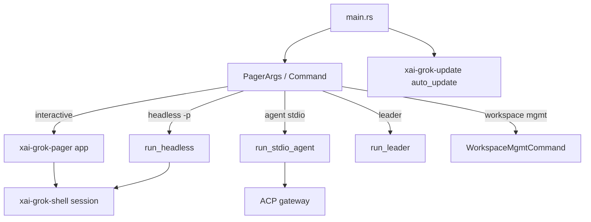

# xai-grok-pager binary (grok CLI)

## What it is

Composition-root package `xai-grok-pager-bin` builds binary **`xai-grok-pager`** (distributed as `grok`). Owns global allocator (optional jemalloc), CLI parsing via pager args, auto-update enforcement, and dispatch into TUI vs shell agent modes. [Graph:High; Existing:README.md]

Provenance: graph package inventory + repository layout synthesis. Agents should open grounded paths rather than treat this page as complete implementation documentation.

## How it works

Key shell entrypoints: `run_headless`, `run_stdio_agent`, `run_leader` in `xai-grok-shell/src/agent/app.rs`.

## Used by

- End-user installs (`curl …/install.sh`)
- Developers: `cargo run -p xai-grok-pager-bin`
- IDE ACP clients spawning `grok agent stdio`

## Blast radius

Startup regressions block all modes. Mode-dispatch mistakes can skip auth, bypass update gates, or fail to attach leader sockets. Always smoke-test interactive + `grok -p` headless after changes.

## See also

- [codegen](../systems/codegen.md)
- User guide getting started: `crates/codegen/xai-grok-pager/docs/user-guide/01-getting-started.md`
