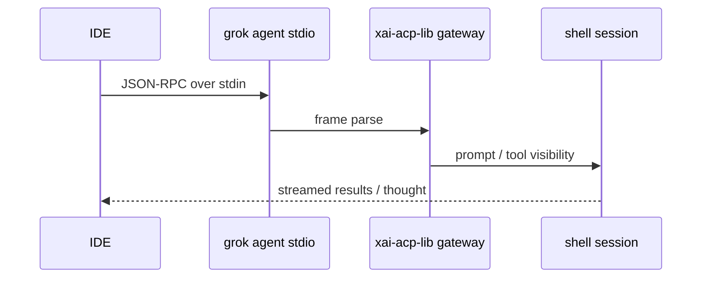

# ACP agent mode & IDE integration

## What it is

Agent Client Protocol integration: persistent agent process for IDEs via stdio JSON-RPC, optional WebSocket serve, and relay for remote access. [Existing:user-guide/15]

Provenance: graph package inventory + repository layout synthesis. Agents should open grounded paths rather than treat this page as complete implementation documentation.

## How it works

Commands: `grok agent stdio`, `grok agent serve --bind …`, relay mode for internet reachability.

## Used by

- IDE extensions (Zed, Neovim, Emacs, custom)
- [entrypoint](../entrypoints/main.md) agent subcommands

## Blast radius

Wire format breakage disconnects all IDE clients. Session resume semantics must stay compatible across reconnects.

## See also

- [codegen](../systems/codegen.md)
- [entrypoint](../entrypoints/main.md)

## Notes

- Supporting detail 1: keep graph package labels distinct from Cargo crate names when routing edits.
- Supporting detail 2: keep graph package labels distinct from Cargo crate names when routing edits.
- Supporting detail 3: keep graph package labels distinct from Cargo crate names when routing edits.
