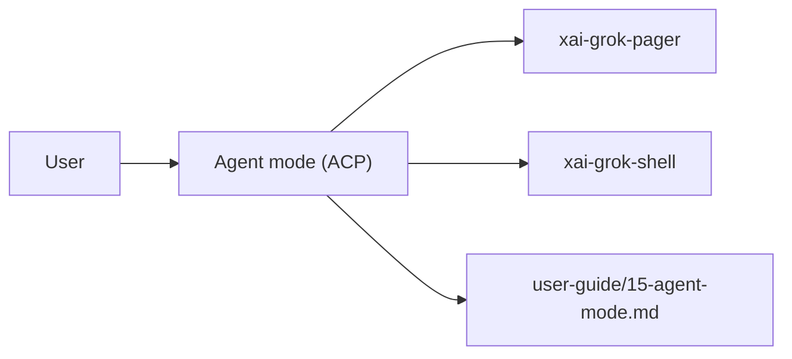

# Agent mode (ACP) (product feature)

## What it is

Product feature documented in the Grok Build user guide (`15-agent-mode.md`).

Agent mode runs Grok as an ACP (Agent Client Protocol) server for integration with IDEs, editors, and custom tooling. Unlike single-prompt mode (`grok -p`, which prints one response and exits), agent mode keeps a persistent process running and communicates through structured JSON-RPC messages. --- The [Agent Client Protocol (ACP)](https://agentclientprotocol.com) is a standard for AI agent communication. It defines how clients (IDEs, editors, custom apps) interact with AI agents through a struct

Implementation spans pager UI and/or shell runtime depending on the surface.

## How it works

User-facing behavior is specified in the guide; code typically lives under `xai-grok-pager` (UI) and `xai-grok-shell` / related crates (runtime).

Related crates: `xai-acp-lib`, `xai-grok-shell`, `main`.

## Used by

- End users of the `grok` CLI/TUI
- Agents implementing or debugging this capability
- [systems/xai-acp-lib.md](../systems/xai-acp-lib.md)
- [systems/xai-grok-shell.md](../systems/xai-grok-shell.md)
- [entrypoints/main.md](../entrypoints/main.md)
- User guide: `crates/codegen/xai-grok-pager/docs/user-guide/15-agent-mode.md`

## Blast radius

Regressions here break the documented user workflow for **Agent mode (ACP)**. Prefer guide + integration tests in pager/shell when changing behavior.

## See also

- [systems/xai-acp-lib.md](../systems/xai-acp-lib.md)
- [systems/xai-grok-shell.md](../systems/xai-grok-shell.md)
- [entrypoints/main.md](../entrypoints/main.md)
- User guide: `crates/codegen/xai-grok-pager/docs/user-guide/15-agent-mode.md`
