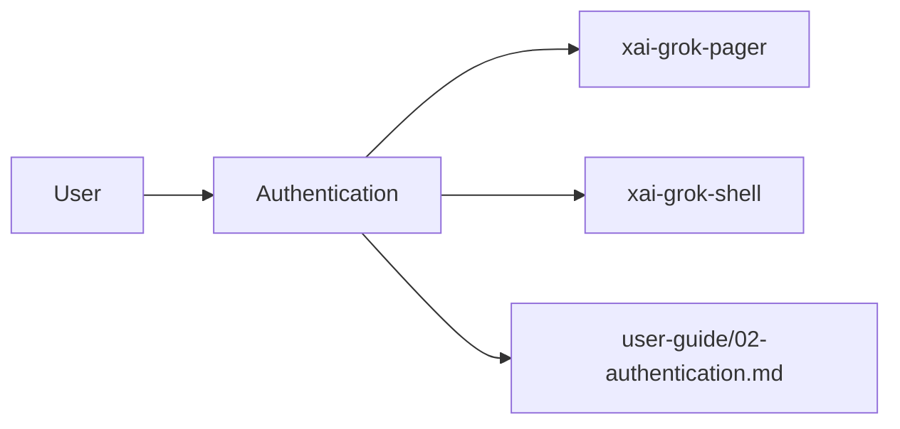

# Authentication (product feature)

## What it is

Product feature documented in the Grok Build user guide (`02-authentication.md`).

Grok supports several authentication methods, including interactive browser login, enterprise single sign-on (SSO), and headless CI/CD runners. --- On first launch, Grok opens your browser to authenticate with grok.com: ```bash grok ``` Grok stores credentials in `~/.grok/auth.json` and reuses them across sessions. Grok refreshes access tokens automatically in the background. When a token can't be refreshed, Grok prompts you to sign in again. Credentials without a server-provided expiry fall bac

Implementation spans pager UI and/or shell runtime depending on the surface.

## How it works

User-facing behavior is specified in the guide; code typically lives under `xai-grok-pager` (UI) and `xai-grok-shell` / related crates (runtime).

Related crates: `xai-grok-auth`.



## Used by

- End users of the `grok` CLI/TUI
- Agents implementing or debugging this capability
- [systems/xai-grok-auth.md](../systems/xai-grok-auth.md)
- User guide: `crates/codegen/xai-grok-pager/docs/user-guide/02-authentication.md`

## Blast radius

Regressions here break the documented user workflow for **Authentication**. Prefer guide + integration tests in pager/shell when changing behavior.

## See also

- [systems/xai-grok-auth.md](../systems/xai-grok-auth.md)
- User guide: `crates/codegen/xai-grok-pager/docs/user-guide/02-authentication.md`
