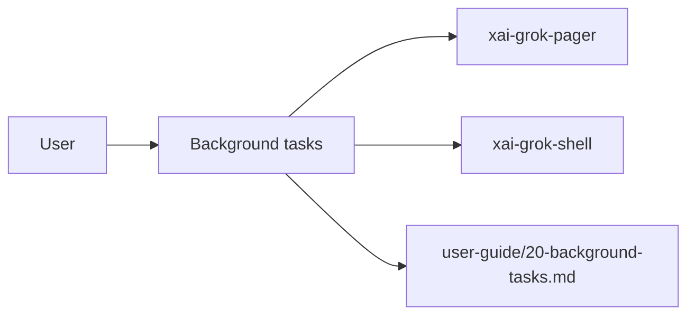

# Background tasks (product feature)

## What it is

Product feature documented in the Grok Build user guide (`20-background-tasks.md`).

Grok runs long-lived processes without blocking the conversation. This document covers background commands, the `/loop` command, the `monitor` tool, and the scheduler. --- Set `background: true` on the `run_terminal_command` tool to run a command in the background. It returns a task ID immediately; retrieve output with `get_command_or_subagent_output`. 1. The agent calls `run_terminal_command` with `background: true`. 2. The command starts in the background. 3. The agent receives a `task_id` for

Implementation spans pager UI and/or shell runtime depending on the surface.

## How it works

User-facing behavior is specified in the guide; code typically lives under `xai-grok-pager` (UI) and `xai-grok-shell` / related crates (runtime).

Related crates: `xai-grok-pager`, `xai-grok-shell`.

## Used by

- End users of the `grok` CLI/TUI
- Agents implementing or debugging this capability
- [systems/xai-grok-pager.md](../systems/xai-grok-pager.md)
- [systems/xai-grok-shell.md](../systems/xai-grok-shell.md)
- User guide: `crates/codegen/xai-grok-pager/docs/user-guide/20-background-tasks.md`

## Blast radius

Regressions here break the documented user workflow for **Background tasks**. Prefer guide + integration tests in pager/shell when changing behavior.

## See also

- [systems/xai-grok-pager.md](../systems/xai-grok-pager.md)
- [systems/xai-grok-shell.md](../systems/xai-grok-shell.md)
- User guide: `crates/codegen/xai-grok-pager/docs/user-guide/20-background-tasks.md`
