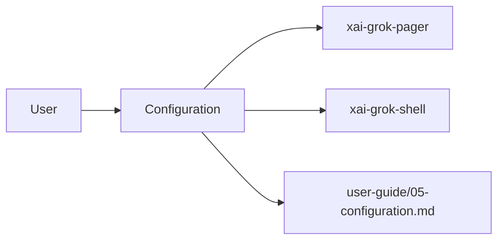

# Configuration (product feature)

## What it is

Product feature documented in the Grok Build user guide (`05-configuration.md`).

Grok reads configuration from local config files, environment variables, and CLI flags. This document covers the common options. --- Configuration is resolved in this order (highest priority first): 1. **CLI flags** (e.g., `--yolo`, `--model`, `--sandbox`) 2. **Environment variables** (e.g., `XAI_API_KEY`, `GROK_MEMORY`) 3. **config.toml** (`~/.grok/config.toml`) 4. **Managed / requirements config** (local files your org may deploy, e.g.

Implementation spans pager UI and/or shell runtime depending on the surface.

## How it works

User-facing behavior is specified in the guide; code typically lives under `xai-grok-pager` (UI) and `xai-grok-shell` / related crates (runtime).

Related crates: `xai-grok-config`.

## Used by

- End users of the `grok` CLI/TUI
- Agents implementing or debugging this capability
- [systems/xai-grok-config.md](../systems/xai-grok-config.md)
- User guide: `crates/codegen/xai-grok-pager/docs/user-guide/05-configuration.md`

## Blast radius

Regressions here break the documented user workflow for **Configuration**. Prefer guide + integration tests in pager/shell when changing behavior.

## See also

- [systems/xai-grok-config.md](../systems/xai-grok-config.md)
- User guide: `crates/codegen/xai-grok-pager/docs/user-guide/05-configuration.md`
