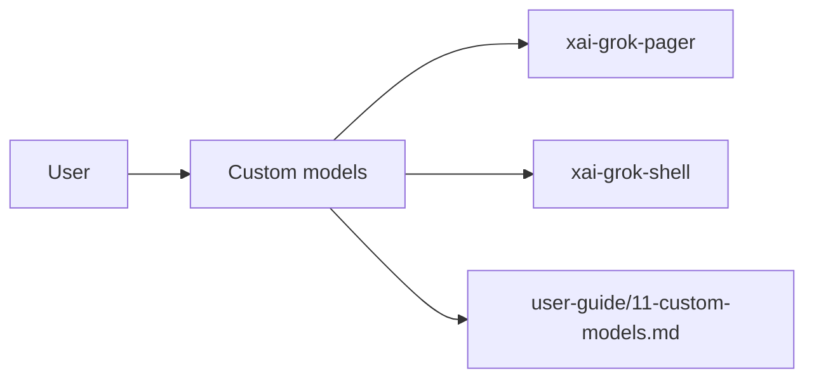

# Custom models (product feature)

## What it is

Product feature documented in the Grok Build user guide (`11-custom-models.md`).

Grok connects to custom model endpoints for alternative providers, self-hosted models, and overriding built-in settings. This guide explains how to select models, configure endpoints, and integrate third-party providers. --- By default, Grok uses models hosted by SpaceXAI, and new sessions start with `grok-build`. Default models require no configuration. Authenticate with `grok login` or an API key, then start a session. List all available models: ```bash grok models ``` ---

Implementation spans pager UI and/or shell runtime depending on the surface.

## How it works

User-facing behavior is specified in the guide; code typically lives under `xai-grok-pager` (UI) and `xai-grok-shell` / related crates (runtime).

Related crates: `xai-grok-pager`, `xai-grok-shell`.



## Used by

- End users of the `grok` CLI/TUI
- Agents implementing or debugging this capability
- [systems/xai-grok-pager.md](../systems/xai-grok-pager.md)
- [systems/xai-grok-shell.md](../systems/xai-grok-shell.md)
- User guide: `crates/codegen/xai-grok-pager/docs/user-guide/11-custom-models.md`

## Blast radius

Regressions here break the documented user workflow for **Custom models**. Prefer guide + integration tests in pager/shell when changing behavior.

## See also

- [systems/xai-grok-pager.md](../systems/xai-grok-pager.md)
- [systems/xai-grok-shell.md](../systems/xai-grok-shell.md)
- User guide: `crates/codegen/xai-grok-pager/docs/user-guide/11-custom-models.md`
