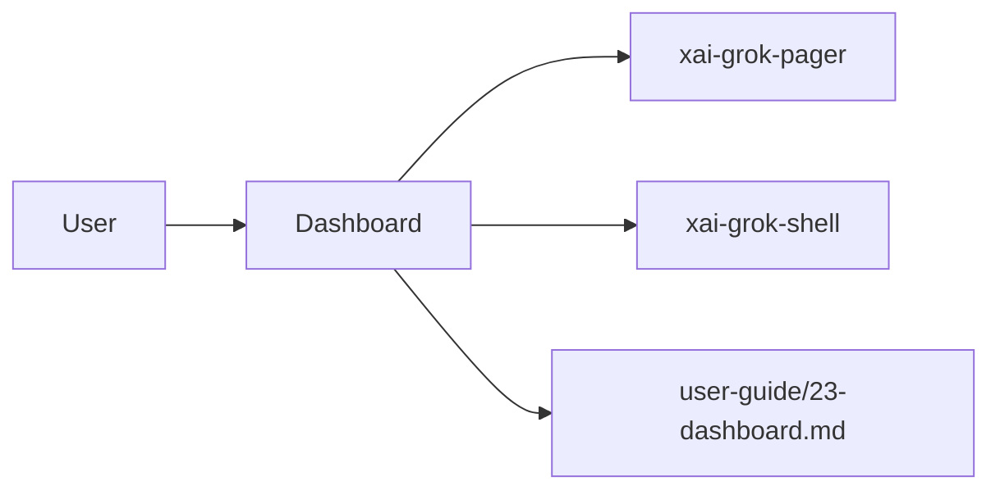

# Dashboard (product feature)

## What it is

Product feature documented in the Grok Build user guide (`23-dashboard.md`).

The Agent Dashboard is a centralised, agent-native overview of every top-level session you have in flight — your local sessions and forks — grouped by state, with peek, attach, and dispatch from one screen. Subagents are not listed here: they run under their parent session, which already shows when work is in flight. --- Three entry points, all opening the same view: - **`grok dashboard`** — launches the TUI directly into the dashboard.

Implementation spans pager UI and/or shell runtime depending on the surface.

## How it works

User-facing behavior is specified in the guide; code typically lives under `xai-grok-pager` (UI) and `xai-grok-shell` / related crates (runtime).

Related crates: `xai-grok-pager`, `xai-grok-shell`.

## Used by

- End users of the `grok` CLI/TUI
- Agents implementing or debugging this capability
- [systems/xai-grok-pager.md](../systems/xai-grok-pager.md)
- [systems/xai-grok-shell.md](../systems/xai-grok-shell.md)
- User guide: `crates/codegen/xai-grok-pager/docs/user-guide/23-dashboard.md`

## Blast radius

Regressions here break the documented user workflow for **Dashboard**. Prefer guide + integration tests in pager/shell when changing behavior.

## See also

- [systems/xai-grok-pager.md](../systems/xai-grok-pager.md)
- [systems/xai-grok-shell.md](../systems/xai-grok-shell.md)
- User guide: `crates/codegen/xai-grok-pager/docs/user-guide/23-dashboard.md`
