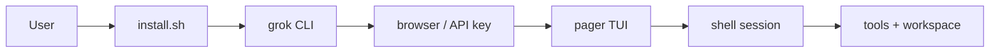

# Getting started (product feature)

## What it is

End-user onboarding for **Grok Build** as documented in the shippable user guide
(`01-getting-started.md`). Covers install scripts, first authentication, basic
TUI interaction, `@` file attachments, permission defaults, and sessions.

This is the **product** view. For developer build-from-source steps, use
[overview/getting-started.md](../overview/getting-started.md) or the draft root
[getting-started.md](../../getting-started.md).

## How it works

1. **Install** — `curl …/install.sh | bash` (or PowerShell installer on Windows).
2. **Run** — `grok` opens the full-screen TUI; first run triggers browser auth.
3. **Prompt** — type messages; tools stream into scrollback; `@file` attaches paths.
4. **Permissions** — default ask-before-edit/shell; `Ctrl+O` / `--yolo` / `/always-approve`.
5. **Sessions** — auto-saved under `~/.grok/sessions/`; `/resume`, `grok -c`, `Ctrl+N`.

Implementation spans `xai-grok-pager` (TUI) and `xai-grok-shell` (runtime/auth).

## Used by

- New end users and first-time CLI installs
- Docs and support pointing at install + first-run
- Related: [authentication](authentication.md), [slash-commands](slash-commands.md),
  [permissions-and-safety](permissions-and-safety.md),
  [sessions](sessions.md)

## Blast radius

Breaking first-run auth, install paths, or the default permission UX blocks
onboarding for every new user. Keep install URLs and `~/.grok` paths consistent
with the user guide and README.

## See also

- Canonical draft page: [../../getting-started.md](../../getting-started.md)
- Build/runbook: [../overview/getting-started.md](../overview/getting-started.md)
- Source guide: `crates/codegen/xai-grok-pager/docs/user-guide/01-getting-started.md`
- Crates: [xai-grok-pager](../systems/xai-grok-pager.md),
  [xai-grok-shell](../systems/xai-grok-shell.md),
  [entrypoint](../entrypoints/main.md)
