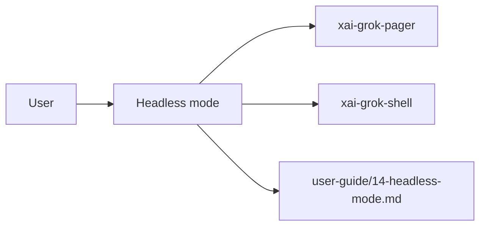

# Headless mode (product feature)

## What it is

Product feature documented in the Grok Build user guide (`14-headless-mode.md`).

Headless mode runs Grok non-interactively from the command line. It accepts a single prompt, executes it with full tool access, and returns the result. Use it to automate tasks, script workflows, build integrations, and parse output programmatically. --- Passing a prompt non-interactively triggers headless mode. The most common way is the `-p` flag (short for `--single`); `--prompt-json` and `--prompt-file` also trigger it: ```bash grok -p "Your prompt here" ``` Grok processes the prompt, runs a

Implementation spans pager UI and/or shell runtime depending on the surface.

## How it works

User-facing behavior is specified in the guide; code typically lives under `xai-grok-pager` (UI) and `xai-grok-shell` / related crates (runtime).

Related crates: `xai-grok-shell`, `main`.



## Used by

- End users of the `grok` CLI/TUI
- Agents implementing or debugging this capability
- [systems/xai-grok-shell.md](../systems/xai-grok-shell.md)
- [entrypoints/main.md](../entrypoints/main.md)
- User guide: `crates/codegen/xai-grok-pager/docs/user-guide/14-headless-mode.md`

## Blast radius

Regressions here break the documented user workflow for **Headless mode**. Prefer guide + integration tests in pager/shell when changing behavior.

## See also

- [systems/xai-grok-shell.md](../systems/xai-grok-shell.md)
- [entrypoints/main.md](../entrypoints/main.md)
- User guide: `crates/codegen/xai-grok-pager/docs/user-guide/14-headless-mode.md`
