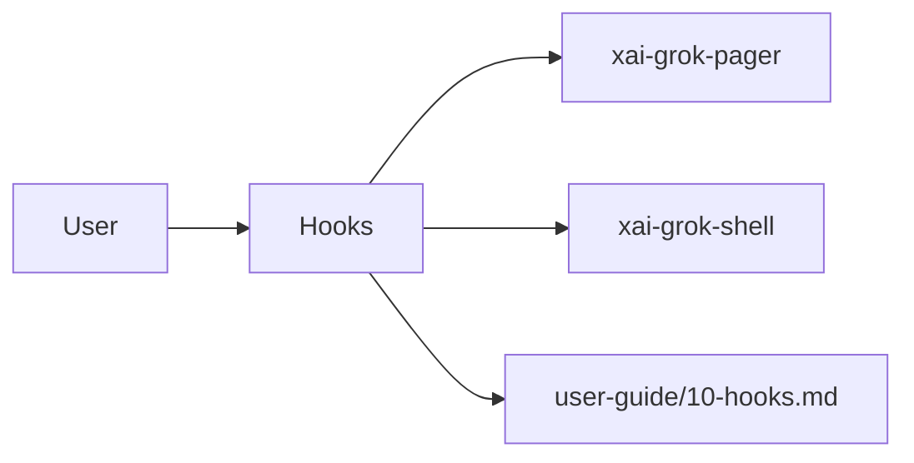

# Hooks (product feature)

## What it is

Product feature documented in the Grok Build user guide (`10-hooks.md`).

Hooks let you run a script or send an HTTP request at key moments in a Grok session. Use them to automate tasks, enforce safety checks, log activity, send notifications, and integrate your own tools. --- A hook is a shell command or HTTP endpoint that Grok calls when a specific lifecycle event occurs. Hooks can: - **Block actions** -- A `PreToolUse` hook can deny a dangerous command before it runs. - **React to events** -- A `PostToolUse` hook can log every tool execution to a file. - **Set up c

Implementation spans pager UI and/or shell runtime depending on the surface.

## How it works

User-facing behavior is specified in the guide; code typically lives under `xai-grok-pager` (UI) and `xai-grok-shell` / related crates (runtime).

Related crates: `xai-grok-hooks`.

## Used by

- End users of the `grok` CLI/TUI
- Agents implementing or debugging this capability
- [systems/xai-grok-hooks.md](../systems/xai-grok-hooks.md)
- User guide: `crates/codegen/xai-grok-pager/docs/user-guide/10-hooks.md`

## Blast radius

Regressions here break the documented user workflow for **Hooks**. Prefer guide + integration tests in pager/shell when changing behavior.

## See also

- [systems/xai-grok-hooks.md](../systems/xai-grok-hooks.md)
- User guide: `crates/codegen/xai-grok-pager/docs/user-guide/10-hooks.md`
