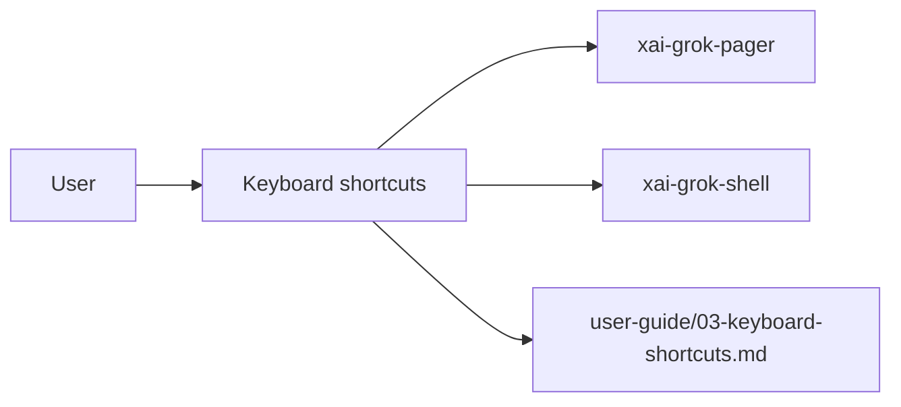

# Keyboard shortcuts (product feature)

## What it is

Product feature documented in the Grok Build user guide (`03-keyboard-shortcuts.md`).

Reference for key bindings in the Grok Build TUI. Bindings are built in and cannot currently be remapped. --- Grok has two input modes that control how you navigate the scrollback: - **Simple mode** (default): Arrow keys for navigation, `Shift+Arrow` for turn navigation, `Space` to focus the prompt, and any letter key auto-focuses the prompt. - **Vim mode** (opt-in): `j`/`k` for navigation, `H`/`L` for turn navigation, `J`/`K` for response navigation, `h`/`l` for fold, `e`/`E` for expand/collaps

Implementation spans pager UI and/or shell runtime depending on the surface.

## How it works

User-facing behavior is specified in the guide; code typically lives under `xai-grok-pager` (UI) and `xai-grok-shell` / related crates (runtime).

Related crates: `xai-grok-pager`, `xai-grok-shell`.

## Used by

- End users of the `grok` CLI/TUI
- Agents implementing or debugging this capability
- [systems/xai-grok-pager.md](../systems/xai-grok-pager.md)
- [systems/xai-grok-shell.md](../systems/xai-grok-shell.md)
- User guide: `crates/codegen/xai-grok-pager/docs/user-guide/03-keyboard-shortcuts.md`

## Blast radius

Regressions here break the documented user workflow for **Keyboard shortcuts**. Prefer guide + integration tests in pager/shell when changing behavior.

## See also

- [systems/xai-grok-pager.md](../systems/xai-grok-pager.md)
- [systems/xai-grok-shell.md](../systems/xai-grok-shell.md)
- User guide: `crates/codegen/xai-grok-pager/docs/user-guide/03-keyboard-shortcuts.md`
