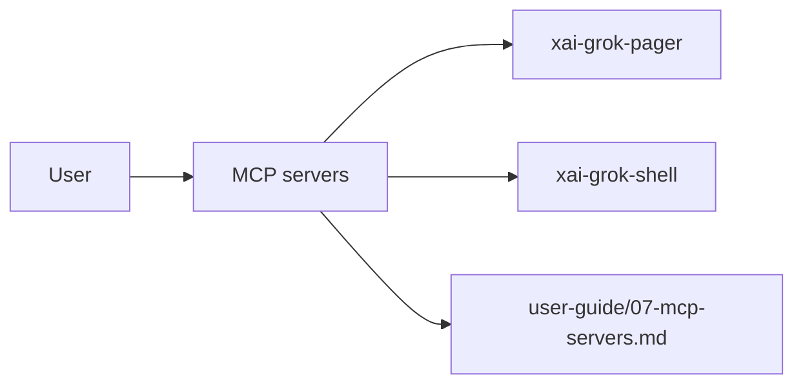

# MCP servers (product feature)

## What it is

Product feature documented in the Grok Build user guide (`07-mcp-servers.md`).

MCP (Model Context Protocol) servers extend Grok with external tool integrations. They let Grok interact with any service that implements the MCP standard. --- An MCP server is a process that exposes tools to Grok over a standardized protocol. When you configure an MCP server, its tools become available to the model alongside Grok's built-in tools. The model can discover and call these tools during a session. For example, a GitHub MCP server might expose tools like `create_issue`, `list_pull_req

Implementation spans pager UI and/or shell runtime depending on the surface.

## How it works

User-facing behavior is specified in the guide; code typically lives under `xai-grok-pager` (UI) and `xai-grok-shell` / related crates (runtime).

Related crates: `xai-grok-mcp`.

## Used by

- End users of the `grok` CLI/TUI
- Agents implementing or debugging this capability
- [systems/xai-grok-mcp.md](../systems/xai-grok-mcp.md)
- User guide: `crates/codegen/xai-grok-pager/docs/user-guide/07-mcp-servers.md`

## Blast radius

Regressions here break the documented user workflow for **MCP servers**. Prefer guide + integration tests in pager/shell when changing behavior.

## See also

- [systems/xai-grok-mcp.md](../systems/xai-grok-mcp.md)
- User guide: `crates/codegen/xai-grok-pager/docs/user-guide/07-mcp-servers.md`
