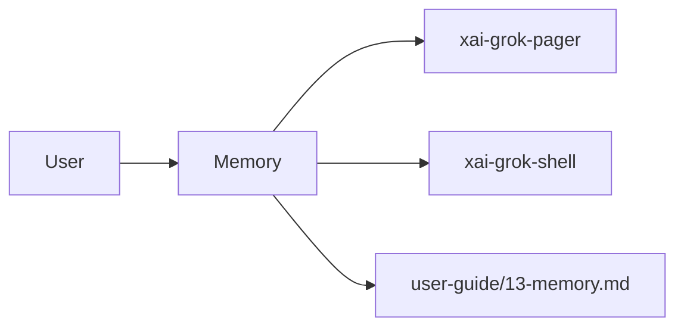

# Memory (product feature)

## What it is

Product feature documented in the Grok Build user guide (`13-memory.md`).

Memory lets Grok recall facts, decisions, and patterns from earlier sessions. Grok indexes the information you save and searches it automatically, so a new session can reuse relevant context. --- Without memory, each Grok session starts fresh: the model knows nothing about previous sessions. When you enable memory, Grok can: - Recall project conventions you explained before. - Reuse debugging steps that worked. - Carry architectural decisions forward across sessions. - Avoid re-asking questions 

Implementation spans pager UI and/or shell runtime depending on the surface.

## How it works

User-facing behavior is specified in the guide; code typically lives under `xai-grok-pager` (UI) and `xai-grok-shell` / related crates (runtime).

Related crates: `xai-grok-memory`.

## Used by

- End users of the `grok` CLI/TUI
- Agents implementing or debugging this capability
- [systems/xai-grok-memory.md](../systems/xai-grok-memory.md)
- User guide: `crates/codegen/xai-grok-pager/docs/user-guide/13-memory.md`

## Blast radius

Regressions here break the documented user workflow for **Memory**. Prefer guide + integration tests in pager/shell when changing behavior.

## See also

- [systems/xai-grok-memory.md](../systems/xai-grok-memory.md)
- User guide: `crates/codegen/xai-grok-pager/docs/user-guide/13-memory.md`
