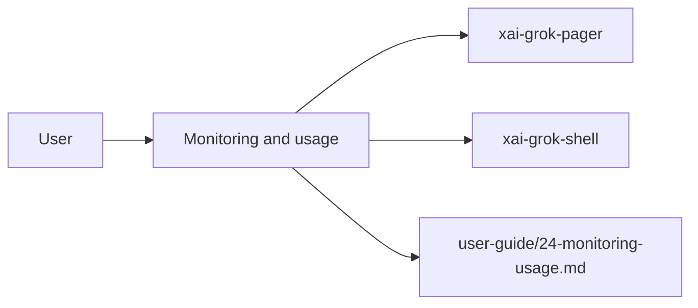

# Monitoring and usage (product feature)

## What it is

Product feature documented in the Grok Build user guide (`24-monitoring-usage.md`).

> **Status: alpha.** The schema below is versioned (`grok_code.schema.version = v1`); > additive changes may occur without notice, renames/removals will bump the > version and be called out in the changelog. Grok CLI can export usage **metrics** and **events** to your organization's own OpenTelemetry collector, so platform teams can monitor adoption, token consumption, tool-permission decisions, and errors across the fleet — without any data flowing through SpaceXAI. The external stream is:

Implementation spans pager UI and/or shell runtime depending on the surface.

## How it works

User-facing behavior is specified in the guide; code typically lives under `xai-grok-pager` (UI) and `xai-grok-shell` / related crates (runtime).

Related crates: `xai-grok-pager`, `xai-grok-shell`.

## Used by

- End users of the `grok` CLI/TUI
- Agents implementing or debugging this capability
- [systems/xai-grok-pager.md](../systems/xai-grok-pager.md)
- [systems/xai-grok-shell.md](../systems/xai-grok-shell.md)
- User guide: `crates/codegen/xai-grok-pager/docs/user-guide/24-monitoring-usage.md`

## Blast radius

Regressions here break the documented user workflow for **Monitoring and usage**. Prefer guide + integration tests in pager/shell when changing behavior.

## See also

- [systems/xai-grok-pager.md](../systems/xai-grok-pager.md)
- [systems/xai-grok-shell.md](../systems/xai-grok-shell.md)
- User guide: `crates/codegen/xai-grok-pager/docs/user-guide/24-monitoring-usage.md`
