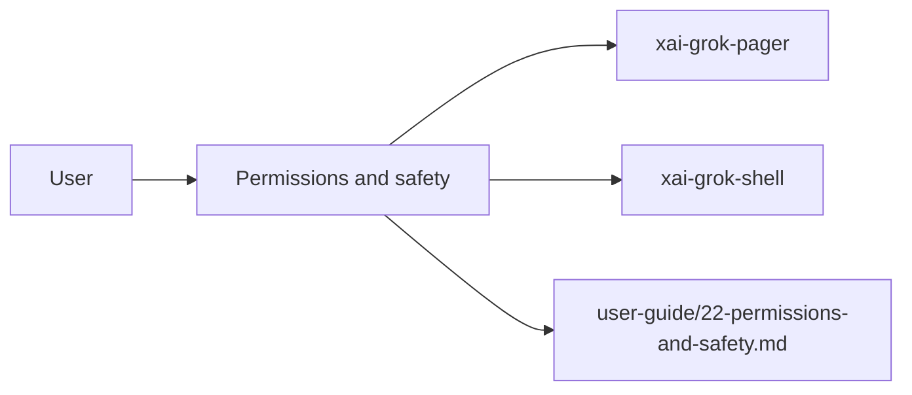

# Permissions and safety (product feature)

## What it is

Product feature documented in the Grok Build user guide (`22-permissions-and-safety.md`).

Grok can read files, search code, edit files, and run shell commands. The permission system controls what the agent is allowed to do. You can combine several independent layers: permission rules, permission modes, hooks, and the OS-level sandbox. This guide explains how a tool call is authorized, how to configure permission rules from the CLI, native configuration, or Claude settings, and how to use `PreToolUse` hooks for allow lists that apply in every mode. --- When the model requests a tool, 

Implementation spans pager UI and/or shell runtime depending on the surface.

## How it works

User-facing behavior is specified in the guide; code typically lives under `xai-grok-pager` (UI) and `xai-grok-shell` / related crates (runtime).

Related crates: `xai-grok-workspace`, `xai-grok-tools`, `xai-grok-hooks`.

## Used by

- End users of the `grok` CLI/TUI
- Agents implementing or debugging this capability
- [systems/xai-grok-workspace.md](../systems/xai-grok-workspace.md)
- [systems/xai-grok-tools.md](../systems/xai-grok-tools.md)
- [systems/xai-grok-hooks.md](../systems/xai-grok-hooks.md)
- User guide: `crates/codegen/xai-grok-pager/docs/user-guide/22-permissions-and-safety.md`

## Blast radius

Regressions here break the documented user workflow for **Permissions and safety**. Prefer guide + integration tests in pager/shell when changing behavior.

## See also

- [systems/xai-grok-workspace.md](../systems/xai-grok-workspace.md)
- [systems/xai-grok-tools.md](../systems/xai-grok-tools.md)
- [systems/xai-grok-hooks.md](../systems/xai-grok-hooks.md)
- User guide: `crates/codegen/xai-grok-pager/docs/user-guide/22-permissions-and-safety.md`
