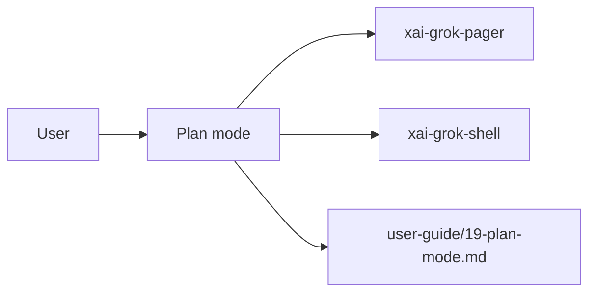

# Plan mode (product feature)

## What it is

Product feature documented in the Grok Build user guide (`19-plan-mode.md`).

Plan mode is a structured planning phase: the agent explores the codebase and designs an implementation approach before writing any code. Use it for tasks with genuine ambiguity about the right approach, where getting your input before coding prevents significant rework. --- When plan mode is active, the agent: 1. Reads and searches the codebase to understand existing patterns and architecture 2. Designs an implementation approach and writes it to the plan file 3. May use `ask_user_question` to 

Implementation spans pager UI and/or shell runtime depending on the surface.

## How it works

User-facing behavior is specified in the guide; code typically lives under `xai-grok-pager` (UI) and `xai-grok-shell` / related crates (runtime).

Related crates: `xai-grok-pager`, `xai-grok-shell`.

## Used by

- End users of the `grok` CLI/TUI
- Agents implementing or debugging this capability
- [systems/xai-grok-pager.md](../systems/xai-grok-pager.md)
- [systems/xai-grok-shell.md](../systems/xai-grok-shell.md)
- User guide: `crates/codegen/xai-grok-pager/docs/user-guide/19-plan-mode.md`

## Blast radius

Regressions here break the documented user workflow for **Plan mode**. Prefer guide + integration tests in pager/shell when changing behavior.

## See also

- [systems/xai-grok-pager.md](../systems/xai-grok-pager.md)
- [systems/xai-grok-shell.md](../systems/xai-grok-shell.md)
- User guide: `crates/codegen/xai-grok-pager/docs/user-guide/19-plan-mode.md`
