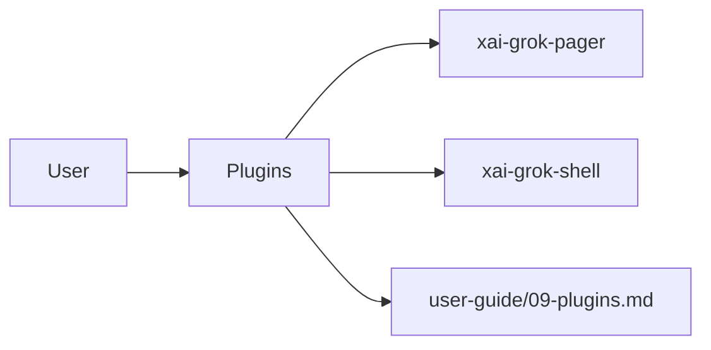

# Plugins (product feature)

## What it is

Product feature documented in the Grok Build user guide (`09-plugins.md`).

A plugin bundles skills, slash commands, agents, hooks, MCP server configurations, and LSP server configurations into one installable unit. --- A plugin is a directory that holds any combination of these components: - **Skills** -- a `skills/` directory of SKILL.md files - **Slash commands** -- a `commands/` directory of command files - **Agents** -- an `agents/` directory of agent definitions - **Hooks** -- a `hooks/hooks.json` file of lifecycle hooks. Plugin hooks also receive `GROK_PLUGIN_ROO

Implementation spans pager UI and/or shell runtime depending on the surface.

## How it works

User-facing behavior is specified in the guide; code typically lives under `xai-grok-pager` (UI) and `xai-grok-shell` / related crates (runtime).

Related crates: `xai-grok-pager`, `xai-grok-shell`.

## Used by

- End users of the `grok` CLI/TUI
- Agents implementing or debugging this capability
- [systems/xai-grok-pager.md](../systems/xai-grok-pager.md)
- [systems/xai-grok-shell.md](../systems/xai-grok-shell.md)
- User guide: `crates/codegen/xai-grok-pager/docs/user-guide/09-plugins.md`

## Blast radius

Regressions here break the documented user workflow for **Plugins**. Prefer guide + integration tests in pager/shell when changing behavior.

## See also

- [systems/xai-grok-pager.md](../systems/xai-grok-pager.md)
- [systems/xai-grok-shell.md](../systems/xai-grok-shell.md)
- User guide: `crates/codegen/xai-grok-pager/docs/user-guide/09-plugins.md`
