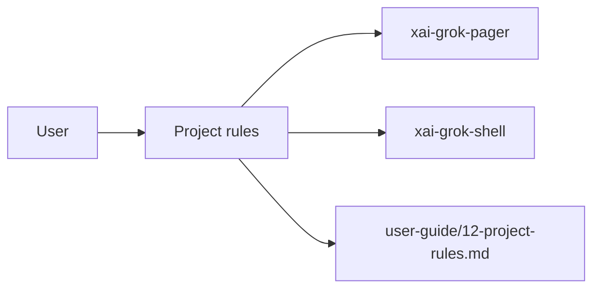

# Project rules (product feature)

## What it is

Product feature documented in the Grok Build user guide (`12-project-rules.md`).

Project rules let you configure Grok per project or directory. By placing an AGENTS.md file in your repository, you can set coding conventions, build instructions, style guides, and any other instructions that Grok should follow when working in that codebase. --- Project rules are Markdown files that Grok reads and adds to its context. Grok follows their content for every interaction in that tree. This is the primary mechanism for teaching Grok about your project's conventions, so you need not r

Implementation spans pager UI and/or shell runtime depending on the surface.

## How it works

User-facing behavior is specified in the guide; code typically lives under `xai-grok-pager` (UI) and `xai-grok-shell` / related crates (runtime).

Related crates: `xai-grok-pager`, `xai-grok-shell`.

## Used by

- End users of the `grok` CLI/TUI
- Agents implementing or debugging this capability
- [systems/xai-grok-pager.md](../systems/xai-grok-pager.md)
- [systems/xai-grok-shell.md](../systems/xai-grok-shell.md)
- User guide: `crates/codegen/xai-grok-pager/docs/user-guide/12-project-rules.md`

## Blast radius

Regressions here break the documented user workflow for **Project rules**. Prefer guide + integration tests in pager/shell when changing behavior.

## See also

- [systems/xai-grok-pager.md](../systems/xai-grok-pager.md)
- [systems/xai-grok-shell.md](../systems/xai-grok-shell.md)
- User guide: `crates/codegen/xai-grok-pager/docs/user-guide/12-project-rules.md`
