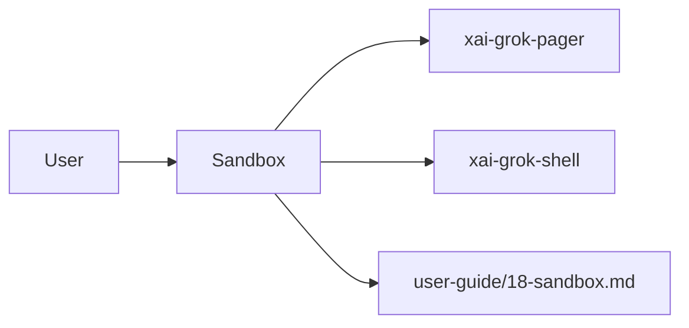

# Sandbox (product feature)

## What it is

Product feature documented in the Grok Build user guide (`18-sandbox.md`).

Sandbox mode restricts what the agent process and its spawned commands can access on your filesystem and network using OS-level kernel primitives (Landlock on Linux, Seatbelt on macOS). The kernel enforces these limits for the process lifetime. Sandbox mode is off by default. --- ```bash grok --sandbox workspace grok --sandbox read-only grok --sandbox strict ```

Implementation spans pager UI and/or shell runtime depending on the surface.

## How it works

User-facing behavior is specified in the guide; code typically lives under `xai-grok-pager` (UI) and `xai-grok-shell` / related crates (runtime).

Related crates: `xai-grok-sandbox`.



## Used by

- End users of the `grok` CLI/TUI
- Agents implementing or debugging this capability
- [systems/xai-grok-sandbox.md](../systems/xai-grok-sandbox.md)
- User guide: `crates/codegen/xai-grok-pager/docs/user-guide/18-sandbox.md`

## Blast radius

Regressions here break the documented user workflow for **Sandbox**. Prefer guide + integration tests in pager/shell when changing behavior.

## See also

- [systems/xai-grok-sandbox.md](../systems/xai-grok-sandbox.md)
- User guide: `crates/codegen/xai-grok-pager/docs/user-guide/18-sandbox.md`
