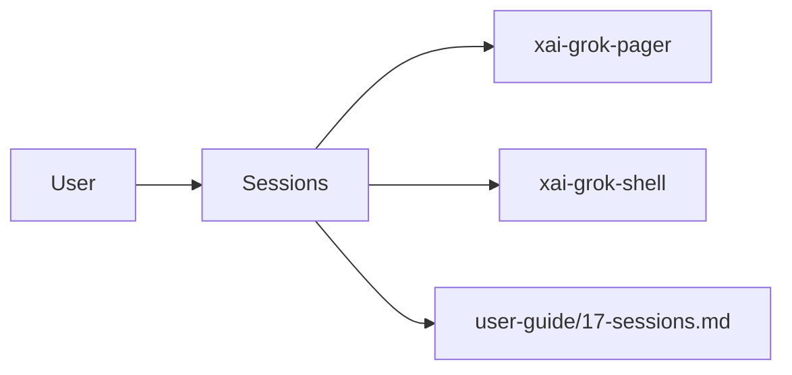

# Sessions (product feature)

## What it is

Product feature documented in the Grok Build user guide (`17-sessions.md`).

Grok saves every conversation to disk automatically. Whether you work in the TUI, in headless mode, or over agent stdio, Grok records the exchange as a session. You can resume, rewind, or compact it. This document describes how to manage sessions. --- A session is a persistent conversation with full history. It includes: - All user prompts and agent responses - Tool calls and their results - TODO/task list state - File snapshots for rewind - Token usage and turn counts

Implementation spans pager UI and/or shell runtime depending on the surface.

## How it works

User-facing behavior is specified in the guide; code typically lives under `xai-grok-pager` (UI) and `xai-grok-shell` / related crates (runtime).

Related crates: `xai-grok-shell`, `xai-chat-state`.

## Used by

- End users of the `grok` CLI/TUI
- Agents implementing or debugging this capability
- [systems/xai-grok-shell.md](../systems/xai-grok-shell.md)
- [systems/xai-chat-state.md](../systems/xai-chat-state.md)
- User guide: `crates/codegen/xai-grok-pager/docs/user-guide/17-sessions.md`

## Blast radius

Regressions here break the documented user workflow for **Sessions**. Prefer guide + integration tests in pager/shell when changing behavior.

## See also

- [systems/xai-grok-shell.md](../systems/xai-grok-shell.md)
- [systems/xai-chat-state.md](../systems/xai-chat-state.md)
- User guide: `crates/codegen/xai-grok-pager/docs/user-guide/17-sessions.md`
