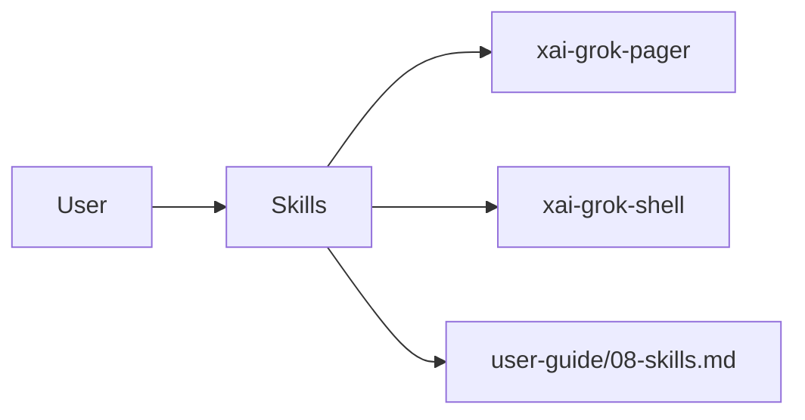

# Skills (product feature)

## What it is

Product feature documented in the Grok Build user guide (`08-skills.md`).

Skills are reusable prompt packages that extend Grok with task-specific instructions. They let you capture a repeatable procedure once, instead of re-explaining it each session. --- A skill is a directory that contains a `SKILL.md` file. Its markdown body tells Grok how to handle a specific type of task: step-by-step instructions, conventions, and tool-usage patterns. Use a skill for a repeatable procedure that's too specific for AGENTS.md but too long to retype. Grok activates a skill only when

Implementation spans pager UI and/or shell runtime depending on the surface.

## How it works

User-facing behavior is specified in the guide; code typically lives under `xai-grok-pager` (UI) and `xai-grok-shell` / related crates (runtime).

Related crates: `xai-grok-tools`.

## Used by

- End users of the `grok` CLI/TUI
- Agents implementing or debugging this capability
- [systems/xai-grok-tools.md](../systems/xai-grok-tools.md)
- User guide: `crates/codegen/xai-grok-pager/docs/user-guide/08-skills.md`

## Blast radius

Regressions here break the documented user workflow for **Skills**. Prefer guide + integration tests in pager/shell when changing behavior.

## See also

- [systems/xai-grok-tools.md](../systems/xai-grok-tools.md)
- User guide: `crates/codegen/xai-grok-pager/docs/user-guide/08-skills.md`
