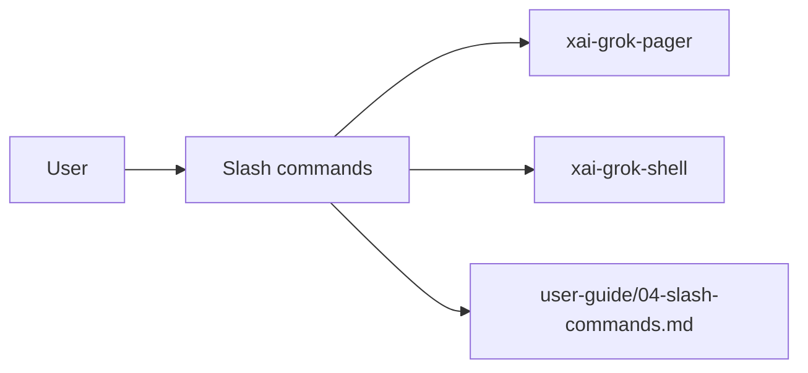

# Slash commands (product feature)

## What it is

Product feature documented in the Grok Build user guide (`04-slash-commands.md`).

Type `/` in the prompt to access commands. Each command runs an action immediately and autocompletes as you type. Slash commands come from two sources: - **Shell builtins** -- handled by the agent backend (xai-grok-shell) - **Pager builtins** -- handled by the TUI frontend (xai-grok-pager) Both sets are available in the autocomplete menu. Skills installed via SKILL.md files also appear as slash commands. --- Start a new session, clearing the current conversation. ```

Implementation spans pager UI and/or shell runtime depending on the surface.

## How it works

User-facing behavior is specified in the guide; code typically lives under `xai-grok-pager` (UI) and `xai-grok-shell` / related crates (runtime).

Related crates: `xai-grok-pager`.



## Used by

- End users of the `grok` CLI/TUI
- Agents implementing or debugging this capability
- [systems/xai-grok-pager.md](../systems/xai-grok-pager.md)
- User guide: `crates/codegen/xai-grok-pager/docs/user-guide/04-slash-commands.md`

## Blast radius

Regressions here break the documented user workflow for **Slash commands**. Prefer guide + integration tests in pager/shell when changing behavior.

## See also

- [systems/xai-grok-pager.md](../systems/xai-grok-pager.md)
- User guide: `crates/codegen/xai-grok-pager/docs/user-guide/04-slash-commands.md`
