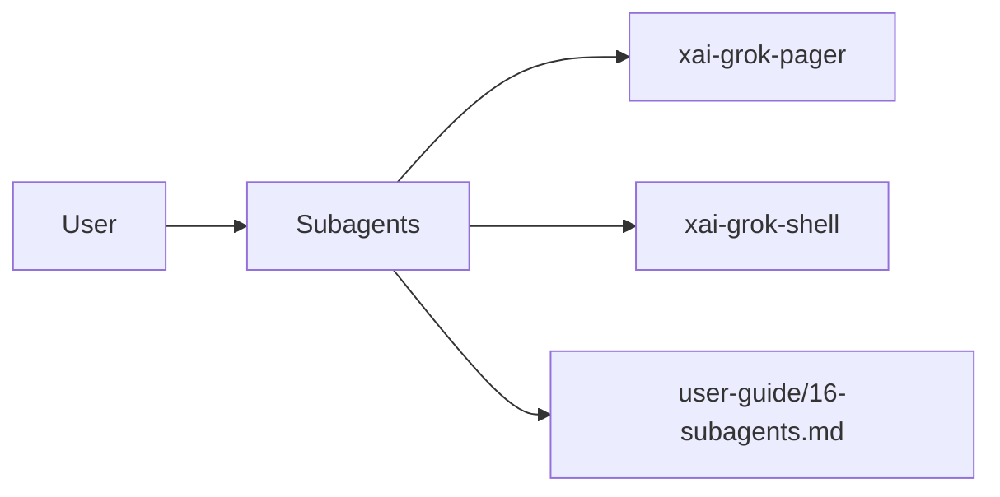

# Subagents (product feature)

## What it is

Product feature documented in the Grok Build user guide (`16-subagents.md`).

Subagents are independent child sessions that handle tasks in parallel. Each subagent has its own context window, so the main agent can delegate work (research, implementation, testing, and code review) without consuming its own context. A subagent reports a summary back to the parent when it finishes. Subagents are enabled by default. --- Agents and personas both customize behavior, but they operate at different levels: | | **Agents** | **Personas** | |---|---|---| | **What they configure** | T

Implementation spans pager UI and/or shell runtime depending on the surface.

## How it works

User-facing behavior is specified in the guide; code typically lives under `xai-grok-pager` (UI) and `xai-grok-shell` / related crates (runtime).

Related crates: `xai-grok-shell`, `xai-grok-subagent-resolution`.

## Used by

- End users of the `grok` CLI/TUI
- Agents implementing or debugging this capability
- [systems/xai-grok-shell.md](../systems/xai-grok-shell.md)
- [systems/xai-grok-subagent-resolution.md](../systems/xai-grok-subagent-resolution.md)
- User guide: `crates/codegen/xai-grok-pager/docs/user-guide/16-subagents.md`

## Blast radius

Regressions here break the documented user workflow for **Subagents**. Prefer guide + integration tests in pager/shell when changing behavior.

## See also

- [systems/xai-grok-shell.md](../systems/xai-grok-shell.md)
- [systems/xai-grok-subagent-resolution.md](../systems/xai-grok-subagent-resolution.md)
- User guide: `crates/codegen/xai-grok-pager/docs/user-guide/16-subagents.md`
