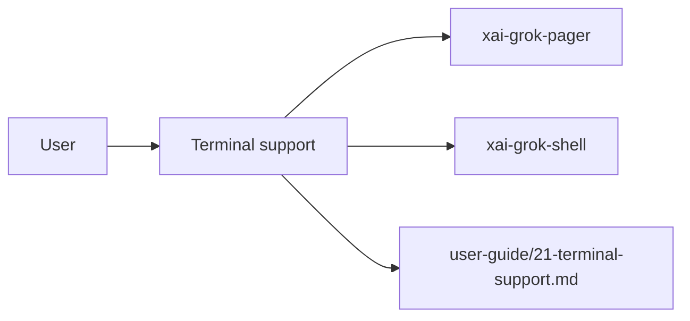

# Terminal support (product feature)

## What it is

Product feature documented in the Grok Build user guide (`21-terminal-support.md`).

Grok Build runs as a full-screen TUI. To draw the interface, it relies on terminal escape sequences for color, clipboard, mouse, and full-screen control. Some terminals, multiplexers, and SSH sessions handle these sequences differently. ```bash export COLORTERM=truecolor ``` Inside tmux or over SSH, also add to your tmux config: ```tmux set -g default-terminal "tmux-256color" set -as terminal-features ",*:RGB"

Implementation spans pager UI and/or shell runtime depending on the surface.

## How it works

User-facing behavior is specified in the guide; code typically lives under `xai-grok-pager` (UI) and `xai-grok-shell` / related crates (runtime).

Related crates: `xai-grok-pager`, `xai-grok-shell`.



## Used by

- End users of the `grok` CLI/TUI
- Agents implementing or debugging this capability
- [systems/xai-grok-pager.md](../systems/xai-grok-pager.md)
- [systems/xai-grok-shell.md](../systems/xai-grok-shell.md)
- User guide: `crates/codegen/xai-grok-pager/docs/user-guide/21-terminal-support.md`

## Blast radius

Regressions here break the documented user workflow for **Terminal support**. Prefer guide + integration tests in pager/shell when changing behavior.

## See also

- [systems/xai-grok-pager.md](../systems/xai-grok-pager.md)
- [systems/xai-grok-shell.md](../systems/xai-grok-shell.md)
- User guide: `crates/codegen/xai-grok-pager/docs/user-guide/21-terminal-support.md`
