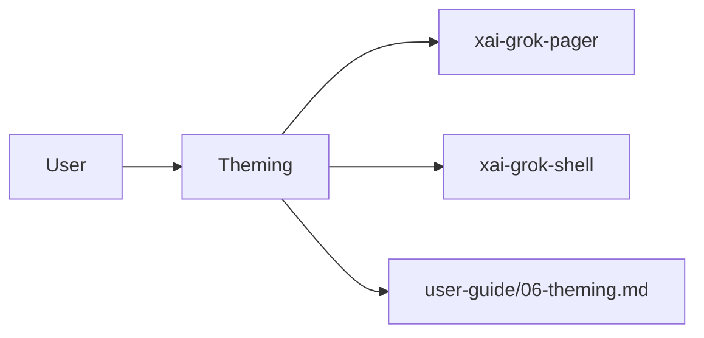

# Theming (product feature)

## What it is

Product feature documented in the Grok Build user guide (`06-theming.md`).

Grok Build draws all TUI colors from a central theme. You can switch themes while Grok is running, follow your operating system's light or dark appearance, and adjust scrollback layout, animations, and block styling through configuration files. --- Grok includes five built-in themes, plus an `auto` option that follows your system appearance: | Theme | Config Names | Description | Truecolor Required | |-------|-------------|-------------|--------------------| | **GrokNight** | `groknight`, `grok-

Implementation spans pager UI and/or shell runtime depending on the surface.

## How it works

User-facing behavior is specified in the guide; code typically lives under `xai-grok-pager` (UI) and `xai-grok-shell` / related crates (runtime).

Related crates: `xai-grok-pager`, `xai-grok-pager-render`.

## Used by

- End users of the `grok` CLI/TUI
- Agents implementing or debugging this capability
- [systems/xai-grok-pager.md](../systems/xai-grok-pager.md)
- [systems/xai-grok-pager-render.md](../systems/xai-grok-pager-render.md)
- User guide: `crates/codegen/xai-grok-pager/docs/user-guide/06-theming.md`

## Blast radius

Regressions here break the documented user workflow for **Theming**. Prefer guide + integration tests in pager/shell when changing behavior.

## See also

- [systems/xai-grok-pager.md](../systems/xai-grok-pager.md)
- [systems/xai-grok-pager-render.md](../systems/xai-grok-pager-render.md)
- User guide: `crates/codegen/xai-grok-pager/docs/user-guide/06-theming.md`
