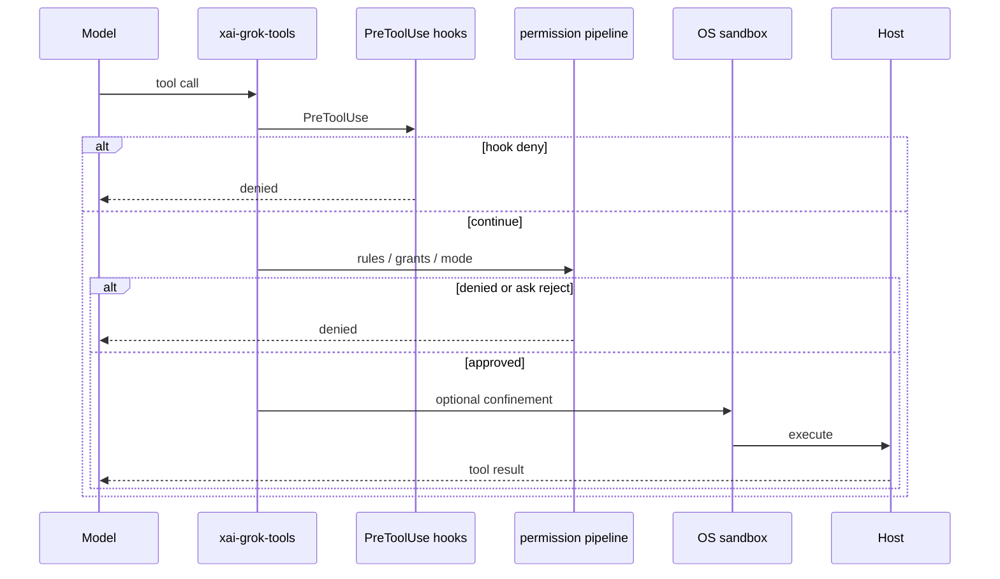

# Tool authorization pipeline

## What it is

End-to-end authorization for model-requested tools and shell commands. Spans hooks, permission rules/modes, remembered grants, built-in read-only auto-approvals, and optional OS sandbox. [Existing:user-guide/22]

Provenance: graph package inventory + repository layout synthesis. Agents should open grounded paths rather than treat this page as complete implementation documentation.

## How it works

Order (authoritative user-guide): (1) PreToolUse hooks (2) deny/ask/allow rules (3) remembered grants (4) built-in auto-approvals (5) mode policy. `bypassPermissions` short-circuits after step 2 with denials/hooks still applying.

## Used by

- [codegen tools + workspace](../systems/codegen.md)
- Interactive TUI approval UI; headless `dontAsk` CI

## Blast radius

Weakening deny-wins or skipping hooks can allow destructive commands. Mode changes affect CI safety defaults.

## See also

- [codegen](../systems/codegen.md)
- user-guide/10-hooks.md, 18-sandbox.md
