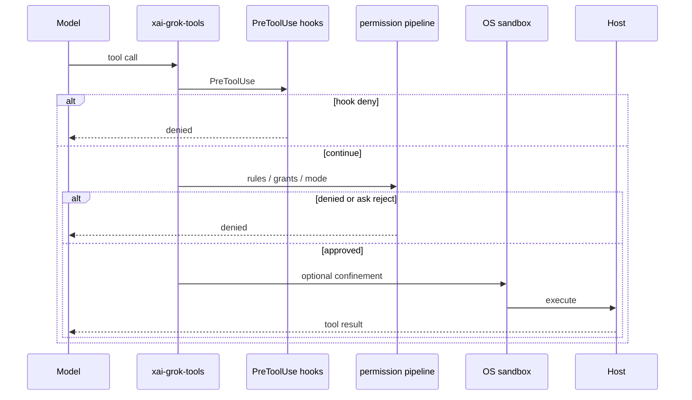

# Grok Build — system architecture overview

## What it is

**Grok Build** is SpaceXAI's terminal AI coding agent: full-screen TUI, headless/CI mode, and ACP IDE embedding. This OSS tree is a periodic sync of the Rust CLI/TUI + agent runtime from the internal monorepo. [Existing:README.md]

Graph spine: ~87.9k nodes / 580k edges; Rust-dominant (~2219 `.rs` files). Engine packages are coarse (`codegen`, `common`, third_party, …) — crate-level truth lives under `crates/codegen/*`.

## How it works

```mermaid
flowchart TB
  User[User / IDE / CI] --> Bin[xai-grok-pager-bin]
  Bin -->|TUI| Pager[xai-grok-pager]
  Bin -->|headless/stdio/leader| Shell[xai-grok-shell]
  Pager --> Shell
  Shell --> Session[session + agent]
  Session --> Sampler[xai-grok-sampler]
  Session --> Tools[xai-grok-tools]
  Tools --> Workspace[xai-grok-workspace]
  Workspace --> FS[file_system / permission / sandbox]
  Sampler --> API[xAI API / chat proxy]
  Shell --> MCP[xai-grok-mcp]
  Shell --> ACP[xai-acp-lib]
```

### Repository layout

| Path | Role |
|------|------|
| `crates/codegen/` | Application crates (pager, shell, tools, workspace, …) |
| `crates/common/` | Shared leaves (tool protocol, compaction, hub) |
| `crates/build/` | Proto build helpers |
| `prod/mc/` | Proxy shared types |
| `third_party/` | Vendored Mermaid SVG stack |
| `bin/protoc` | Hermetic protoc launcher |

### Invariants (synthesis from user-guide + structure)

1. **Permission order** — PreToolUse hooks → deny/ask/allow rules → remembered grants → built-in read-only auto-approvals → permission mode. Deny wins. [Existing:user-guide/22-permissions-and-safety.md]
2. **Root Cargo.toml is generated** — edit per-crate manifests only. [Existing:README.md]
3. **External contributions not accepted** — [Existing:CONTRIBUTING.md]
4. **Prefer per-crate cargo** — full workspace builds are slow. [Existing:README.md]

## Used by

- All wiki concept pages hang under this overview for orientation.
- Agents should load `draft/.ai-context.md` for compact routing.

## Blast radius

Mis-documenting process roles or the permission order causes unsafe agent edits (skipped denials) or wrong crate targeting. Keep this page sparse; deep dives belong under systems/*.

## See also

- [codegen](../systems/codegen.md)
- [entrypoint](../entrypoints/main.md)
- [getting-started](getting-started.md)
