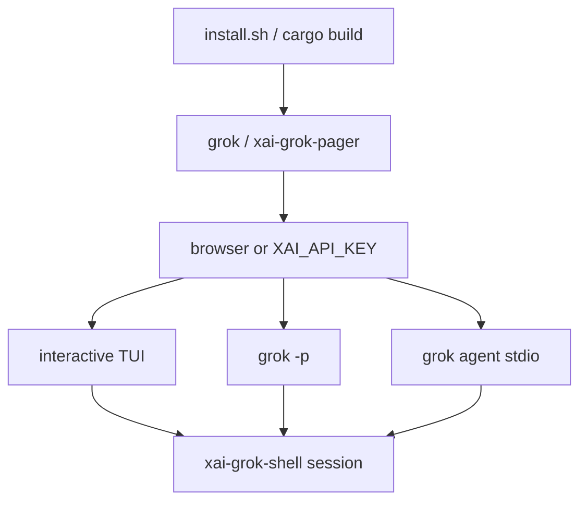

# Getting started — build and run

## What it is

Ops-oriented onboarding for **Grok Build** in this repository: install the
released `grok` binary, or build the TUI from source with Cargo, authenticate,
and run the first session.

Also mirrored at the draft root as [getting-started.md](../../getting-started.md)
and as the product feature page [features/getting-started.md](../features/getting-started.md).

## How it works

### Install released binary

```sh
curl -fsSL https://x.ai/cli/install.sh | bash   # macOS / Linux / Git Bash
irm https://x.ai/cli/install.ps1 | iex          # Windows PowerShell
grok --version
grok update
```

### Build from source

Requirements:

- Rust — pinned in `rust-toolchain.toml` (1.92.0)
- `protoc` — `bin/protoc` (dotslash) or `$PROTOC` / PATH
- Hosts: macOS and Linux primary; Windows best-effort

```sh
cargo run -p xai-grok-pager-bin              # build + launch TUI
cargo build -p xai-grok-pager-bin --release  # target/release/xai-grok-pager
cargo check -p xai-grok-pager-bin
cargo test -p <crate>
cargo clippy -p <crate>
cargo fmt --all
```

Binary name in-tree: `xai-grok-pager` (shipped as `grok`). Root `Cargo.toml` is
generated — edit per-crate manifests only. Prefer `cargo -p <crate>` over full
workspace builds.

### First launch and auth

```sh
grok
# or from this tree:
cargo run -p xai-grok-pager-bin
```

First interactive launch opens a browser for grok.com auth; credentials land in
`~/.grok/auth.json`. For API key auth (CI / no browser):

```sh
export XAI_API_KEY="xai-..."
grok
```

### Headless / ACP

```sh
grok -p "summarize this repo"
grok agent stdio
```



## See also

- Draft root: [getting-started.md](../../getting-started.md)
- Product feature: [features/getting-started.md](../features/getting-started.md)
- Full user guide: `crates/codegen/xai-grok-pager/docs/user-guide/01-getting-started.md`
- [architecture.md](architecture.md) · [entrypoint](../entrypoints/main.md)
- [authentication](../features/authentication.md) · [build runbook](../reference/build-runbook.md)
- Online: https://docs.x.ai/build/overview
