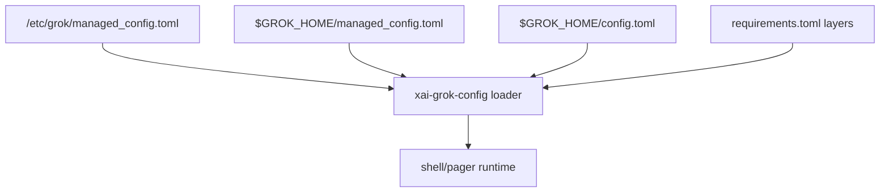

# Configuration surface

## What it is

Configuration merges multiple layers (system managed → user managed → user config → signed requirements → MDM on macOS).

See `xai-grok-config` docs and user-guide/05-configuration.md for operator-facing keys.

Implementation lives at `crates/codegen/xai-grok-config`.

## How it works

## See also

- [systems/xai-grok-config.md](../systems/xai-grok-config.md)
- [systems/xai-grok-tools.md](../systems/xai-grok-tools.md)
- [overview/architecture.md](../overview/architecture.md)
- User guide under crates/codegen/xai-grok-pager/docs/user-guide/
