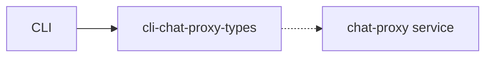

# cli-chat-proxy wire types

## What it is

Serde types for CLI ↔ chat-proxy compatibility. Field renames require coordinated deploys.

Implementation lives at `prod/mc/cli-chat-proxy-types`.

## How it works

## See also

- [systems/xai-grok-config.md](../systems/xai-grok-config.md)
- [systems/xai-grok-tools.md](../systems/xai-grok-tools.md)
- [overview/architecture.md](../overview/architecture.md)
- User guide under crates/codegen/xai-grok-pager/docs/user-guide/
