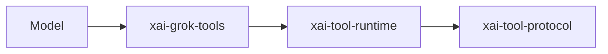

# Tool protocol API

## What it is

Tool execution uses protocol types (`xai-tool-protocol`) and runtime dispatch (`xai-tool-runtime`) consumed by `xai-grok-tools`.

Implementation lives at `crates/common/xai-tool-protocol`.

## How it works

## See also

- [systems/xai-grok-config.md](../systems/xai-grok-config.md)
- [systems/xai-grok-tools.md](../systems/xai-grok-tools.md)
- [overview/architecture.md](../overview/architecture.md)
- User guide under crates/codegen/xai-grok-pager/docs/user-guide/
