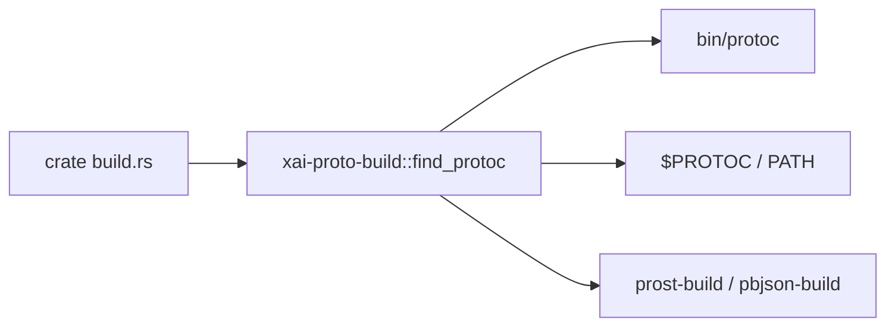

# build — proto build helpers

## What it is

`crates/build/xai-proto-build` locates `protoc` (dotslash launcher at `bin/protoc`, `$PROTOC`, or PATH) for crates that generate Rust from `.proto` (notably `xai-grok-tools-api`). [Graph:High — package `build`]

Provenance: graph package inventory + repository layout synthesis. Agents should open grounded paths rather than treat this page as complete implementation documentation.

## How it works

## Used by

- [codegen](codegen.md) crates with protobuf codegen (e.g. tools-api)

## Blast radius

Broken protoc resolution fails compile of proto-dependent crates. Prefer the checked-in `bin/protoc` for hermeticity.

## See also

- [codegen](codegen.md)
- README § Building from source

## Notes

- Supporting detail 1: keep graph package labels distinct from Cargo crate names when routing edits.
- Supporting detail 2: keep graph package labels distinct from Cargo crate names when routing edits.
- Supporting detail 3: keep graph package labels distinct from Cargo crate names when routing edits.
- Supporting detail 4: keep graph package labels distinct from Cargo crate names when routing edits.
- Supporting detail 5: keep graph package labels distinct from Cargo crate names when routing edits.
