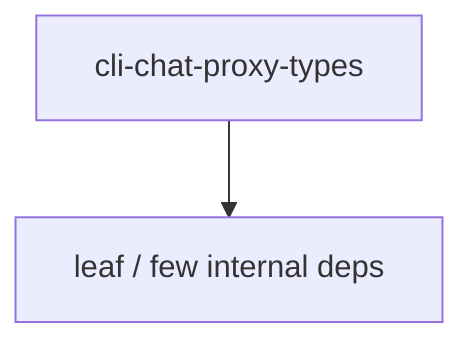

# cli-chat-proxy-types — Chat proxy types

## What it is

`cli-chat-proxy-types` is a Cargo workspace member at `prod/mc/cli-chat-proxy-types` (10 `.rs` files).

Lightweight request/response types for the cli-chat-proxy sandbox API.  This crate contains only the API types with minimal dependencies (just serde), suitable for use by clients that don't need the full cli-chat-proxy crate.

**Role:** Chat proxy types. [Graph: approximate via crate tree; Human:Synthesis from lib.rs docs]

## How it works

Primary surface is `src/lib.rs`.

Notable workspace dependencies (from crate Cargo.toml, truncated): `chrono`, `serde`, `serde_json.workspace`, `toml.workspace`.

## Used by

- Parent cluster: [mc](mc.md)
- Other crates that depend on this package (see Cargo graph / `cargo tree -p cli-chat-proxy-types`)

## Blast radius

Changes affect any consumer of `cli-chat-proxy-types` in the workspace. Run `cargo test -p cli-chat-proxy-types` and re-check dependent top crates (`xai-grok-shell`, `xai-grok-pager`, `xai-grok-tools`) when public APIs move.

## See also

- [systems/mc.md](mc.md)
- [entrypoint](../entrypoints/main.md)
- Workspace root `Cargo.toml` (generated — do not hand-edit)

## Notes

- Prefer `cargo check -p cli-chat-proxy-types` / `cargo test -p cli-chat-proxy-types` for this crate.
- Full workspace builds are slow; target the crate under change.
- See root README for build prerequisites (Rust toolchain, protoc).
