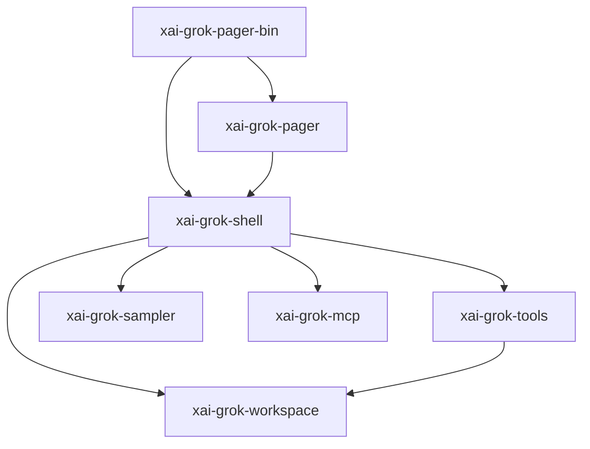
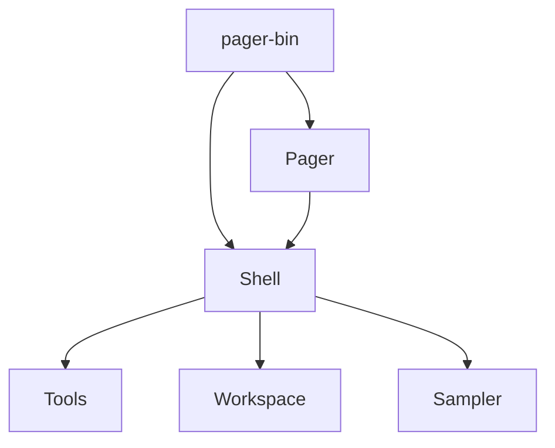

# codegen — primary CLI crate closure

## What it is

`crates/codegen/` holds the primary application crates for Grok Build (pager TUI, shell runtime, tools, workspace, sampling, config, MCP, …).

This page is the **parent map**. Prefer the per-crate pages below for implementation work.

| Crate | `.rs` | Wiki page |
|-------|------:|-----------|
| `xai-grok-pager` | 596 | [xai-grok-pager.md](xai-grok-pager.md) |
| `xai-grok-shell` | 429 | [xai-grok-shell.md](xai-grok-shell.md) |
| `xai-grok-tools` | 211 | [xai-grok-tools.md](xai-grok-tools.md) |
| `xai-grok-workspace` | 87 | [xai-grok-workspace.md](xai-grok-workspace.md) |
| `xai-grok-pager-render` | 64 | [xai-grok-pager-render.md](xai-grok-pager-render.md) |
| `xai-grok-workspace-types` | 45 | [xai-grok-workspace-types.md](xai-grok-workspace-types.md) |
| `xai-grok-telemetry` | 39 | [xai-grok-telemetry.md](xai-grok-telemetry.md) |
| `xai-grok-pager-pty-harness` | 37 | [xai-grok-pager-pty-harness.md](xai-grok-pager-pty-harness.md) |
| `xai-fast-worktree` | 36 | [xai-fast-worktree.md](xai-fast-worktree.md) |
| `xai-grok-agent` | 30 | [xai-grok-agent.md](xai-grok-agent.md) |
| `xai-codebase-graph` | 28 | [xai-codebase-graph.md](xai-codebase-graph.md) |
| `xai-grok-markdown` | 28 | [xai-grok-markdown.md](xai-grok-markdown.md) |
| `xai-grok-sampler` | 26 | [xai-grok-sampler.md](xai-grok-sampler.md) |
| `xai-chat-state` | 17 | [xai-chat-state.md](xai-chat-state.md) |
| `xai-hunk-tracker` | 17 | [xai-hunk-tracker.md](xai-hunk-tracker.md) |
| `xai-agent-lifecycle` | 15 | [xai-agent-lifecycle.md](xai-agent-lifecycle.md) |
| `xai-file-utils` | 15 | [xai-file-utils.md](xai-file-utils.md) |
| `xai-grok-hooks` | 15 | [xai-grok-hooks.md](xai-grok-hooks.md) |
| `xai-grok-memory` | 15 | [xai-grok-memory.md](xai-grok-memory.md) |
| `xai-grok-update` | 15 | [xai-grok-update.md](xai-grok-update.md) |
| `xai-grok-voice` | 15 | [xai-grok-voice.md](xai-grok-voice.md) |
| `xai-grok-config` | 14 | [xai-grok-config.md](xai-grok-config.md) |
| `xai-grok-pager-minimal` | 11 | [xai-grok-pager-minimal.md](xai-grok-pager-minimal.md) |
| `xai-grok-plugin-marketplace` | 11 | [xai-grok-plugin-marketplace.md](xai-grok-plugin-marketplace.md) |
| `xai-grok-sandbox` | 11 | [xai-grok-sandbox.md](xai-grok-sandbox.md) |
| `xai-grok-test-support` | 11 | [xai-grok-test-support.md](xai-grok-test-support.md) |
| `xai-fsnotify` | 10 | [xai-fsnotify.md](xai-fsnotify.md) |
| `xai-grok-mcp` | 10 | [xai-grok-mcp.md](xai-grok-mcp.md) |
| `xai-grok-shell-base` | 10 | [xai-grok-shell-base.md](xai-grok-shell-base.md) |
| `xai-ratatui-inline` | 10 | [xai-ratatui-inline.md](xai-ratatui-inline.md) |
| `ptyctl` | 8 | [ptyctl.md](ptyctl.md) |
| `xai-acp-lib` | 8 | [xai-acp-lib.md](xai-acp-lib.md) |
| `xai-grok-shared` | 8 | [xai-grok-shared.md](xai-grok-shared.md) |
| `xai-grok-mermaid` | 7 | [xai-grok-mermaid.md](xai-grok-mermaid.md) |
| `xai-grok-sampling-types` | 7 | [xai-grok-sampling-types.md](xai-grok-sampling-types.md) |
| `ptyctl-cli` | 6 | [ptyctl-cli.md](ptyctl-cli.md) |
| `xai-crash-handler` | 6 | [xai-crash-handler.md](xai-crash-handler.md) |
| `xai-grok-config-types` | 6 | [xai-grok-config-types.md](xai-grok-config-types.md) |
| `xai-grok-subagent-resolution` | 6 | [xai-grok-subagent-resolution.md](xai-grok-subagent-resolution.md) |
| `xai-ratatui-textarea` | 6 | [xai-ratatui-textarea.md](xai-ratatui-textarea.md) |
| `xai-grok-tools-api` | 5 | [xai-grok-tools-api.md](xai-grok-tools-api.md) |
| `xai-grok-auth` | 4 | [xai-grok-auth.md](xai-grok-auth.md) |
| `xai-system-power` | 4 | [xai-system-power.md](xai-system-power.md) |
| `xai-tracing-macros` | 3 | [xai-tracing-macros.md](xai-tracing-macros.md) |
| `xai-grok-pager-bin` | 2 | [xai-grok-pager-bin.md](xai-grok-pager-bin.md) |
| `xai-grok-secrets` | 2 | [xai-grok-secrets.md](xai-grok-secrets.md) |
| `xai-grok-shell-session-support` | 2 | [xai-grok-shell-session-support.md](xai-grok-shell-session-support.md) |
| `xai-grok-version` | 2 | [xai-grok-version.md](xai-grok-version.md) |
| `xai-prompt-queue` | 2 | [xai-prompt-queue.md](xai-prompt-queue.md) |
| `xai-tty-utils` | 2 | [xai-tty-utils.md](xai-tty-utils.md) |
| `xai-gix-status` | 1 | [xai-gix-status.md](xai-gix-status.md) |
| `xai-grok-announcements` | 1 | [xai-grok-announcements.md](xai-grok-announcements.md) |
| `xai-grok-env` | 1 | [xai-grok-env.md](xai-grok-env.md) |
| `xai-grok-http` | 1 | [xai-grok-http.md](xai-grok-http.md) |
| `xai-grok-markdown-core` | 1 | [xai-grok-markdown-core.md](xai-grok-markdown-core.md) |
| `xai-grok-models` | 1 | [xai-grok-models.md](xai-grok-models.md) |
| `xai-grok-paths` | 1 | [xai-grok-paths.md](xai-grok-paths.md) |
| `xai-grok-workspace-client` | 1 | [xai-grok-workspace-client.md](xai-grok-workspace-client.md) |
| `xai-hooks-plugins-types` | 1 | [xai-hooks-plugins-types.md](xai-hooks-plugins-types.md) |
| `xai-mixpanel` | 1 | [xai-mixpanel.md](xai-mixpanel.md) |
| `xai-sqlite-journal` | 1 | [xai-sqlite-journal.md](xai-sqlite-journal.md) |
| `xai-token-estimation` | 1 | [xai-token-estimation.md](xai-token-estimation.md) |

## How it works

Composition root dispatches TUI vs headless vs ACP vs leader into shell/pager.

## Used by

- [entrypoint](../entrypoints/main.md)
- All product features under `wiki/features/`
- [common](common.md) shared leaves

## Blast radius

API or behavior changes in any listed crate can ship in the `grok` binary. Prefer per-crate tests; validate pager-bin integration for cross-crate features.

## See also

- [xai-grok-pager.md](xai-grok-pager.md)
- [xai-grok-shell.md](xai-grok-shell.md)
- [xai-grok-tools.md](xai-grok-tools.md)
- [xai-grok-workspace.md](xai-grok-workspace.md)
- [common.md](common.md)
