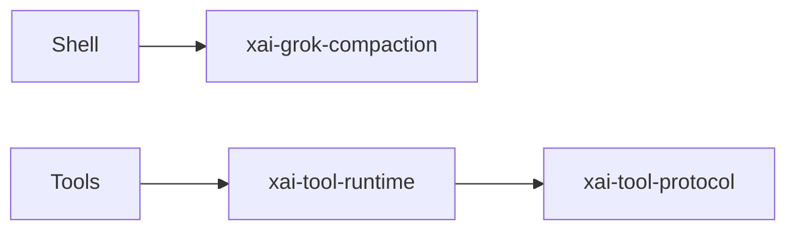

# common — shared leaf crates

## What it is

Shared leaf libraries used by the CLI closure (not process entrypoints).

| Crate | `.rs` | Wiki page |
|-------|------:|-----------|
| `xai-grok-compaction` | 33 | [xai-grok-compaction.md](xai-grok-compaction.md) |
| `xai-computer-hub-sdk` | 21 | [xai-computer-hub-sdk.md](xai-computer-hub-sdk.md) |
| `xai-tool-protocol` | 21 | [xai-tool-protocol.md](xai-tool-protocol.md) |
| `xai-circuit-breaker` | 18 | [xai-circuit-breaker.md](xai-circuit-breaker.md) |
| `xai-tool-runtime` | 18 | [xai-tool-runtime.md](xai-tool-runtime.md) |
| `xai-computer-hub-core` | 15 | [xai-computer-hub-core.md](xai-computer-hub-core.md) |
| `xai-tracing` | 8 | [xai-tracing.md](xai-tracing.md) |
| `xai-test-utils` | 6 | [xai-test-utils.md](xai-test-utils.md) |
| `xai-tool-types` | 6 | [xai-tool-types.md](xai-tool-types.md) |
| `xai-computer-hub-mcp-adapter` | 5 | [xai-computer-hub-mcp-adapter.md](xai-computer-hub-mcp-adapter.md) |
| `xai-interjection-core` | 4 | [xai-interjection-core.md](xai-interjection-core.md) |

## How it works

These crates are dependency targets. Tool protocol + runtime feed `xai-grok-tools`; compaction is used by long sessions; computer-hub supports remote tool execution.

## Used by

- Parent consumers in [codegen](codegen.md)
- Per-crate pages linked in the table above

## Blast radius

Wire/protocol changes break tools and MCP; compaction changes alter long-session behavior and cost.

## See also

- [xai-tool-protocol.md](xai-tool-protocol.md)
- [xai-grok-compaction.md](xai-grok-compaction.md)
- [codegen.md](codegen.md)
