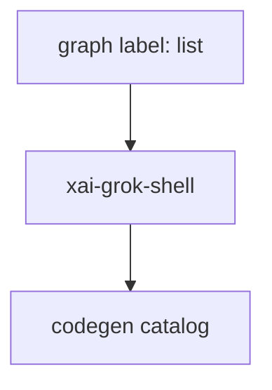

# list — graph label → see xai-grok-shell

## What it is

**This is not a Cargo crate.** The knowledge-graph engine clustered a low-node package labeled `list`.

List UIs live in pager/shell session listing — not a package boundary.

**Canonical page:** [xai-grok-shell.md](xai-grok-shell.md)

## How it works

Do not implement features under a `list` module path. Route work to `xai-grok-shell` and related crates in the [codegen catalog](codegen.md).

## Used by

- Agents misrouted by graph package list
- [codegen.md](codegen.md) parent map

## Blast radius

Mis-editing as if `list` were a module wastes time. Always open `xai-grok-shell` sources instead.

## See also

- [xai-grok-shell.md](xai-grok-shell.md)
- [codegen.md](codegen.md)

## Notes

- Prefer `cargo check -p list` / `cargo test -p list` for this crate.
- Full workspace builds are slow; target the crate under change.
- See root README for build prerequisites (Rust toolchain, protoc).
