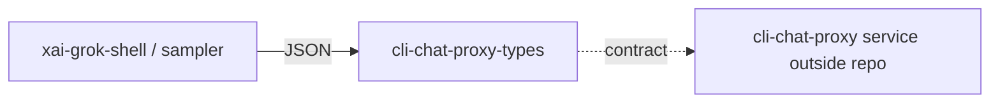

# mc — cli-chat-proxy shared types

## What it is

`prod/mc/cli-chat-proxy-types` defines **shared serialization types** for the CLI ↔ chat-proxy boundary (session, storage, feedback, sandbox, deployment config, client metrics, subagent bundles). [Graph:High — package `mc`]

Provenance: graph package inventory + repository layout synthesis. Agents should open grounded paths rather than treat this page as complete implementation documentation.

## How it works

Pure types crate (serde-facing). Codegen shell/agent code imports these to speak the proxy's contract without embedding server code in the OSS tree.

## Used by

- [codegen](codegen.md) agent/session/upload paths that talk to xAI backends

## Blast radius

Field renames or enum changes break CLI↔proxy compatibility across version skew. Coordinate with proxy deploy when evolving types.

## See also

- [codegen](codegen.md)
- [common](common.md)

## Notes

- Supporting detail 1: keep graph package labels distinct from Cargo crate names when routing edits.
- Supporting detail 2: keep graph package labels distinct from Cargo crate names when routing edits.
- Supporting detail 3: keep graph package labels distinct from Cargo crate names when routing edits.
- Supporting detail 4: keep graph package labels distinct from Cargo crate names when routing edits.
- Supporting detail 5: keep graph package labels distinct from Cargo crate names when routing edits.
