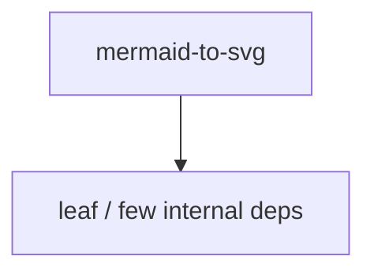

# mermaid-to-svg — Mermaid→SVG

## What it is

`mermaid-to-svg` is a Cargo workspace member at `third_party/mermaid-to-svg` (35 `.rs` files).

Rust crate `mermaid-to-svg` at `third_party/mermaid-to-svg`.

**Role:** Mermaid→SVG. [Graph: approximate via crate tree; Human:Synthesis from lib.rs docs]

## How it works

Primary surface is `src/lib.rs`.

Notable workspace dependencies (from crate Cargo.toml, truncated): `thiserror`, `dagre_rust`, `graphlib_rust`, `unicode-segmentation`, `unicode-width`, `serde_yaml`.

## Used by

- Parent cluster: [mermaid-to-svg](mermaid-to-svg.md)
- Other crates that depend on this package (see Cargo graph / `cargo tree -p mermaid-to-svg`)

## Blast radius

Changes affect any consumer of `mermaid-to-svg` in the workspace. Run `cargo test -p mermaid-to-svg` and re-check dependent top crates (`xai-grok-shell`, `xai-grok-pager`, `xai-grok-tools`) when public APIs move.

## See also

- [systems/mermaid-to-svg.md](mermaid-to-svg.md)
- [entrypoint](../entrypoints/main.md)
- Workspace root `Cargo.toml` (generated — do not hand-edit)

## Notes

- Prefer `cargo check -p mermaid-to-svg` / `cargo test -p mermaid-to-svg` for this crate.
- Full workspace builds are slow; target the crate under change.
- See root README for build prerequisites (Rust toolchain, protoc).
