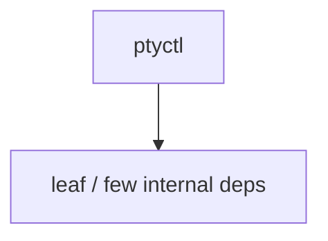

# ptyctl — PTY control lib

## What it is

`ptyctl` is a Cargo workspace member at `crates/codegen/ptyctl` (8 `.rs` files).

ptyctl — Headless PTY controller built on alacritty_terminal.  Provides programmatic control of terminal sessions: spawn processes in a PTY, send keystrokes, read screen content as text/styled/HTML, and expose it all via HTTP REST API.

**Role:** PTY control lib. [Graph: approximate via crate tree; Human:Synthesis from lib.rs docs]

## How it works

Primary surface is `src/lib.rs`.

Notable workspace dependencies (from crate Cargo.toml, truncated): `alacritty_terminal`, `portable-pty`, `terminput`, `tokio`, `axum`, `futures-util`, `tower-http`, `serde`.

## Used by

- Parent cluster: [codegen](codegen.md)
- Other crates that depend on this package (see Cargo graph / `cargo tree -p ptyctl`)

## Blast radius

Changes affect any consumer of `ptyctl` in the workspace. Run `cargo test -p ptyctl` and re-check dependent top crates (`xai-grok-shell`, `xai-grok-pager`, `xai-grok-tools`) when public APIs move.

## See also

- [systems/codegen.md](codegen.md)
- [entrypoint](../entrypoints/main.md)
- Workspace root `Cargo.toml` (generated — do not hand-edit)

## Notes

- Prefer `cargo check -p ptyctl` / `cargo test -p ptyctl` for this crate.
- Full workspace builds are slow; target the crate under change.
- See root README for build prerequisites (Rust toolchain, protoc).
