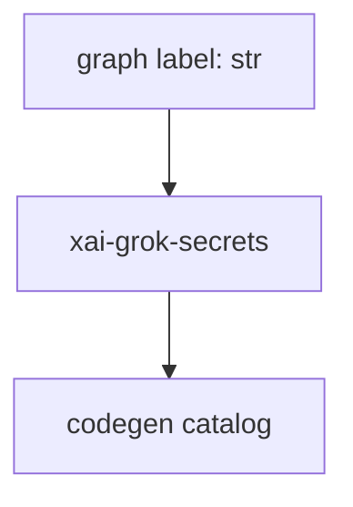

# str — graph label → see xai-grok-secrets

## What it is

**This is not a Cargo crate.** The knowledge-graph engine clustered a low-node package labeled `str`.

String/secret handling is not a package; see secrets sanitizer and string-heavy crates.

**Canonical page:** [xai-grok-secrets.md](xai-grok-secrets.md)

## How it works

Do not implement features under a `str` module path. Route work to `xai-grok-secrets` and related crates in the [codegen catalog](codegen.md).

## Used by

- Agents misrouted by graph package list
- [codegen.md](codegen.md) parent map

## Blast radius

Mis-editing as if `str` were a module wastes time. Always open `xai-grok-secrets` sources instead.

## See also

- [xai-grok-secrets.md](xai-grok-secrets.md)
- [codegen.md](codegen.md)

## Notes

- Prefer `cargo check -p str` / `cargo test -p str` for this crate.
- Full workspace builds are slow; target the crate under change.
- See root README for build prerequisites (Rust toolchain, protoc).
