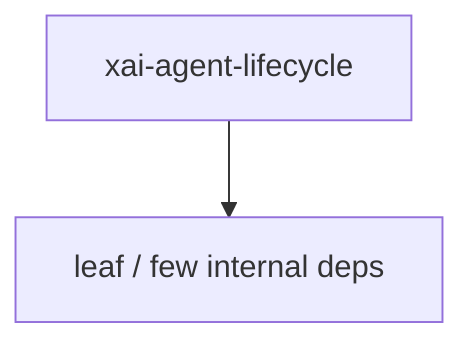

# xai-agent-lifecycle — Agent lifecycle

## What it is

`xai-agent-lifecycle` is a Cargo workspace member at `crates/codegen/xai-agent-lifecycle` (15 `.rs` files).

Host-agnostic agent lifecycle hooks shared by multiple agent hosts (e.g. xai-grok-shell). Contributors receive data-only per-hook inputs at dispatch time; anything they act through is a capability injected at install time, and they never own loop control.

**Role:** Agent lifecycle. [Graph: approximate via crate tree; Human:Synthesis from lib.rs docs]

## How it works

Primary surface is `src/lib.rs`.

Notable workspace dependencies (from crate Cargo.toml, truncated): `async-trait`, `tracing`.

## Used by

- Parent cluster: [codegen](codegen.md)
- Other crates that depend on this package (see Cargo graph / `cargo tree -p xai-agent-lifecycle`)

## Blast radius

Changes affect any consumer of `xai-agent-lifecycle` in the workspace. Run `cargo test -p xai-agent-lifecycle` and re-check dependent top crates (`xai-grok-shell`, `xai-grok-pager`, `xai-grok-tools`) when public APIs move.

## See also

- [systems/codegen.md](codegen.md)
- [entrypoint](../entrypoints/main.md)
- Workspace root `Cargo.toml` (generated — do not hand-edit)

## Notes

- Prefer `cargo check -p xai-agent-lifecycle` / `cargo test -p xai-agent-lifecycle` for this crate.
- Full workspace builds are slow; target the crate under change.
- See root README for build prerequisites (Rust toolchain, protoc).
