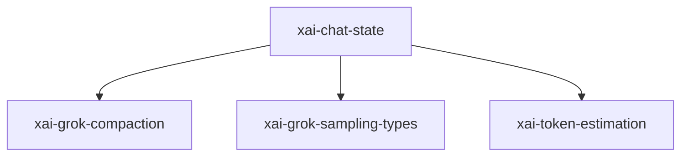

# xai-chat-state — Chat state actor

## What it is

`xai-chat-state` is a Cargo workspace member at `crates/codegen/xai-chat-state` (17 `.rs` files).

xai-chat-state — Actor-based chat state management for xAI agents.  This crate extracts conversation state management from `xai-grok-shell`'s `acp_session.rs` into a standalone actor. It follows the same actor pattern as `xai-hunk-tracker`:  ```text ┌────────────────┐                  ┌──────────────────────────────────────┐ │ SessionActor   │ ─── Command ───▶ │        ChatStateActor              

**Role:** Chat state actor. [Graph: approximate via crate tree; Human:Synthesis from lib.rs docs]

## How it works

Primary surface is `src/lib.rs`.

Notable workspace dependencies (from crate Cargo.toml, truncated): `indexmap`, `regex`, `serde`, `serde_json`, `strum`, `tokio`, `tokio-util`, `tracing`.



## Used by

- Parent cluster: [codegen](codegen.md)
- Other crates that depend on this package (see Cargo graph / `cargo tree -p xai-chat-state`)

## Blast radius

Changes affect any consumer of `xai-chat-state` in the workspace. Run `cargo test -p xai-chat-state` and re-check dependent top crates (`xai-grok-shell`, `xai-grok-pager`, `xai-grok-tools`) when public APIs move.

## See also

- [systems/codegen.md](codegen.md)
- [entrypoint](../entrypoints/main.md)
- Workspace root `Cargo.toml` (generated — do not hand-edit)
