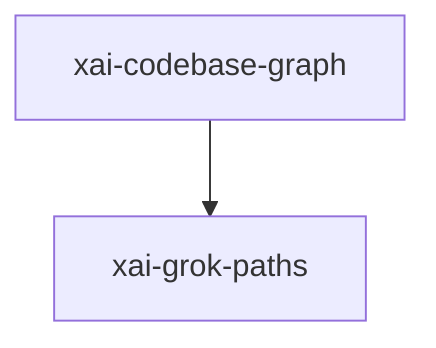

# xai-codebase-graph — Code index graph

## What it is

`xai-codebase-graph` is a Cargo workspace member at `crates/codegen/xai-codebase-graph` (28 `.rs` files).

# xai-codebase-graph  High-performance code graph generation using tree-sitter queries.  This crate provides: - **Go-to-definitions**: Find where symbols are defined - **Go-to-references**: Find where symbols are used - **Initial repository indexing**: Build the full index from scratch - **Incremental reindexing**: Update the index based on file system events - **Parallel processing**: Uses rayon 

**Role:** Code index graph. [Graph: approximate via crate tree; Human:Synthesis from lib.rs docs]

## How it works

Primary surface is `src/lib.rs`.

Notable workspace dependencies (from crate Cargo.toml, truncated): `dunce`, `xai-grok-paths`, `petgraph`, `serde`, `serde_json`, `rayon`, `crossbeam`, `num_cpus`.

## Used by

- Parent cluster: [codegen](codegen.md)
- Other crates that depend on this package (see Cargo graph / `cargo tree -p xai-codebase-graph`)

## Blast radius

Changes affect any consumer of `xai-codebase-graph` in the workspace. Run `cargo test -p xai-codebase-graph` and re-check dependent top crates (`xai-grok-shell`, `xai-grok-pager`, `xai-grok-tools`) when public APIs move.

## See also

- [systems/codegen.md](codegen.md)
- [entrypoint](../entrypoints/main.md)
- Workspace root `Cargo.toml` (generated — do not hand-edit)

## Notes

- Prefer `cargo check -p xai-codebase-graph` / `cargo test -p xai-codebase-graph` for this crate.
- Full workspace builds are slow; target the crate under change.
- See root README for build prerequisites (Rust toolchain, protoc).
