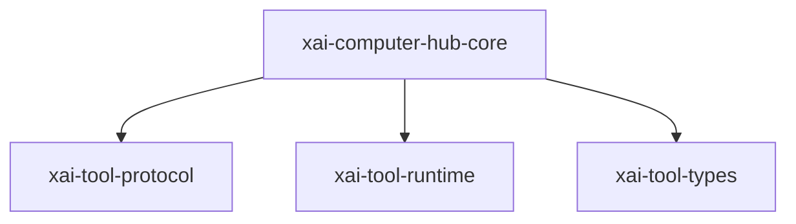

# xai-computer-hub-core — Computer hub core

## What it is

`xai-computer-hub-core` is a Cargo workspace member at `crates/common/xai-computer-hub-core` (15 `.rs` files).

xAI Computer Hub — transport + registry + resolver core.  Object-safe abstractions used by every router build: a `Transport` that authorises and dispatches calls, a `ToolRegistry` trait shared by both storage planes, a `CompoundResolver` that applies the local-shadows-remote rule, and the local + remote transports plus inner-dispatch glue that sit on top.

**Role:** Computer hub core. [Graph: approximate via crate tree; Human:Synthesis from lib.rs docs]

## How it works

Primary surface is `src/lib.rs`.

Notable workspace dependencies (from crate Cargo.toml, truncated): `async-trait`, `chrono`, `futures`, `serde_json`, `tracing`, `xai-tool-protocol`, `xai-tool-runtime`, `xai-tool-types`.

## Used by

- Parent cluster: [common](common.md)
- Other crates that depend on this package (see Cargo graph / `cargo tree -p xai-computer-hub-core`)

## Blast radius

Changes affect any consumer of `xai-computer-hub-core` in the workspace. Run `cargo test -p xai-computer-hub-core` and re-check dependent top crates (`xai-grok-shell`, `xai-grok-pager`, `xai-grok-tools`) when public APIs move.

## See also

- [systems/common.md](common.md)
- [entrypoint](../entrypoints/main.md)
- Workspace root `Cargo.toml` (generated — do not hand-edit)
