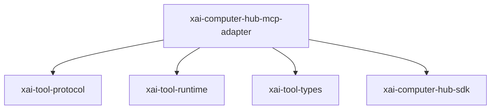

# xai-computer-hub-mcp-adapter — Hub MCP adapter

## What it is

`xai-computer-hub-mcp-adapter` is a Cargo workspace member at `crates/common/xai-computer-hub-mcp-adapter` (5 `.rs` files).

Unified MCP adapter for the xAI Computer Hub.  This crate bridges MCP (Model Context Protocol) servers into the computer hub's tool routing infrastructure. An `McpBridge` connects to an MCP server via an `McpTransport`, discovers the server's tools, and produces `ToolServerHandler` implementations that can be registered with a hub `ToolServerBuilder`
**Role:** Hub MCP adapter. [Graph: approximate via crate tree; Human:Synthesis from lib.rs docs]

## How it works

Primary surface is `src/lib.rs`.

Notable workspace dependencies (from crate Cargo.toml, truncated): `async-trait`, `serde`, `serde_json`, `thiserror`, `tokio`, `tracing`, `prometheus`, `xai-tool-protocol`.

## Used by

- Parent cluster: [common](common.md)
- Other crates that depend on this package (see Cargo graph / `cargo tree -p xai-computer-hub-mcp-adapter`)

## Blast radius

Changes affect any consumer of `xai-computer-hub-mcp-adapter` in the workspace. Run `cargo test -p xai-computer-hub-mcp-adapter` and re-check dependent top crates (`xai-grok-shell`, `xai-grok-pager`, `xai-grok-tools`) when public APIs move.

## See also

- [systems/common.md](common.md)
- [entrypoint](../entrypoints/main.md)
- Workspace root `Cargo.toml` (generated — do not hand-edit)
