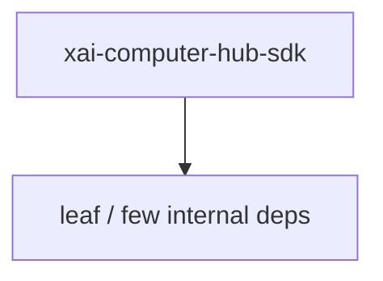

# xai-computer-hub-sdk — Computer hub SDK

## What it is

`xai-computer-hub-sdk` is a Cargo workspace member at `crates/common/xai-computer-hub-sdk` (21 `.rs` files).

Tool-server and harness SDK.  Single crate hosting both the tool-server runtime and the harness-side dispatch surface. The shared substrate — `HubConnectionPool`, `HubConnection`, the inbound demux, the refcount-managed bound-session set, and the transparent reconnect / replay state machine — lives here so both ends speak through one frame multiplex on top of one WebSocket per `(url, principal

**Role:** Computer hub SDK. [Graph: approximate via crate tree; Human:Synthesis from lib.rs docs]

## How it works

Primary surface is `src/lib.rs`.

Notable workspace dependencies (from crate Cargo.toml, truncated): `tokio`, `tokio-tungstenite`, `tokio-util`, `futures`, `serde`, `serde_json`, `dashmap`, `indexmap`.

## Used by

- Parent cluster: [common](common.md)
- Other crates that depend on this package (see Cargo graph / `cargo tree -p xai-computer-hub-sdk`)

## Blast radius

Changes affect any consumer of `xai-computer-hub-sdk` in the workspace. Run `cargo test -p xai-computer-hub-sdk` and re-check dependent top crates (`xai-grok-shell`, `xai-grok-pager`, `xai-grok-tools`) when public APIs move.

## See also

- [systems/common.md](common.md)
- [entrypoint](../entrypoints/main.md)
- Workspace root `Cargo.toml` (generated — do not hand-edit)

## Notes

- Prefer `cargo check -p xai-computer-hub-sdk` / `cargo test -p xai-computer-hub-sdk` for this crate.
- Full workspace builds are slow; target the crate under change.
- See root README for build prerequisites (Rust toolchain, protoc).
