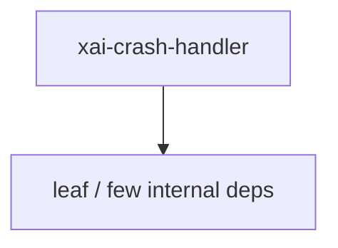

# xai-crash-handler — Workspace crate

## What it is

`xai-crash-handler` is a Cargo workspace member at `crates/codegen/xai-crash-handler` (6 `.rs` files).

Cross-platform crash handler with startup crash detection.  - **Unix**: SIGBUS/SIGSEGV via `sigaction(2)`. - **Windows**: access violations via `SetUnhandledExceptionFilter`.  # Usage  Call `check_previous_crash` first to detect crashes from the previous session, then `install` early in `main()`, before any async runtime or thread spawning. `check_previous_crash` must run before `install` beca

**Role:** Workspace crate. [Graph: approximate via crate tree; Human:Synthesis from lib.rs docs]

## How it works

Primary surface is `src/lib.rs`.

Notable workspace dependencies (from crate Cargo.toml, truncated): `backtrace`.

## Used by

- Parent cluster: [codegen](codegen.md)
- Other crates that depend on this package (see Cargo graph / `cargo tree -p xai-crash-handler`)

## Blast radius

Changes affect any consumer of `xai-crash-handler` in the workspace. Run `cargo test -p xai-crash-handler` and re-check dependent top crates (`xai-grok-shell`, `xai-grok-pager`, `xai-grok-tools`) when public APIs move.

## See also

- [systems/codegen.md](codegen.md)
- [entrypoint](../entrypoints/main.md)
- Workspace root `Cargo.toml` (generated — do not hand-edit)

## Notes

- Prefer `cargo check -p xai-crash-handler` / `cargo test -p xai-crash-handler` for this crate.
- Full workspace builds are slow; target the crate under change.
- See root README for build prerequisites (Rust toolchain, protoc).
