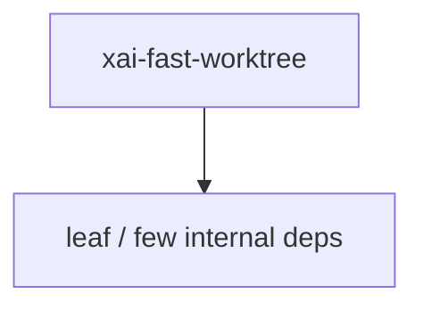

# xai-fast-worktree — Fast git worktrees

## What it is

`xai-fast-worktree` is a Cargo workspace member at `crates/codegen/xai-fast-worktree` (36 `.rs` files).

High-performance git worktree creation using CoW cloning.  This crate provides fast worktree creation by: 1. Using `git worktree add --no-checkout` (instant metadata creation) 2. Parallel CoW file cloning with hash-based sharding 3. Optional dirty file replication and ignored file copying 4. BTRFS snapshot support on Linux for O(1) cloning 5. Worktree sync API for pre-created worktree pools 6. SQL

**Role:** Fast git worktrees. [Graph: approximate via crate tree; Human:Synthesis from lib.rs docs]

## How it works

Primary surface is `src/lib.rs`.

Notable workspace dependencies (from crate Cargo.toml, truncated): `anyhow`, `bytes`, `clap`, `crossbeam`, `dashmap`, `dunce`, `gix`, `gix-status`.

## Used by

- Parent cluster: [codegen](codegen.md)
- Other crates that depend on this package (see Cargo graph / `cargo tree -p xai-fast-worktree`)

## Blast radius

Changes affect any consumer of `xai-fast-worktree` in the workspace. Run `cargo test -p xai-fast-worktree` and re-check dependent top crates (`xai-grok-shell`, `xai-grok-pager`, `xai-grok-tools`) when public APIs move.

## See also

- [systems/codegen.md](codegen.md)
- [entrypoint](../entrypoints/main.md)
- Workspace root `Cargo.toml` (generated — do not hand-edit)

## Notes

- Prefer `cargo check -p xai-fast-worktree` / `cargo test -p xai-fast-worktree` for this crate.
- Full workspace builds are slow; target the crate under change.
- See root README for build prerequisites (Rust toolchain, protoc).
